# CodeDebrief Decision Flows

> Generated from source code. Do not edit this file manually.

- **Generated:** `2026-07-28T18:49:46.310462+00:00`
- **Source root:** `.`
- **Flows:** 215
- **Entry points:** 160
- **Scopes:** Assets (51) · external (164)

## Project Map


## Entry Point Flows

### ActionBar.ActionBar

`method` · `csharp` · `generic` · [`Assets/Scripts/Hollowmere/Interaction/ActionBar.cs:36`](../Assets/Scripts/Hollowmere/Interaction/ActionBar.cs#L36)

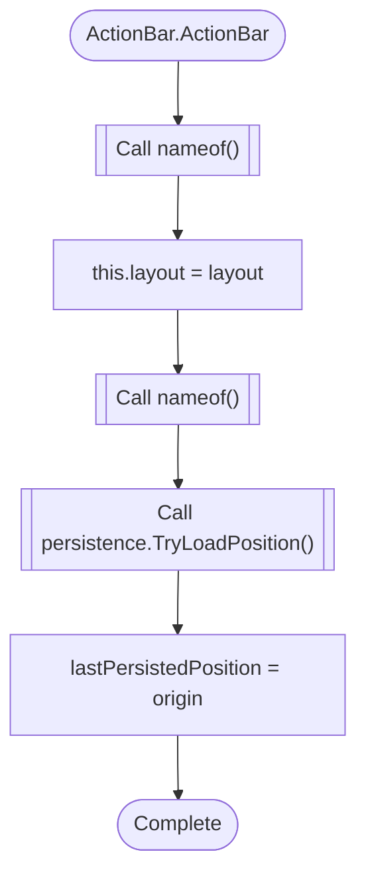

### ActionBar.AddButton

`method` · `csharp` · `generic` · [`Assets/Scripts/Hollowmere/Interaction/ActionBar.cs:49`](../Assets/Scripts/Hollowmere/Interaction/ActionBar.cs#L49)

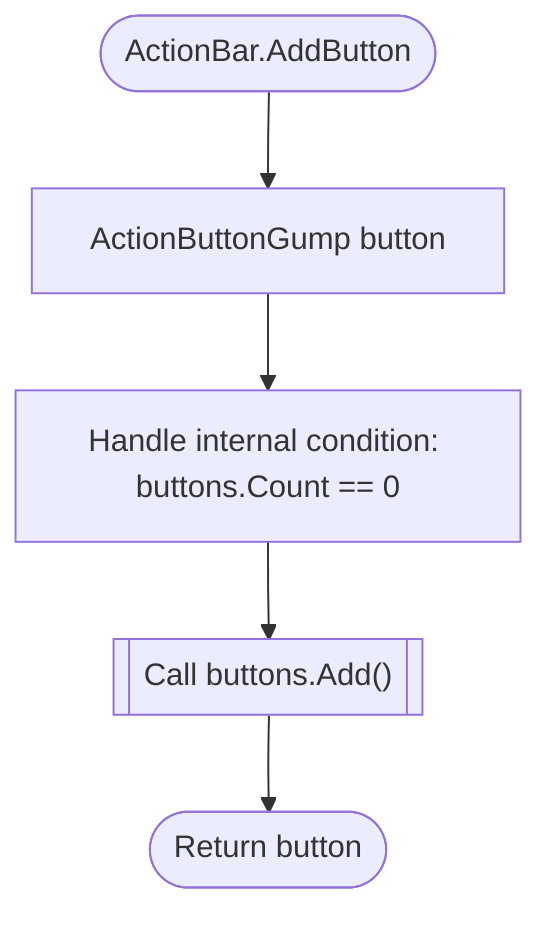

### ActionBar.Clear

`method` · `csharp` · `generic` · [`Assets/Scripts/Hollowmere/Interaction/ActionBar.cs:98`](../Assets/Scripts/Hollowmere/Interaction/ActionBar.cs#L98)

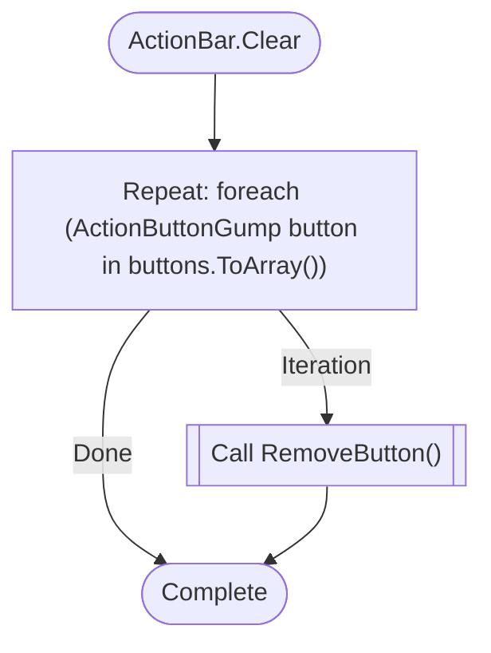

### ActionBar.Contains

`method` · `csharp` · `generic` · [`Assets/Scripts/Hollowmere/Interaction/ActionBar.cs:93`](../Assets/Scripts/Hollowmere/Interaction/ActionBar.cs#L93)

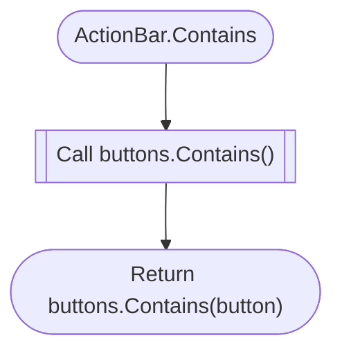

### ActionBar.RemoveButton

`method` · `csharp` · `generic` · [`Assets/Scripts/Hollowmere/Interaction/ActionBar.cs:82`](../Assets/Scripts/Hollowmere/Interaction/ActionBar.cs#L82)

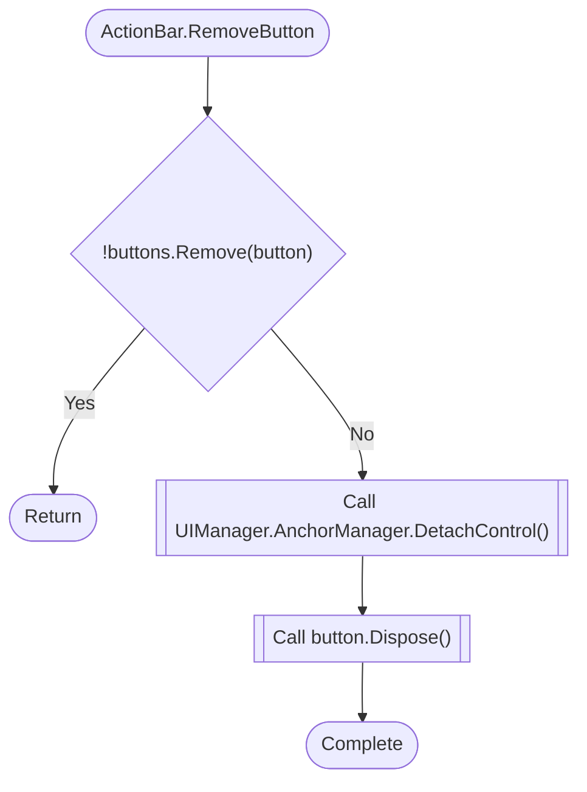

### ActionBar.Tick

`method` · `csharp` · `generic` · [`Assets/Scripts/Hollowmere/Interaction/ActionBar.cs:115`](../Assets/Scripts/Hollowmere/Interaction/ActionBar.cs#L115)

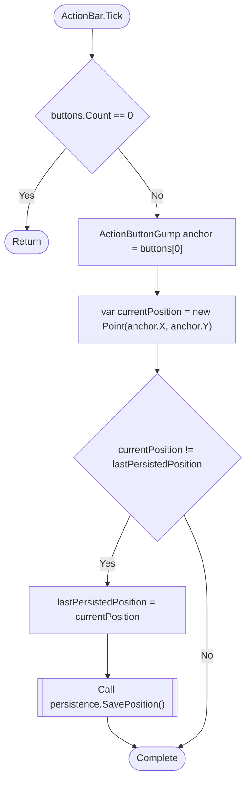

### ActionButtonGump.ActionButtonGump

`method` · `csharp` · `generic` · [`Assets/Scripts/Hollowmere/Interaction/ActionButtonGump.cs:36`](../Assets/Scripts/Hollowmere/Interaction/ActionButtonGump.cs#L36)

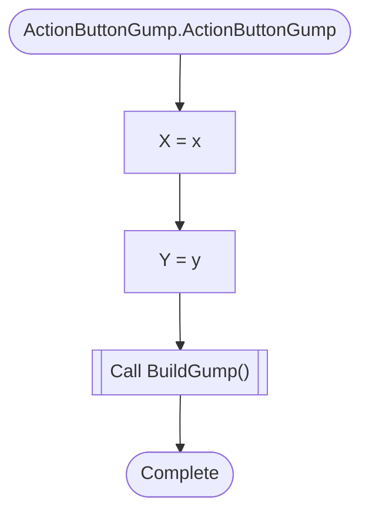

### ActionButtonGump.ActionButtonGump

`method` · `csharp` · `generic` · [`Assets/Scripts/Hollowmere/Interaction/ActionButtonGump.cs:43`](../Assets/Scripts/Hollowmere/Interaction/ActionButtonGump.cs#L43)

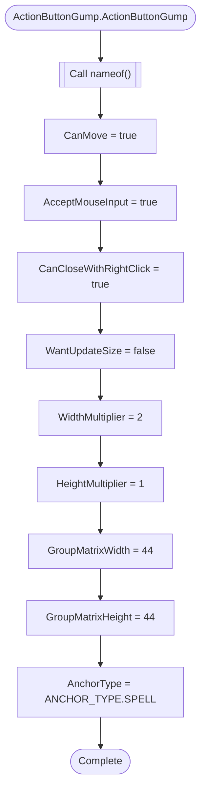

### ActionButtonGump.Draw

`method` · `csharp` · `generic` · [`Assets/Scripts/Hollowmere/Interaction/ActionButtonGump.cs:100`](../Assets/Scripts/Hollowmere/Interaction/ActionButtonGump.cs#L100)

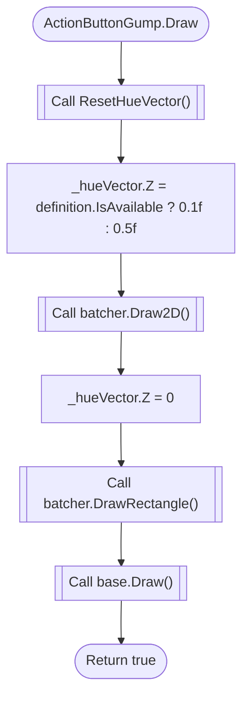

### GameActionDefinition.GameActionDefinition

`method` · `csharp` · `generic` · [`Assets/Scripts/Hollowmere/Interaction/GameActionDefinition.cs:24`](../Assets/Scripts/Hollowmere/Interaction/GameActionDefinition.cs#L24)

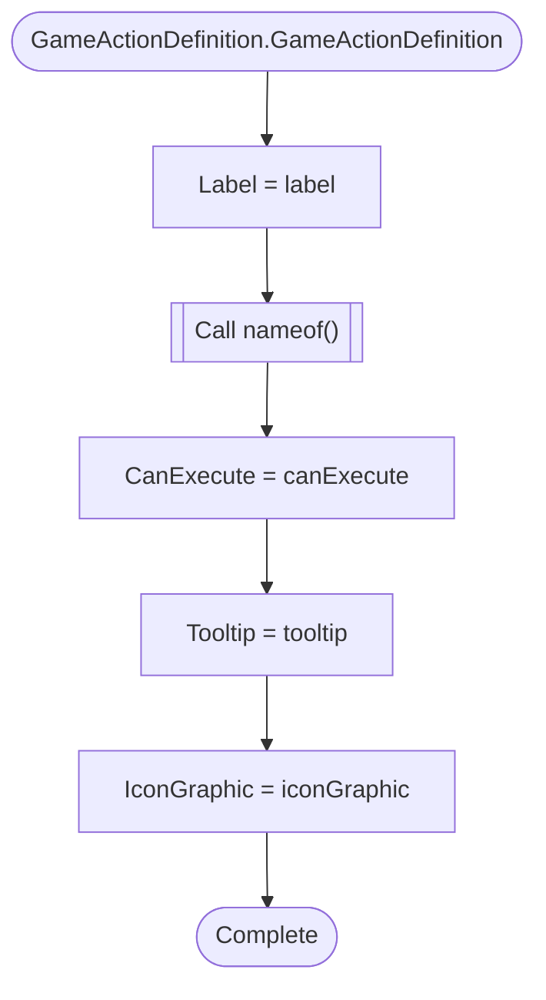

### GameActionDefinition.TryExecute

`method` · `csharp` · `generic` · [`Assets/Scripts/Hollowmere/Interaction/GameActionDefinition.cs:40`](../Assets/Scripts/Hollowmere/Interaction/GameActionDefinition.cs#L40)

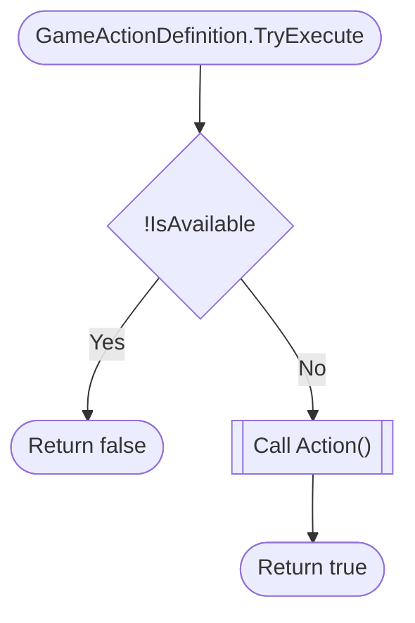

### JoystickExclusionZone.IsExcluded

`method` · `csharp` · `generic` · [`Assets/Scripts/Hollowmere/Interaction/JoystickExclusionZone.cs:22`](../Assets/Scripts/Hollowmere/Interaction/JoystickExclusionZone.cs#L22)

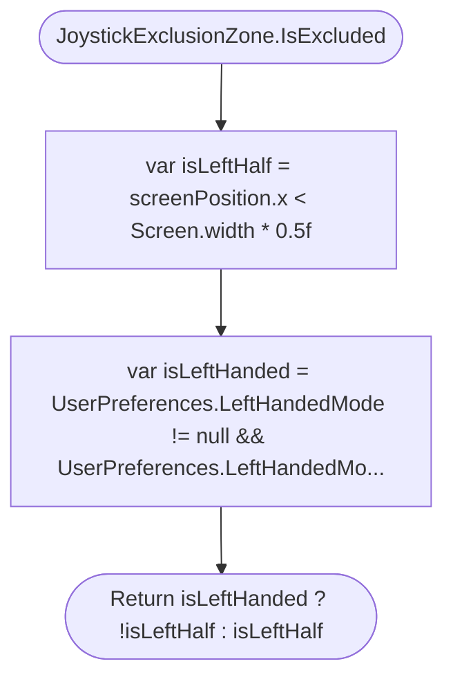

### LongPressSettings.LongPressSettings

`method` · `csharp` · `generic` · [`Assets/Scripts/Hollowmere/Interaction/LongPressSettings.cs:17`](../Assets/Scripts/Hollowmere/Interaction/LongPressSettings.cs#L17)

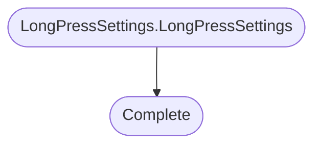

### LongPressSettings.LongPressSettings

`method` · `csharp` · `generic` · [`Assets/Scripts/Hollowmere/Interaction/LongPressSettings.cs:21`](../Assets/Scripts/Hollowmere/Interaction/LongPressSettings.cs#L21)

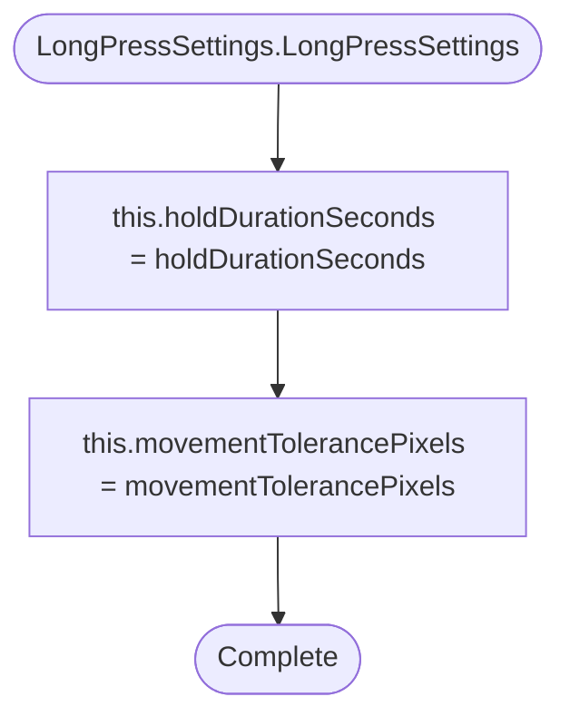

### LongPressStateMachine.LongPressStateMachine

`method` · `csharp` · `generic` · [`Assets/Scripts/Hollowmere/Interaction/LongPressStateMachine.cs:33`](../Assets/Scripts/Hollowmere/Interaction/LongPressStateMachine.cs#L33)

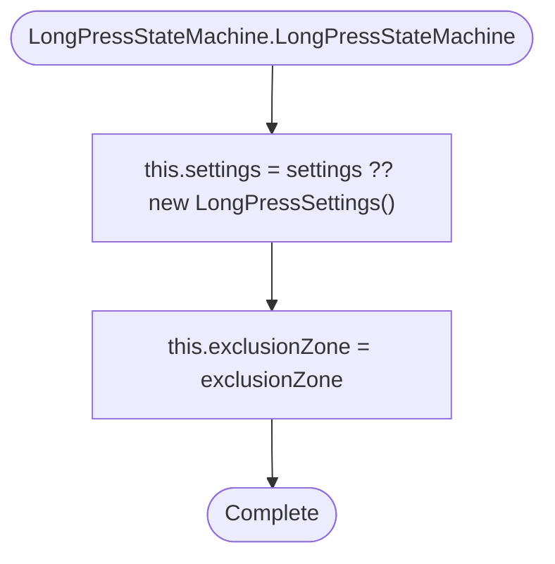

### LongPressStateMachine.OnFingerDown

`method` · `csharp` · `generic` · [`Assets/Scripts/Hollowmere/Interaction/LongPressStateMachine.cs:39`](../Assets/Scripts/Hollowmere/Interaction/LongPressStateMachine.cs#L39)

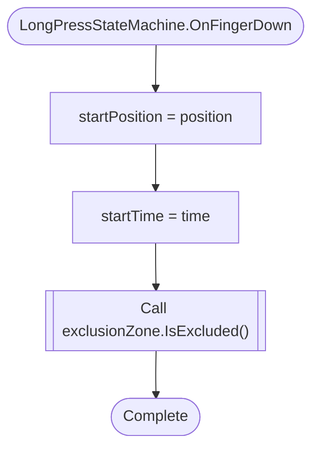

### LongPressStateMachine.OnFingerMove

`method` · `csharp` · `generic` · [`Assets/Scripts/Hollowmere/Interaction/LongPressStateMachine.cs:48`](../Assets/Scripts/Hollowmere/Interaction/LongPressStateMachine.cs#L48)

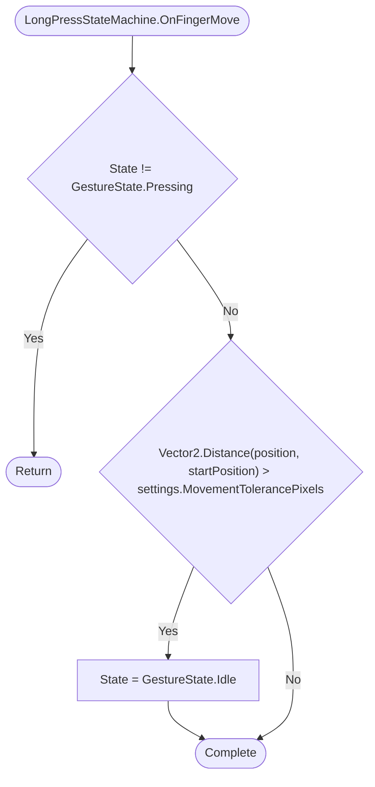

### LongPressStateMachine.OnFingerUp

`method` · `csharp` · `generic` · [`Assets/Scripts/Hollowmere/Interaction/LongPressStateMachine.cs:75`](../Assets/Scripts/Hollowmere/Interaction/LongPressStateMachine.cs#L75)

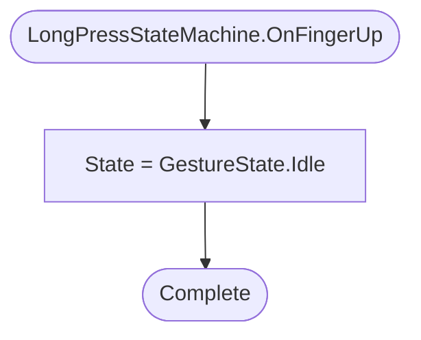

### LongPressStateMachine.Tick

`method` · `csharp` · `generic` · [`Assets/Scripts/Hollowmere/Interaction/LongPressStateMachine.cs:61`](../Assets/Scripts/Hollowmere/Interaction/LongPressStateMachine.cs#L61)

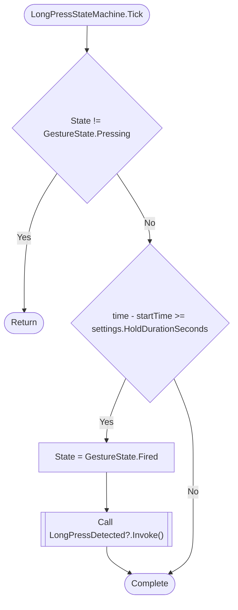

### PlayerPrefsActionBarPersistence.SavePosition

`method` · `csharp` · `generic` · [`Assets/Scripts/Hollowmere/Interaction/PlayerPrefsActionBarPersistence.cs:28`](../Assets/Scripts/Hollowmere/Interaction/PlayerPrefsActionBarPersistence.cs#L28)

```mermaid
flowchart TD
  mflow_09dc953ce94d3923_n1(["PlayerPrefsActionBarPersistence.SavePosition"])
  mflow_09dc953ce94d3923_n2[["Call PlayerPrefs.SetInt()"]]
  mflow_09dc953ce94d3923_n3[["Call PlayerPrefs.SetInt()"]]
  mflow_09dc953ce94d3923_n4[["Call PlayerPrefs.Save()"]]
  mflow_09dc953ce94d3923_n5(["Complete"])
  mflow_09dc953ce94d3923_n1 --> mflow_09dc953ce94d3923_n2
  mflow_09dc953ce94d3923_n2 --> mflow_09dc953ce94d3923_n3
  mflow_09dc953ce94d3923_n3 --> mflow_09dc953ce94d3923_n4
  mflow_09dc953ce94d3923_n4 --> mflow_09dc953ce94d3923_n5
```

### PlayerPrefsActionBarPersistence.TryLoadPosition

`method` · `csharp` · `generic` · [`Assets/Scripts/Hollowmere/Interaction/PlayerPrefsActionBarPersistence.cs:16`](../Assets/Scripts/Hollowmere/Interaction/PlayerPrefsActionBarPersistence.cs#L16)

```mermaid
flowchart TD
  mflow_95586b3c9e768610_n1(["PlayerPrefsActionBarPersistence.TryLoadPosition"])
  mflow_95586b3c9e768610_n2{"!PlayerPrefs.HasKey(key + &quot;X&quot;) || !PlayerPrefs.HasKey(key + &quot;Y&quot;)"}
  mflow_95586b3c9e768610_n3["position = default"]
  mflow_95586b3c9e768610_n4(["Return false"])
  mflow_95586b3c9e768610_n5[["Call PlayerPrefs.GetInt()"]]
  mflow_95586b3c9e768610_n6(["Return true"])
  mflow_95586b3c9e768610_n1 --> mflow_95586b3c9e768610_n2
  mflow_95586b3c9e768610_n2 -->|"Yes"| mflow_95586b3c9e768610_n3
  mflow_95586b3c9e768610_n3 --> mflow_95586b3c9e768610_n4
  mflow_95586b3c9e768610_n2 -->|"No"| mflow_95586b3c9e768610_n5
  mflow_95586b3c9e768610_n5 --> mflow_95586b3c9e768610_n6
```

### HollowmereButton.ApplyTheme

`method` · `csharp` · `generic` · [`Assets/Scripts/Hollowmere/UI/Controls/HollowmereButton.cs:68`](../Assets/Scripts/Hollowmere/UI/Controls/HollowmereButton.cs#L68)

```mermaid
flowchart TD
  mflow_a980c0b67b2d5a6c_n1(["HollowmereButton.ApplyTheme"])
  mflow_a980c0b67b2d5a6c_n2{"theme == null || button == null"}
  mflow_a980c0b67b2d5a6c_n3(["Return"])
  mflow_a980c0b67b2d5a6c_n4[["Call VariantColor()"]]
  mflow_a980c0b67b2d5a6c_n5["var colors = button.colors"]
  mflow_a980c0b67b2d5a6c_n6["colors.normalColor = baseColor"]
  mflow_a980c0b67b2d5a6c_n7[["Call Color.Lerp()"]]
  mflow_a980c0b67b2d5a6c_n8[["Call Color.Lerp()"]]
  mflow_a980c0b67b2d5a6c_n9[["Call Color.Lerp()"]]
  mflow_a980c0b67b2d5a6c_n10["colors.disabledColor = theme.Disabled"]
  mflow_a980c0b67b2d5a6c_n11["button.colors = colors"]
  mflow_a980c0b67b2d5a6c_n12(["Complete"])
  mflow_a980c0b67b2d5a6c_n1 --> mflow_a980c0b67b2d5a6c_n2
  mflow_a980c0b67b2d5a6c_n2 -->|"Yes"| mflow_a980c0b67b2d5a6c_n3
  mflow_a980c0b67b2d5a6c_n2 -->|"No"| mflow_a980c0b67b2d5a6c_n4
  mflow_a980c0b67b2d5a6c_n4 --> mflow_a980c0b67b2d5a6c_n5
  mflow_a980c0b67b2d5a6c_n5 --> mflow_a980c0b67b2d5a6c_n6
  mflow_a980c0b67b2d5a6c_n6 --> mflow_a980c0b67b2d5a6c_n7
  mflow_a980c0b67b2d5a6c_n7 --> mflow_a980c0b67b2d5a6c_n8
  mflow_a980c0b67b2d5a6c_n8 --> mflow_a980c0b67b2d5a6c_n9
  mflow_a980c0b67b2d5a6c_n9 --> mflow_a980c0b67b2d5a6c_n10
  mflow_a980c0b67b2d5a6c_n10 --> mflow_a980c0b67b2d5a6c_n11
  mflow_a980c0b67b2d5a6c_n11 --> mflow_a980c0b67b2d5a6c_n12
```

### HollowmerePanel.ApplyTheme

`method` · `csharp` · `generic` · [`Assets/Scripts/Hollowmere/UI/Panels/HollowmerePanel.cs:62`](../Assets/Scripts/Hollowmere/UI/Panels/HollowmerePanel.cs#L62)

```mermaid
flowchart TD
  mflow_59f40c3610d30c62_n1(["HollowmerePanel.ApplyTheme"])
  mflow_59f40c3610d30c62_n2{"theme == null || background == null"}
  mflow_59f40c3610d30c62_n3(["Return"])
  mflow_59f40c3610d30c62_n4["background.color = theme.Surface"]
  mflow_59f40c3610d30c62_n5["Handle internal condition: border != null"]
  mflow_59f40c3610d30c62_n6["Handle internal condition: shadow != null"]
  mflow_59f40c3610d30c62_n7(["Complete"])
  mflow_59f40c3610d30c62_n1 --> mflow_59f40c3610d30c62_n2
  mflow_59f40c3610d30c62_n2 -->|"Yes"| mflow_59f40c3610d30c62_n3
  mflow_59f40c3610d30c62_n2 -->|"No"| mflow_59f40c3610d30c62_n4
  mflow_59f40c3610d30c62_n4 --> mflow_59f40c3610d30c62_n5
  mflow_59f40c3610d30c62_n5 --> mflow_59f40c3610d30c62_n6
  mflow_59f40c3610d30c62_n6 --> mflow_59f40c3610d30c62_n7
```

### HollowmereTextStyle.ApplyTo

`method` · `csharp` · `generic` · [`Assets/Scripts/Hollowmere/UI/Theme/HollowmereTypography.cs:15`](../Assets/Scripts/Hollowmere/UI/Theme/HollowmereTypography.cs#L15)

```mermaid
flowchart TD
  mflow_38e02da4f318b790_n1(["HollowmereTextStyle.ApplyTo"])
  mflow_38e02da4f318b790_n2{"target == null"}
  mflow_38e02da4f318b790_n3(["Return"])
  mflow_38e02da4f318b790_n4["Handle internal condition: font != null"]
  mflow_38e02da4f318b790_n5["target.fontSize = fontSize"]
  mflow_38e02da4f318b790_n6["target.fontStyle = fontStyle"]
  mflow_38e02da4f318b790_n7["target.lineSpacing = lineSpacing"]
  mflow_38e02da4f318b790_n8(["Complete"])
  mflow_38e02da4f318b790_n1 --> mflow_38e02da4f318b790_n2
  mflow_38e02da4f318b790_n2 -->|"Yes"| mflow_38e02da4f318b790_n3
  mflow_38e02da4f318b790_n2 -->|"No"| mflow_38e02da4f318b790_n4
  mflow_38e02da4f318b790_n4 --> mflow_38e02da4f318b790_n5
  mflow_38e02da4f318b790_n5 --> mflow_38e02da4f318b790_n6
  mflow_38e02da4f318b790_n6 --> mflow_38e02da4f318b790_n7
  mflow_38e02da4f318b790_n7 --> mflow_38e02da4f318b790_n8
```

### HollowmereUIService.SwitchTheme

`method` · `csharp` · `generic` · [`Assets/Scripts/Hollowmere/UI/HollowmereUIService.cs:52`](../Assets/Scripts/Hollowmere/UI/HollowmereUIService.cs#L52)

```mermaid
flowchart TD
  mflow_8afb2fed6cdc049e_n1(["HollowmereUIService.SwitchTheme"])
  mflow_8afb2fed6cdc049e_n2[["Call FindTheme()"]]
  mflow_8afb2fed6cdc049e_n3{"theme == null || theme == ActiveTheme"}
  mflow_8afb2fed6cdc049e_n4(["Return false"])
  mflow_8afb2fed6cdc049e_n5["ActiveTheme = theme"]
  mflow_8afb2fed6cdc049e_n6[["Call PlayerPrefs.SetString()"]]
  mflow_8afb2fed6cdc049e_n7[["Call PlayerPrefs.Save()"]]
  mflow_8afb2fed6cdc049e_n8[["Call ThemeChanged?.Invoke()"]]
  mflow_8afb2fed6cdc049e_n9(["Return true"])
  mflow_8afb2fed6cdc049e_n1 --> mflow_8afb2fed6cdc049e_n2
  mflow_8afb2fed6cdc049e_n2 --> mflow_8afb2fed6cdc049e_n3
  mflow_8afb2fed6cdc049e_n3 -->|"Yes"| mflow_8afb2fed6cdc049e_n4
  mflow_8afb2fed6cdc049e_n3 -->|"No"| mflow_8afb2fed6cdc049e_n5
  mflow_8afb2fed6cdc049e_n5 --> mflow_8afb2fed6cdc049e_n6
  mflow_8afb2fed6cdc049e_n6 --> mflow_8afb2fed6cdc049e_n7
  mflow_8afb2fed6cdc049e_n7 --> mflow_8afb2fed6cdc049e_n8
  mflow_8afb2fed6cdc049e_n8 --> mflow_8afb2fed6cdc049e_n9
```

### ShadowPreset.ShadowPreset

`method` · `csharp` · `generic` · [`Assets/Scripts/Hollowmere/UI/HollowmereMetrics.cs:42`](../Assets/Scripts/Hollowmere/UI/HollowmereMetrics.cs#L42)

```mermaid
flowchart TD
  mflow_130b11131075e363_n1(["ShadowPreset.ShadowPreset"])
  mflow_130b11131075e363_n2["this.distance = distance"]
  mflow_130b11131075e363_n3["this.alpha = alpha"]
  mflow_130b11131075e363_n4(["Complete"])
  mflow_130b11131075e363_n1 --> mflow_130b11131075e363_n2
  mflow_130b11131075e363_n2 --> mflow_130b11131075e363_n3
  mflow_130b11131075e363_n3 --> mflow_130b11131075e363_n4
```

### AnchorGroup.AddControlToMatrix

`method` · `csharp` · `generic` · [`external/ClassicUO/src/Game/Managers/AnchorManager.cs:281`](../external/ClassicUO/src/Game/Managers/AnchorManager.cs#L281)

```mermaid
flowchart TD
  mflow_52c5ccf5ef5dd967_n1(["AnchorGroup.AddControlToMatrix"])
  mflow_52c5ccf5ef5dd967_n2["Repeat: for (int x = 0; x &lt; control.WidthMultiplier; x++)"]
  mflow_52c5ccf5ef5dd967_n3["Repeat: for (int y = 0; y &lt; control.HeightMultiplier; y++) controlMatrix[x + xinit, y + yInit] = co..."]
  mflow_52c5ccf5ef5dd967_n4["controlMatrix[x + xinit, y + yInit] = control"]
  mflow_52c5ccf5ef5dd967_n5(["Complete"])
  mflow_52c5ccf5ef5dd967_n1 --> mflow_52c5ccf5ef5dd967_n2
  mflow_52c5ccf5ef5dd967_n2 -->|"Iteration"| mflow_52c5ccf5ef5dd967_n3
  mflow_52c5ccf5ef5dd967_n3 -->|"Iteration"| mflow_52c5ccf5ef5dd967_n4
  mflow_52c5ccf5ef5dd967_n2 -->|"Done"| mflow_52c5ccf5ef5dd967_n5
  mflow_52c5ccf5ef5dd967_n3 -->|"Done"| mflow_52c5ccf5ef5dd967_n5
  mflow_52c5ccf5ef5dd967_n4 --> mflow_52c5ccf5ef5dd967_n5
```

### AnchorGroup.AnchorControlAt

`method` · `csharp` · `generic` · [`external/ClassicUO/src/Game/Managers/AnchorManager.cs:375`](../external/ClassicUO/src/Game/Managers/AnchorManager.cs#L375)

```mermaid
flowchart TD
  mflow_4b954f8a0203d0f1_n1(["AnchorGroup.AnchorControlAt"])
  mflow_4b954f8a0203d0f1_n2[["Call GetControlCoordinates()"]]
  mflow_4b954f8a0203d0f1_n3{"hostPosition.HasValue"}
  mflow_4b954f8a0203d0f1_n4["var targetX = hostPosition.Value.X + relativePosition.X"]
  mflow_4b954f8a0203d0f1_n5["var targetY = hostPosition.Value.Y + relativePosition.Y"]
  mflow_4b954f8a0203d0f1_n6{"IsEmptyDirection(targetX, targetY)"}
  mflow_4b954f8a0203d0f1_n7["Handle internal condition: targetX &lt; 0"]
  mflow_4b954f8a0203d0f1_n8["Handle internal condition: targetY &lt; 0"]
  mflow_4b954f8a0203d0f1_n9[["Call GetControlCoordinates()"]]
  mflow_4b954f8a0203d0f1_n10["Handle internal condition: hostPosition.HasValue"]
  mflow_4b954f8a0203d0f1_n11(["Complete"])
  mflow_4b954f8a0203d0f1_n1 --> mflow_4b954f8a0203d0f1_n2
  mflow_4b954f8a0203d0f1_n2 --> mflow_4b954f8a0203d0f1_n3
  mflow_4b954f8a0203d0f1_n3 -->|"Yes"| mflow_4b954f8a0203d0f1_n4
  mflow_4b954f8a0203d0f1_n4 --> mflow_4b954f8a0203d0f1_n5
  mflow_4b954f8a0203d0f1_n5 --> mflow_4b954f8a0203d0f1_n6
  mflow_4b954f8a0203d0f1_n6 -->|"Yes"| mflow_4b954f8a0203d0f1_n7
  mflow_4b954f8a0203d0f1_n7 --> mflow_4b954f8a0203d0f1_n8
  mflow_4b954f8a0203d0f1_n8 --> mflow_4b954f8a0203d0f1_n9
  mflow_4b954f8a0203d0f1_n9 --> mflow_4b954f8a0203d0f1_n10
  mflow_4b954f8a0203d0f1_n10 --> mflow_4b954f8a0203d0f1_n11
  mflow_4b954f8a0203d0f1_n6 -->|"No"| mflow_4b954f8a0203d0f1_n11
  mflow_4b954f8a0203d0f1_n3 -->|"No"| mflow_4b954f8a0203d0f1_n11
```

### AnchorGroup.AnchorGroup

`method` · `csharp` · `generic` · [`external/ClassicUO/src/Game/Managers/AnchorManager.cs:270`](../external/ClassicUO/src/Game/Managers/AnchorManager.cs#L270)

```mermaid
flowchart TD
  mflow_049fc423288402a0_n1(["AnchorGroup.AnchorGroup"])
  mflow_049fc423288402a0_n2["controlMatrix = new AnchorableGump[initial.WidthMultiplier, initial.HeightMultiplier]"]
  mflow_049fc423288402a0_n3[["Call AddControlToMatrix()"]]
  mflow_049fc423288402a0_n4(["Complete"])
  mflow_049fc423288402a0_n1 --> mflow_049fc423288402a0_n2
  mflow_049fc423288402a0_n2 --> mflow_049fc423288402a0_n3
  mflow_049fc423288402a0_n3 --> mflow_049fc423288402a0_n4
```

### AnchorGroup.AnchorGroup

`method` · `csharp` · `generic` · [`external/ClassicUO/src/Game/Managers/AnchorManager.cs:276`](../external/ClassicUO/src/Game/Managers/AnchorManager.cs#L276)

```mermaid
flowchart TD
  mflow_049fc423288402a0_n1(["AnchorGroup.AnchorGroup"])
  mflow_049fc423288402a0_n2["controlMatrix = new AnchorableGump[0, 0]"]
  mflow_049fc423288402a0_n3(["Complete"])
  mflow_049fc423288402a0_n1 --> mflow_049fc423288402a0_n2
  mflow_049fc423288402a0_n2 --> mflow_049fc423288402a0_n3
```

### AnchorGroup.DetachControl

`method` · `csharp` · `generic` · [`external/ClassicUO/src/Game/Managers/AnchorManager.cs:335`](../external/ClassicUO/src/Game/Managers/AnchorManager.cs#L335)

```mermaid
flowchart TD
  mflow_89a8f8868ae180fb_n1(["AnchorGroup.DetachControl"])
  mflow_89a8f8868ae180fb_n2["Repeat: for (int x = 0; x &lt; controlMatrix.GetLength(0); x++)"]
  mflow_89a8f8868ae180fb_n3["Repeat: for (int y = 0; y &lt; controlMatrix.GetLength(1); y++)"]
  mflow_89a8f8868ae180fb_n4["Handle internal condition: controlMatrix[x, y] == control"]
  mflow_89a8f8868ae180fb_n5(["Complete"])
  mflow_89a8f8868ae180fb_n1 --> mflow_89a8f8868ae180fb_n2
  mflow_89a8f8868ae180fb_n2 -->|"Iteration"| mflow_89a8f8868ae180fb_n3
  mflow_89a8f8868ae180fb_n3 -->|"Iteration"| mflow_89a8f8868ae180fb_n4
  mflow_89a8f8868ae180fb_n2 -->|"Done"| mflow_89a8f8868ae180fb_n5
  mflow_89a8f8868ae180fb_n3 -->|"Done"| mflow_89a8f8868ae180fb_n5
  mflow_89a8f8868ae180fb_n4 --> mflow_89a8f8868ae180fb_n5
```

### AnchorGroup.IsEmptyDirection

`method` · `csharp` · `generic` · [`external/ClassicUO/src/Game/Managers/AnchorManager.cs:410`](../external/ClassicUO/src/Game/Managers/AnchorManager.cs#L410)

```mermaid
flowchart TD
  mflow_50497efa2a80de6a_n1(["AnchorGroup.IsEmptyDirection"])
  mflow_50497efa2a80de6a_n2[["Call GetControlCoordinates()"]]
  mflow_50497efa2a80de6a_n3["bool isEmpty = true"]
  mflow_50497efa2a80de6a_n4{"hostPosition.HasValue"}
  mflow_50497efa2a80de6a_n5["var targetInitPosition = hostPosition.Value + relativePosition"]
  mflow_50497efa2a80de6a_n6["Repeat: for (int xOffset = 0; xOffset &lt; draggedControl.WidthMultiplier; xOffset++)"]
  mflow_50497efa2a80de6a_n7["Repeat: for (int yOffset = 0; yOffset &lt; draggedControl.HeightMultiplier; yOffset++) isEmpty &= IsEm..."]
  mflow_50497efa2a80de6a_n8[["Call IsEmptyDirection()"]]
  mflow_50497efa2a80de6a_n9["//// TODO: loop through"]
  mflow_50497efa2a80de6a_n10["//var targetX = hostPosition.Value.X + relativePosition.X"]
  mflow_50497efa2a80de6a_n11["//var targetY = hostPosition.Value.Y + relativePosition.Y"]
  mflow_50497efa2a80de6a_n12["//return IsEmptyDirection(targetX, targetY)"]
  mflow_50497efa2a80de6a_n13(["Return isEmpty"])
  mflow_50497efa2a80de6a_n1 --> mflow_50497efa2a80de6a_n2
  mflow_50497efa2a80de6a_n2 --> mflow_50497efa2a80de6a_n3
  mflow_50497efa2a80de6a_n3 --> mflow_50497efa2a80de6a_n4
  mflow_50497efa2a80de6a_n4 -->|"Yes"| mflow_50497efa2a80de6a_n5
  mflow_50497efa2a80de6a_n5 --> mflow_50497efa2a80de6a_n6
  mflow_50497efa2a80de6a_n6 -->|"Iteration"| mflow_50497efa2a80de6a_n7
  mflow_50497efa2a80de6a_n7 -->|"Iteration"| mflow_50497efa2a80de6a_n8
  mflow_50497efa2a80de6a_n6 -->|"Done"| mflow_50497efa2a80de6a_n9
  mflow_50497efa2a80de6a_n7 -->|"Done"| mflow_50497efa2a80de6a_n9
  mflow_50497efa2a80de6a_n8 --> mflow_50497efa2a80de6a_n9
  mflow_50497efa2a80de6a_n9 --> mflow_50497efa2a80de6a_n10
  mflow_50497efa2a80de6a_n10 --> mflow_50497efa2a80de6a_n11
  mflow_50497efa2a80de6a_n11 --> mflow_50497efa2a80de6a_n12
  mflow_50497efa2a80de6a_n12 --> mflow_50497efa2a80de6a_n13
  mflow_50497efa2a80de6a_n4 -->|"No"| mflow_50497efa2a80de6a_n13
```

### AnchorGroup.IsEmptyDirection

`method` · `csharp` · `generic` · [`external/ClassicUO/src/Game/Managers/AnchorManager.cs:435`](../external/ClassicUO/src/Game/Managers/AnchorManager.cs#L435)

```mermaid
flowchart TD
  mflow_50497efa2a80de6a_n1(["AnchorGroup.IsEmptyDirection"])
  mflow_50497efa2a80de6a_n2{"x &lt; 0 || x &gt; controlMatrix.GetLength(0) - 1 || y &lt; 0 || y &gt; controlMatrix.GetLength(1) - 1"}
  mflow_50497efa2a80de6a_n3(["Return true"])
  mflow_50497efa2a80de6a_n4(["Return controlMatrix[x, y] == null"])
  mflow_50497efa2a80de6a_n1 --> mflow_50497efa2a80de6a_n2
  mflow_50497efa2a80de6a_n2 -->|"Yes"| mflow_50497efa2a80de6a_n3
  mflow_50497efa2a80de6a_n2 -->|"No"| mflow_50497efa2a80de6a_n4
```

### AnchorGroup.Load

`method` · `csharp` · `generic` · [`external/ClassicUO/src/Game/Managers/AnchorManager.cs:317`](../external/ClassicUO/src/Game/Managers/AnchorManager.cs#L317)

```mermaid
flowchart TD
  mflow_7d756bfdf40b9786_n1(["AnchorGroup.Load"])
  mflow_7d756bfdf40b9786_n2(["Complete"])
  mflow_7d756bfdf40b9786_n1 --> mflow_7d756bfdf40b9786_n2
```

### AnchorGroup.MakeTopMost

`method` · `csharp` · `generic` · [`external/ClassicUO/src/Game/Managers/AnchorManager.cs:323`](../external/ClassicUO/src/Game/Managers/AnchorManager.cs#L323)

```mermaid
flowchart TD
  mflow_8a2ec0a6c10ab90a_n1(["AnchorGroup.MakeTopMost"])
  mflow_8a2ec0a6c10ab90a_n2["Repeat: for (int x = 0; x &lt; controlMatrix.GetLength(0); x++)"]
  mflow_8a2ec0a6c10ab90a_n3["Repeat: for (int y = 0; y &lt; controlMatrix.GetLength(1); y++)"]
  mflow_8a2ec0a6c10ab90a_n4["Handle internal condition: controlMatrix[x, y] != null"]
  mflow_8a2ec0a6c10ab90a_n5(["Complete"])
  mflow_8a2ec0a6c10ab90a_n1 --> mflow_8a2ec0a6c10ab90a_n2
  mflow_8a2ec0a6c10ab90a_n2 -->|"Iteration"| mflow_8a2ec0a6c10ab90a_n3
  mflow_8a2ec0a6c10ab90a_n3 -->|"Iteration"| mflow_8a2ec0a6c10ab90a_n4
  mflow_8a2ec0a6c10ab90a_n2 -->|"Done"| mflow_8a2ec0a6c10ab90a_n5
  mflow_8a2ec0a6c10ab90a_n3 -->|"Done"| mflow_8a2ec0a6c10ab90a_n5
  mflow_8a2ec0a6c10ab90a_n4 --> mflow_8a2ec0a6c10ab90a_n5
```

### AnchorGroup.ResizeMatrix

`method` · `csharp` · `generic` · [`external/ClassicUO/src/Game/Managers/AnchorManager.cs:458`](../external/ClassicUO/src/Game/Managers/AnchorManager.cs#L458)

```mermaid
flowchart TD
  mflow_653f56fdd76b3575_n1(["AnchorGroup.ResizeMatrix"])
  mflow_653f56fdd76b3575_n2["AnchorableGump[,] newMatrix = new AnchorableGump[xCount, yCount]"]
  mflow_653f56fdd76b3575_n3["Repeat: for (int x = 0; x &lt; controlMatrix.GetLength(0); x++)"]
  mflow_653f56fdd76b3575_n4["Repeat: for (int y = 0; y &lt; controlMatrix.GetLength(1); y++) newMatrix[x + xInitial, y + yInitial]..."]
  mflow_653f56fdd76b3575_n5["newMatrix[x + xInitial, y + yInitial] = controlMatrix[x, y]"]
  mflow_653f56fdd76b3575_n6["controlMatrix = newMatrix"]
  mflow_653f56fdd76b3575_n7(["Complete"])
  mflow_653f56fdd76b3575_n1 --> mflow_653f56fdd76b3575_n2
  mflow_653f56fdd76b3575_n2 --> mflow_653f56fdd76b3575_n3
  mflow_653f56fdd76b3575_n3 -->|"Iteration"| mflow_653f56fdd76b3575_n4
  mflow_653f56fdd76b3575_n4 -->|"Iteration"| mflow_653f56fdd76b3575_n5
  mflow_653f56fdd76b3575_n3 -->|"Done"| mflow_653f56fdd76b3575_n6
  mflow_653f56fdd76b3575_n4 -->|"Done"| mflow_653f56fdd76b3575_n6
  mflow_653f56fdd76b3575_n5 --> mflow_653f56fdd76b3575_n6
  mflow_653f56fdd76b3575_n6 --> mflow_653f56fdd76b3575_n7
```

### AnchorGroup.Save

`method` · `csharp` · `generic` · [`external/ClassicUO/src/Game/Managers/AnchorManager.cs:290`](../external/ClassicUO/src/Game/Managers/AnchorManager.cs#L290)

```mermaid
flowchart TD
  mflow_4ac80aecb685a154_n1(["AnchorGroup.Save"])
  mflow_4ac80aecb685a154_n2[["Call writer.WriteStartElement()"]]
  mflow_4ac80aecb685a154_n3[["Call writer.WriteAttributeString()"]]
  mflow_4ac80aecb685a154_n4[["Call writer.WriteAttributeString()"]]
  mflow_4ac80aecb685a154_n5["Repeat: for (int y = 0; y &lt; controlMatrix.GetLength(1); y++)"]
  mflow_4ac80aecb685a154_n6["Repeat: for (int x = 0; x &lt; controlMatrix.GetLength(0); x++)"]
  mflow_4ac80aecb685a154_n7["var gump = controlMatrix[x, y]"]
  mflow_4ac80aecb685a154_n8{"gump != null"}
  mflow_4ac80aecb685a154_n9[["Call writer.WriteStartElement()"]]
  mflow_4ac80aecb685a154_n10[["Call gump.Save()"]]
  mflow_4ac80aecb685a154_n11[["Call writer.WriteAttributeString()"]]
  mflow_4ac80aecb685a154_n12[["Call writer.WriteAttributeString()"]]
  mflow_4ac80aecb685a154_n13[["Call writer.WriteEndElement()"]]
  mflow_4ac80aecb685a154_n14[["Call writer.WriteEndElement()"]]
  mflow_4ac80aecb685a154_n15(["Complete"])
  mflow_4ac80aecb685a154_n1 --> mflow_4ac80aecb685a154_n2
  mflow_4ac80aecb685a154_n2 --> mflow_4ac80aecb685a154_n3
  mflow_4ac80aecb685a154_n3 --> mflow_4ac80aecb685a154_n4
  mflow_4ac80aecb685a154_n4 --> mflow_4ac80aecb685a154_n5
  mflow_4ac80aecb685a154_n5 -->|"Iteration"| mflow_4ac80aecb685a154_n6
  mflow_4ac80aecb685a154_n6 -->|"Iteration"| mflow_4ac80aecb685a154_n7
  mflow_4ac80aecb685a154_n7 --> mflow_4ac80aecb685a154_n8
  mflow_4ac80aecb685a154_n8 -->|"Yes"| mflow_4ac80aecb685a154_n9
  mflow_4ac80aecb685a154_n9 --> mflow_4ac80aecb685a154_n10
  mflow_4ac80aecb685a154_n10 --> mflow_4ac80aecb685a154_n11
  mflow_4ac80aecb685a154_n11 --> mflow_4ac80aecb685a154_n12
  mflow_4ac80aecb685a154_n12 --> mflow_4ac80aecb685a154_n13
  mflow_4ac80aecb685a154_n5 -->|"Done"| mflow_4ac80aecb685a154_n14
  mflow_4ac80aecb685a154_n6 -->|"Done"| mflow_4ac80aecb685a154_n14
  mflow_4ac80aecb685a154_n13 --> mflow_4ac80aecb685a154_n14
  mflow_4ac80aecb685a154_n8 -->|"No"| mflow_4ac80aecb685a154_n14
  mflow_4ac80aecb685a154_n14 --> mflow_4ac80aecb685a154_n15
```

### AnchorGroup.UpdateLocation

`method` · `csharp` · `generic` · [`external/ClassicUO/src/Game/Managers/AnchorManager.cs:347`](../external/ClassicUO/src/Game/Managers/AnchorManager.cs#L347)

```mermaid
flowchart TD
  mflow_ccd3859e83720dd5_n1(["AnchorGroup.UpdateLocation"])
  mflow_ccd3859e83720dd5_n2{"updateCount == 0"}
  mflow_ccd3859e83720dd5_n3["updateCount++"]
  mflow_ccd3859e83720dd5_n4["HashSet&lt;Control&gt; visited = new HashSet&lt;Control&gt;()"]
  mflow_ccd3859e83720dd5_n5["Repeat: for (int x = 0; x &lt; controlMatrix.GetLength(0); x++)"]
  mflow_ccd3859e83720dd5_n6["Repeat: for (int y = 0; y &lt; controlMatrix.GetLength(1); y++)"]
  mflow_ccd3859e83720dd5_n7["Handle internal condition: controlMatrix[x, y] != null && controlMatrix[x, y] != control"]
  mflow_ccd3859e83720dd5_n8["updateCount--"]
  mflow_ccd3859e83720dd5_n9(["Complete"])
  mflow_ccd3859e83720dd5_n1 --> mflow_ccd3859e83720dd5_n2
  mflow_ccd3859e83720dd5_n2 -->|"Yes"| mflow_ccd3859e83720dd5_n3
  mflow_ccd3859e83720dd5_n3 --> mflow_ccd3859e83720dd5_n4
  mflow_ccd3859e83720dd5_n4 --> mflow_ccd3859e83720dd5_n5
  mflow_ccd3859e83720dd5_n5 -->|"Iteration"| mflow_ccd3859e83720dd5_n6
  mflow_ccd3859e83720dd5_n6 -->|"Iteration"| mflow_ccd3859e83720dd5_n7
  mflow_ccd3859e83720dd5_n5 -->|"Done"| mflow_ccd3859e83720dd5_n8
  mflow_ccd3859e83720dd5_n6 -->|"Done"| mflow_ccd3859e83720dd5_n8
  mflow_ccd3859e83720dd5_n7 --> mflow_ccd3859e83720dd5_n8
  mflow_ccd3859e83720dd5_n8 --> mflow_ccd3859e83720dd5_n9
  mflow_ccd3859e83720dd5_n2 -->|"No"| mflow_ccd3859e83720dd5_n9
```

### AnchorManager.ClosestOverlappingControl

`method` · `csharp` · `generic` · [`external/ClassicUO/src/Game/Managers/AnchorManager.cs:224`](../external/ClassicUO/src/Game/Managers/AnchorManager.cs#L224)

```mermaid
flowchart TD
  mflow_21c2667f328047ab_n1(["AnchorManager.ClosestOverlappingControl"])
  mflow_21c2667f328047ab_n2{"control == null || control.IsDisposed"}
  mflow_21c2667f328047ab_n3(["Return null"])
  mflow_21c2667f328047ab_n4["AnchorableGump closestControl = null"]
  mflow_21c2667f328047ab_n5["int closestDistance = 99999"]
  mflow_21c2667f328047ab_n6["Repeat: foreach (var c in UIManager.Gumps)"]
  mflow_21c2667f328047ab_n7["Handle internal condition: !c.IsDisposed && c is AnchorableGump host && host.AnchorType == control.AnchorType"]
  mflow_21c2667f328047ab_n8(["Return closestControl"])
  mflow_21c2667f328047ab_n1 --> mflow_21c2667f328047ab_n2
  mflow_21c2667f328047ab_n2 -->|"Yes"| mflow_21c2667f328047ab_n3
  mflow_21c2667f328047ab_n2 -->|"No"| mflow_21c2667f328047ab_n4
  mflow_21c2667f328047ab_n4 --> mflow_21c2667f328047ab_n5
  mflow_21c2667f328047ab_n5 --> mflow_21c2667f328047ab_n6
  mflow_21c2667f328047ab_n6 -->|"Iteration"| mflow_21c2667f328047ab_n7
  mflow_21c2667f328047ab_n6 -->|"Done"| mflow_21c2667f328047ab_n8
  mflow_21c2667f328047ab_n7 --> mflow_21c2667f328047ab_n8
```

### AnchorManager.DetachControl

`method` · `csharp` · `generic` · [`external/ClassicUO/src/Game/Managers/AnchorManager.cs:155`](../external/ClassicUO/src/Game/Managers/AnchorManager.cs#L155)

```mermaid
flowchart TD
  mflow_5fc578eaa0a97435_n1(["AnchorManager.DetachControl"])
  mflow_5fc578eaa0a97435_n2["Handle internal condition: this[control] != null"]
  mflow_5fc578eaa0a97435_n3(["Complete"])
  mflow_5fc578eaa0a97435_n1 --> mflow_5fc578eaa0a97435_n2
  mflow_5fc578eaa0a97435_n2 --> mflow_5fc578eaa0a97435_n3
```

### AnchorManager.DisposeAllControls

`method` · `csharp` · `generic` · [`external/ClassicUO/src/Game/Managers/AnchorManager.cs:177`](../external/ClassicUO/src/Game/Managers/AnchorManager.cs#L177)

```mermaid
flowchart TD
  mflow_22e2456d9e4b1c03_n1(["AnchorManager.DisposeAllControls"])
  mflow_22e2456d9e4b1c03_n2["Handle internal condition: this[control] != null"]
  mflow_22e2456d9e4b1c03_n3(["Complete"])
  mflow_22e2456d9e4b1c03_n1 --> mflow_22e2456d9e4b1c03_n2
  mflow_22e2456d9e4b1c03_n2 --> mflow_22e2456d9e4b1c03_n3
```

### AnchorManager.DropControl

`method` · `csharp` · `generic` · [`external/ClassicUO/src/Game/Managers/AnchorManager.cs:110`](../external/ClassicUO/src/Game/Managers/AnchorManager.cs#L110)

```mermaid
flowchart TD
  mflow_f703fdd3c9549344_n1(["AnchorManager.DropControl"])
  mflow_f703fdd3c9549344_n2["Handle internal condition: host.AnchorType == draggedControl.AnchorType && this[draggedControl] == null"]
  mflow_f703fdd3c9549344_n3(["Complete"])
  mflow_f703fdd3c9549344_n1 --> mflow_f703fdd3c9549344_n2
  mflow_f703fdd3c9549344_n2 --> mflow_f703fdd3c9549344_n3
```

### AnchorManager.GetAnchorableControlUnder

`method` · `csharp` · `generic` · [`external/ClassicUO/src/Game/Managers/AnchorManager.cs:150`](../external/ClassicUO/src/Game/Managers/AnchorManager.cs#L150)

```mermaid
flowchart TD
  mflow_a7998003e79bee14_n1(["AnchorManager.GetAnchorableControlUnder"])
  mflow_a7998003e79bee14_n2[["Call ClosestOverlappingControl()"]]
  mflow_a7998003e79bee14_n3(["Return ClosestOverlappingControl(draggedControl)"])
  mflow_a7998003e79bee14_n1 --> mflow_a7998003e79bee14_n2
  mflow_a7998003e79bee14_n2 --> mflow_a7998003e79bee14_n3
```

### AnchorManager.GetCandidateDropLocation

`method` · `csharp` · `generic` · [`external/ClassicUO/src/Game/Managers/AnchorManager.cs:130`](../external/ClassicUO/src/Game/Managers/AnchorManager.cs#L130)

```mermaid
flowchart TD
  mflow_33936dd69d793fd2_n1(["AnchorManager.GetCandidateDropLocation"])
  mflow_33936dd69d793fd2_n2{"host.AnchorType == draggedControl.AnchorType && this[draggedControl] == null"}
  mflow_33936dd69d793fd2_n3[["Call GetAnchorDirection()"]]
  mflow_33936dd69d793fd2_n4{"relativePosition.HasValue"}
  mflow_33936dd69d793fd2_n5{"this[host] == null || this[host].IsEmptyDirection(draggedControl, host, relativePosition.Value)"}
  mflow_33936dd69d793fd2_n6["var offset = relativePosition.Value * new Point(g.GroupMatrixWidth, g.GroupMatrixHeight)"]
  mflow_33936dd69d793fd2_n7(["Return new Point(host.X + offset.X, host.Y + offset.Y)"])
  mflow_33936dd69d793fd2_n8(["Return draggedControl.Location"])
  mflow_33936dd69d793fd2_n1 --> mflow_33936dd69d793fd2_n2
  mflow_33936dd69d793fd2_n2 -->|"Yes"| mflow_33936dd69d793fd2_n3
  mflow_33936dd69d793fd2_n3 --> mflow_33936dd69d793fd2_n4
  mflow_33936dd69d793fd2_n4 -->|"Yes"| mflow_33936dd69d793fd2_n5
  mflow_33936dd69d793fd2_n5 -->|"Yes"| mflow_33936dd69d793fd2_n6
  mflow_33936dd69d793fd2_n6 --> mflow_33936dd69d793fd2_n7
  mflow_33936dd69d793fd2_n5 -->|"No"| mflow_33936dd69d793fd2_n8
  mflow_33936dd69d793fd2_n4 -->|"No"| mflow_33936dd69d793fd2_n8
  mflow_33936dd69d793fd2_n2 -->|"No"| mflow_33936dd69d793fd2_n8
```

### AnchorManager.Save

`method` · `csharp` · `generic` · [`external/ClassicUO/src/Game/Managers/AnchorManager.cs:90`](../external/ClassicUO/src/Game/Managers/AnchorManager.cs#L90)

```mermaid
flowchart TD
  mflow_430e9a20991970b4_n1(["AnchorManager.Save"])
  mflow_430e9a20991970b4_n2["Repeat: foreach (AnchorGroup value in reverseMap.Values.Distinct())"]
  mflow_430e9a20991970b4_n3[["Call value.Save()"]]
  mflow_430e9a20991970b4_n4(["Complete"])
  mflow_430e9a20991970b4_n1 --> mflow_430e9a20991970b4_n2
  mflow_430e9a20991970b4_n2 -->|"Iteration"| mflow_430e9a20991970b4_n3
  mflow_430e9a20991970b4_n2 -->|"Done"| mflow_430e9a20991970b4_n4
  mflow_430e9a20991970b4_n3 --> mflow_430e9a20991970b4_n4
```

### DelayedObjectClickManager.Clear

`method` · `csharp` · `generic` · [`external/ClassicUO/src/Game/Managers/DelayedObjectClickManager.cs:77`](../external/ClassicUO/src/Game/Managers/DelayedObjectClickManager.cs#L77)

```mermaid
flowchart TD
  mflow_eae6c475bb532b51_n1(["DelayedObjectClickManager.Clear"])
  mflow_eae6c475bb532b51_n2["IsEnabled = false"]
  mflow_eae6c475bb532b51_n3["Serial = 0xFFFF_FFFF"]
  mflow_eae6c475bb532b51_n4["Timer = 0"]
  mflow_eae6c475bb532b51_n5(["Complete"])
  mflow_eae6c475bb532b51_n1 --> mflow_eae6c475bb532b51_n2
  mflow_eae6c475bb532b51_n2 --> mflow_eae6c475bb532b51_n3
  mflow_eae6c475bb532b51_n3 --> mflow_eae6c475bb532b51_n4
  mflow_eae6c475bb532b51_n4 --> mflow_eae6c475bb532b51_n5
```

### DelayedObjectClickManager.Clear

`method` · `csharp` · `generic` · [`external/ClassicUO/src/Game/Managers/DelayedObjectClickManager.cs:84`](../external/ClassicUO/src/Game/Managers/DelayedObjectClickManager.cs#L84)

```mermaid
flowchart TD
  mflow_eae6c475bb532b51_n1(["DelayedObjectClickManager.Clear"])
  mflow_eae6c475bb532b51_n2["Handle internal condition: Serial == serial"]
  mflow_eae6c475bb532b51_n3(["Complete"])
  mflow_eae6c475bb532b51_n1 --> mflow_eae6c475bb532b51_n2
  mflow_eae6c475bb532b51_n2 --> mflow_eae6c475bb532b51_n3
```

### DelayedObjectClickManager.Set

`method` · `csharp` · `generic` · [`external/ClassicUO/src/Game/Managers/DelayedObjectClickManager.cs:66`](../external/ClassicUO/src/Game/Managers/DelayedObjectClickManager.cs#L66)

```mermaid
flowchart TD
  mflow_209247736eb29ad7_n1(["DelayedObjectClickManager.Set"])
  mflow_209247736eb29ad7_n2["Serial = serial"]
  mflow_209247736eb29ad7_n3["LastMouseX = Mouse.Position.X"]
  mflow_209247736eb29ad7_n4["LastMouseY = Mouse.Position.Y"]
  mflow_209247736eb29ad7_n5["X = x"]
  mflow_209247736eb29ad7_n6["Y = y"]
  mflow_209247736eb29ad7_n7["Timer = timer"]
  mflow_209247736eb29ad7_n8["IsEnabled = true"]
  mflow_209247736eb29ad7_n9(["Complete"])
  mflow_209247736eb29ad7_n1 --> mflow_209247736eb29ad7_n2
  mflow_209247736eb29ad7_n2 --> mflow_209247736eb29ad7_n3
  mflow_209247736eb29ad7_n3 --> mflow_209247736eb29ad7_n4
  mflow_209247736eb29ad7_n4 --> mflow_209247736eb29ad7_n5
  mflow_209247736eb29ad7_n5 --> mflow_209247736eb29ad7_n6
  mflow_209247736eb29ad7_n6 --> mflow_209247736eb29ad7_n7
  mflow_209247736eb29ad7_n7 --> mflow_209247736eb29ad7_n8
  mflow_209247736eb29ad7_n8 --> mflow_209247736eb29ad7_n9
```

### DelayedObjectClickManager.Update

`method` · `csharp` · `generic` · [`external/ClassicUO/src/Game/Managers/DelayedObjectClickManager.cs:39`](../external/ClassicUO/src/Game/Managers/DelayedObjectClickManager.cs#L39)

```mermaid
flowchart TD
  mflow_13161619ee7008d9_n1(["DelayedObjectClickManager.Update"])
  mflow_13161619ee7008d9_n2{"!IsEnabled || Timer &gt; Time.Ticks"}
  mflow_13161619ee7008d9_n3(["Return"])
  mflow_13161619ee7008d9_n4[["Call World.Get()"]]
  mflow_13161619ee7008d9_n5["Handle internal condition: entity != null"]
  mflow_13161619ee7008d9_n6[["Call Clear()"]]
  mflow_13161619ee7008d9_n7(["Complete"])
  mflow_13161619ee7008d9_n1 --> mflow_13161619ee7008d9_n2
  mflow_13161619ee7008d9_n2 -->|"Yes"| mflow_13161619ee7008d9_n3
  mflow_13161619ee7008d9_n2 -->|"No"| mflow_13161619ee7008d9_n4
  mflow_13161619ee7008d9_n4 --> mflow_13161619ee7008d9_n5
  mflow_13161619ee7008d9_n5 --> mflow_13161619ee7008d9_n6
  mflow_13161619ee7008d9_n6 --> mflow_13161619ee7008d9_n7
```

### LastTargetInfo.Clear

`method` · `csharp` · `generic` · [`external/ClassicUO/src/Game/Managers/TargetManager.cs:110`](../external/ClassicUO/src/Game/Managers/TargetManager.cs#L110)

```mermaid
flowchart TD
  mflow_b3b8a9a900ef674b_n1(["LastTargetInfo.Clear"])
  mflow_b3b8a9a900ef674b_n2["Serial = 0"]
  mflow_b3b8a9a900ef674b_n3["Graphic = 0xFFFF"]
  mflow_b3b8a9a900ef674b_n4["X = Y = 0xFFFF"]
  mflow_b3b8a9a900ef674b_n5["Z = sbyte.MinValue"]
  mflow_b3b8a9a900ef674b_n6(["Complete"])
  mflow_b3b8a9a900ef674b_n1 --> mflow_b3b8a9a900ef674b_n2
  mflow_b3b8a9a900ef674b_n2 --> mflow_b3b8a9a900ef674b_n3
  mflow_b3b8a9a900ef674b_n3 --> mflow_b3b8a9a900ef674b_n4
  mflow_b3b8a9a900ef674b_n4 --> mflow_b3b8a9a900ef674b_n5
  mflow_b3b8a9a900ef674b_n5 --> mflow_b3b8a9a900ef674b_n6
```

### LastTargetInfo.SetEntity

`method` · `csharp` · `generic` · [`external/ClassicUO/src/Game/Managers/TargetManager.cs:84`](../external/ClassicUO/src/Game/Managers/TargetManager.cs#L84)

```mermaid
flowchart TD
  mflow_da13d87d3274e102_n1(["LastTargetInfo.SetEntity"])
  mflow_da13d87d3274e102_n2["Serial = serial"]
  mflow_da13d87d3274e102_n3["Graphic = 0xFFFF"]
  mflow_da13d87d3274e102_n4["X = Y = 0xFFFF"]
  mflow_da13d87d3274e102_n5["Z = sbyte.MinValue"]
  mflow_da13d87d3274e102_n6(["Complete"])
  mflow_da13d87d3274e102_n1 --> mflow_da13d87d3274e102_n2
  mflow_da13d87d3274e102_n2 --> mflow_da13d87d3274e102_n3
  mflow_da13d87d3274e102_n3 --> mflow_da13d87d3274e102_n4
  mflow_da13d87d3274e102_n4 --> mflow_da13d87d3274e102_n5
  mflow_da13d87d3274e102_n5 --> mflow_da13d87d3274e102_n6
```

### LastTargetInfo.SetLand

`method` · `csharp` · `generic` · [`external/ClassicUO/src/Game/Managers/TargetManager.cs:101`](../external/ClassicUO/src/Game/Managers/TargetManager.cs#L101)

```mermaid
flowchart TD
  mflow_f6062b1e861bab6f_n1(["LastTargetInfo.SetLand"])
  mflow_f6062b1e861bab6f_n2["Serial = 0"]
  mflow_f6062b1e861bab6f_n3["Graphic = 0xFFFF"]
  mflow_f6062b1e861bab6f_n4["X = x"]
  mflow_f6062b1e861bab6f_n5["Y = y"]
  mflow_f6062b1e861bab6f_n6["Z = z"]
  mflow_f6062b1e861bab6f_n7(["Complete"])
  mflow_f6062b1e861bab6f_n1 --> mflow_f6062b1e861bab6f_n2
  mflow_f6062b1e861bab6f_n2 --> mflow_f6062b1e861bab6f_n3
  mflow_f6062b1e861bab6f_n3 --> mflow_f6062b1e861bab6f_n4
  mflow_f6062b1e861bab6f_n4 --> mflow_f6062b1e861bab6f_n5
  mflow_f6062b1e861bab6f_n5 --> mflow_f6062b1e861bab6f_n6
  mflow_f6062b1e861bab6f_n6 --> mflow_f6062b1e861bab6f_n7
```

### LastTargetInfo.SetStatic

`method` · `csharp` · `generic` · [`external/ClassicUO/src/Game/Managers/TargetManager.cs:92`](../external/ClassicUO/src/Game/Managers/TargetManager.cs#L92)

```mermaid
flowchart TD
  mflow_91525a0d487f6456_n1(["LastTargetInfo.SetStatic"])
  mflow_91525a0d487f6456_n2["Serial = 0"]
  mflow_91525a0d487f6456_n3["Graphic = graphic"]
  mflow_91525a0d487f6456_n4["X = x"]
  mflow_91525a0d487f6456_n5["Y = y"]
  mflow_91525a0d487f6456_n6["Z = z"]
  mflow_91525a0d487f6456_n7(["Complete"])
  mflow_91525a0d487f6456_n1 --> mflow_91525a0d487f6456_n2
  mflow_91525a0d487f6456_n2 --> mflow_91525a0d487f6456_n3
  mflow_91525a0d487f6456_n3 --> mflow_91525a0d487f6456_n4
  mflow_91525a0d487f6456_n4 --> mflow_91525a0d487f6456_n5
  mflow_91525a0d487f6456_n5 --> mflow_91525a0d487f6456_n6
  mflow_91525a0d487f6456_n6 --> mflow_91525a0d487f6456_n7
```

### MultiTargetInfo.MultiTargetInfo

`method` · `csharp` · `generic` · [`external/ClassicUO/src/Game/Managers/TargetManager.cs:62`](../external/ClassicUO/src/Game/Managers/TargetManager.cs#L62)

```mermaid
flowchart TD
  mflow_ba4cbf2417d95e9b_n1(["MultiTargetInfo.MultiTargetInfo"])
  mflow_ba4cbf2417d95e9b_n2["Model = model"]
  mflow_ba4cbf2417d95e9b_n3["XOff = x"]
  mflow_ba4cbf2417d95e9b_n4["YOff = y"]
  mflow_ba4cbf2417d95e9b_n5["ZOff = z"]
  mflow_ba4cbf2417d95e9b_n6["Hue = hue"]
  mflow_ba4cbf2417d95e9b_n7(["Complete"])
  mflow_ba4cbf2417d95e9b_n1 --> mflow_ba4cbf2417d95e9b_n2
  mflow_ba4cbf2417d95e9b_n2 --> mflow_ba4cbf2417d95e9b_n3
  mflow_ba4cbf2417d95e9b_n3 --> mflow_ba4cbf2417d95e9b_n4
  mflow_ba4cbf2417d95e9b_n4 --> mflow_ba4cbf2417d95e9b_n5
  mflow_ba4cbf2417d95e9b_n5 --> mflow_ba4cbf2417d95e9b_n6
  mflow_ba4cbf2417d95e9b_n6 --> mflow_ba4cbf2417d95e9b_n7
```

### TargetManager.CancelTarget

`method` · `csharp` · `generic` · [`external/ClassicUO/src/Game/Managers/TargetManager.cs:182`](../external/ClassicUO/src/Game/Managers/TargetManager.cs#L182)

```mermaid
flowchart TD
  mflow_6c4fbe875dacd54c_n1(["TargetManager.CancelTarget"])
  mflow_6c4fbe875dacd54c_n2{"TargetingState == CursorTarget.MultiPlacement"}
  mflow_6c4fbe875dacd54c_n3[["Call World.HouseManager.Remove()"]]
  mflow_6c4fbe875dacd54c_n4{"World.CustomHouseManager != null"}
  mflow_6c4fbe875dacd54c_n5["World.CustomHouseManager.Erasing = false"]
  mflow_6c4fbe875dacd54c_n6["World.CustomHouseManager.SeekTile = false"]
  mflow_6c4fbe875dacd54c_n7["World.CustomHouseManager.SelectedGraphic = 0"]
  mflow_6c4fbe875dacd54c_n8["World.CustomHouseManager.CombinedStair = false"]
  mflow_6c4fbe875dacd54c_n9[["Call UIManager.GetGump&lt;HouseCustomizationGump&gt;()?.Update()"]]
  mflow_6c4fbe875dacd54c_n10[["Call NetClient.Socket.Send()"]]
  mflow_6c4fbe875dacd54c_n11["IsTargeting = false"]
  mflow_6c4fbe875dacd54c_n12[["Call Reset()"]]
  mflow_6c4fbe875dacd54c_n13(["Complete"])
  mflow_6c4fbe875dacd54c_n1 --> mflow_6c4fbe875dacd54c_n2
  mflow_6c4fbe875dacd54c_n2 -->|"Yes"| mflow_6c4fbe875dacd54c_n3
  mflow_6c4fbe875dacd54c_n3 --> mflow_6c4fbe875dacd54c_n4
  mflow_6c4fbe875dacd54c_n4 -->|"Yes"| mflow_6c4fbe875dacd54c_n5
  mflow_6c4fbe875dacd54c_n5 --> mflow_6c4fbe875dacd54c_n6
  mflow_6c4fbe875dacd54c_n6 --> mflow_6c4fbe875dacd54c_n7
  mflow_6c4fbe875dacd54c_n7 --> mflow_6c4fbe875dacd54c_n8
  mflow_6c4fbe875dacd54c_n8 --> mflow_6c4fbe875dacd54c_n9
  mflow_6c4fbe875dacd54c_n9 --> mflow_6c4fbe875dacd54c_n10
  mflow_6c4fbe875dacd54c_n4 -->|"No"| mflow_6c4fbe875dacd54c_n10
  mflow_6c4fbe875dacd54c_n2 -->|"No"| mflow_6c4fbe875dacd54c_n10
  mflow_6c4fbe875dacd54c_n10 --> mflow_6c4fbe875dacd54c_n11
  mflow_6c4fbe875dacd54c_n11 --> mflow_6c4fbe875dacd54c_n12
  mflow_6c4fbe875dacd54c_n12 --> mflow_6c4fbe875dacd54c_n13
```

### TargetManager.Reset

`method` · `csharp` · `generic` · [`external/ClassicUO/src/Game/Managers/TargetManager.cs:149`](../external/ClassicUO/src/Game/Managers/TargetManager.cs#L149)

```mermaid
flowchart TD
  mflow_15d1d06984d304c7_n1(["TargetManager.Reset"])
  mflow_15d1d06984d304c7_n2[["Call ClearTargetingWithoutTargetCancelPacket()"]]
  mflow_15d1d06984d304c7_n3["TargetingState = 0"]
  mflow_15d1d06984d304c7_n4["_targetCursorId = 0"]
  mflow_15d1d06984d304c7_n5["MultiTargetInfo = null"]
  mflow_15d1d06984d304c7_n6["TargetingType = 0"]
  mflow_15d1d06984d304c7_n7(["Complete"])
  mflow_15d1d06984d304c7_n1 --> mflow_15d1d06984d304c7_n2
  mflow_15d1d06984d304c7_n2 --> mflow_15d1d06984d304c7_n3
  mflow_15d1d06984d304c7_n3 --> mflow_15d1d06984d304c7_n4
  mflow_15d1d06984d304c7_n4 --> mflow_15d1d06984d304c7_n5
  mflow_15d1d06984d304c7_n5 --> mflow_15d1d06984d304c7_n6
  mflow_15d1d06984d304c7_n6 --> mflow_15d1d06984d304c7_n7
```

### TargetManager.SendMultiTarget

`method` · `csharp` · `generic` · [`external/ClassicUO/src/Game/Managers/TargetManager.cs:356`](../external/ClassicUO/src/Game/Managers/TargetManager.cs#L356)

```mermaid
flowchart TD
  mflow_454781ed5d89e2b2_n1(["TargetManager.SendMultiTarget"])
  mflow_454781ed5d89e2b2_n2[["Call TargetPacket()"]]
  mflow_454781ed5d89e2b2_n3["MultiTargetInfo = null"]
  mflow_454781ed5d89e2b2_n4(["Complete"])
  mflow_454781ed5d89e2b2_n1 --> mflow_454781ed5d89e2b2_n2
  mflow_454781ed5d89e2b2_n2 --> mflow_454781ed5d89e2b2_n3
  mflow_454781ed5d89e2b2_n3 --> mflow_454781ed5d89e2b2_n4
```

### TargetManager.SetTargeting

`method` · `csharp` · `generic` · [`external/ClassicUO/src/Game/Managers/TargetManager.cs:159`](../external/ClassicUO/src/Game/Managers/TargetManager.cs#L159)

```mermaid
flowchart TD
  mflow_72441ea06fd7728d_n1(["TargetManager.SetTargeting"])
  mflow_72441ea06fd7728d_n2{"targeting == CursorTarget.Invalid"}
  mflow_72441ea06fd7728d_n3(["Return"])
  mflow_72441ea06fd7728d_n4["TargetingState = targeting"]
  mflow_72441ea06fd7728d_n5["_targetCursorId = cursorID"]
  mflow_72441ea06fd7728d_n6["TargetingType = cursorType"]
  mflow_72441ea06fd7728d_n7["bool lastTargetting = IsTargeting"]
  mflow_72441ea06fd7728d_n8["IsTargeting = cursorType &lt; TargetType.Cancel"]
  mflow_72441ea06fd7728d_n9["Handle internal condition: IsTargeting"]
  mflow_72441ea06fd7728d_n10(["Complete"])
  mflow_72441ea06fd7728d_n1 --> mflow_72441ea06fd7728d_n2
  mflow_72441ea06fd7728d_n2 -->|"Yes"| mflow_72441ea06fd7728d_n3
  mflow_72441ea06fd7728d_n2 -->|"No"| mflow_72441ea06fd7728d_n4
  mflow_72441ea06fd7728d_n4 --> mflow_72441ea06fd7728d_n5
  mflow_72441ea06fd7728d_n5 --> mflow_72441ea06fd7728d_n6
  mflow_72441ea06fd7728d_n6 --> mflow_72441ea06fd7728d_n7
  mflow_72441ea06fd7728d_n7 --> mflow_72441ea06fd7728d_n8
  mflow_72441ea06fd7728d_n8 --> mflow_72441ea06fd7728d_n9
  mflow_72441ea06fd7728d_n9 --> mflow_72441ea06fd7728d_n10
```

### TargetManager.SetTargetingMulti

`method` · `csharp` · `generic` · [`external/ClassicUO/src/Game/Managers/TargetManager.cs:205`](../external/ClassicUO/src/Game/Managers/TargetManager.cs#L205)

```mermaid
flowchart TD
  mflow_eb1c07e3330647f0_n1(["TargetManager.SetTargetingMulti"])
  mflow_eb1c07e3330647f0_n2[["Call SetTargeting()"]]
  mflow_eb1c07e3330647f0_n3["//if (model != 0)"]
  mflow_eb1c07e3330647f0_n4["MultiTargetInfo = new MultiTargetInfo(model, x, y, z, hue)"]
  mflow_eb1c07e3330647f0_n5(["Complete"])
  mflow_eb1c07e3330647f0_n1 --> mflow_eb1c07e3330647f0_n2
  mflow_eb1c07e3330647f0_n2 --> mflow_eb1c07e3330647f0_n3
  mflow_eb1c07e3330647f0_n3 --> mflow_eb1c07e3330647f0_n4
  mflow_eb1c07e3330647f0_n4 --> mflow_eb1c07e3330647f0_n5
```

### TargetManager.Target

`method` · `csharp` · `generic` · [`external/ClassicUO/src/Game/Managers/TargetManager.cs:214`](../external/ClassicUO/src/Game/Managers/TargetManager.cs#L214)

```mermaid
flowchart TD
  mflow_f16239bc4bbfb3f4_n1(["TargetManager.Target"])
  mflow_f16239bc4bbfb3f4_n2{"!IsTargeting"}
  mflow_f16239bc4bbfb3f4_n3(["Return"])
  mflow_f16239bc4bbfb3f4_n4[["Call World.Get()"]]
  mflow_f16239bc4bbfb3f4_n5{"entity != null"}
  mflow_f16239bc4bbfb3f4_n6{"Switch on TargetingState"}
  mflow_f16239bc4bbfb3f4_n7(["Return"])
  mflow_f16239bc4bbfb3f4_n8["Handle internal condition: entity != World.Player"]
  mflow_f16239bc4bbfb3f4_n9["Handle internal condition: SerialHelper.IsMobile(serial) && serial != World.Player && (World.Player.NotorietyFlag == No..."]
  mflow_f16239bc4bbfb3f4_n10{"TargetingState != CursorTarget.SetTargetClientSide"}
  mflow_f16239bc4bbfb3f4_n11["var packet = new PTargetObject(entity, entity.Graphic, entity.X, entity.Y, entity.Z, _tar..."]
  mflow_f16239bc4bbfb3f4_n12["Repeat: for (int i = 0; i &lt; _lastDataBuffer.Length; i++)"]
  mflow_f16239bc4bbfb3f4_n13["_lastDataBuffer[i] = packet[i]"]
  mflow_f16239bc4bbfb3f4_n14[["Call NetClient.Socket.Send()"]]
  mflow_f16239bc4bbfb3f4_n15{"SerialHelper.IsMobile(serial) && LastTargetInfo.Serial != serial"}
  mflow_f16239bc4bbfb3f4_n16[["Call GameActions.RequestMobileStatus()"]]
  mflow_f16239bc4bbfb3f4_n17[["Call ClearTargetingWithoutTargetCancelPacket()"]]
  mflow_f16239bc4bbfb3f4_n18["Mouse.CancelDoubleClick = true"]
  mflow_f16239bc4bbfb3f4_n19["Break loop"]
  mflow_f16239bc4bbfb3f4_n20["Handle internal condition: SerialHelper.IsItem(serial)"]
  mflow_f16239bc4bbfb3f4_n21[["Call ClearTargetingWithoutTargetCancelPacket()"]]
  mflow_f16239bc4bbfb3f4_n22(["Return"])
  mflow_f16239bc4bbfb3f4_n23["Handle internal condition: SerialHelper.IsItem(serial)"]
  mflow_f16239bc4bbfb3f4_n24[["Call ClearTargetingWithoutTargetCancelPacket()"]]
  mflow_f16239bc4bbfb3f4_n25(["Return"])
  mflow_f16239bc4bbfb3f4_n26(["Complete"])
  mflow_f16239bc4bbfb3f4_n1 --> mflow_f16239bc4bbfb3f4_n2
  mflow_f16239bc4bbfb3f4_n2 -->|"Yes"| mflow_f16239bc4bbfb3f4_n3
  mflow_f16239bc4bbfb3f4_n2 -->|"No"| mflow_f16239bc4bbfb3f4_n4
  mflow_f16239bc4bbfb3f4_n4 --> mflow_f16239bc4bbfb3f4_n5
  mflow_f16239bc4bbfb3f4_n5 -->|"Yes"| mflow_f16239bc4bbfb3f4_n6
  mflow_f16239bc4bbfb3f4_n6 -->|"CursorTarget.Invalid"| mflow_f16239bc4bbfb3f4_n7
  mflow_f16239bc4bbfb3f4_n6 -->|"CursorTarget.SetTargetClientSide"| mflow_f16239bc4bbfb3f4_n8
  mflow_f16239bc4bbfb3f4_n8 --> mflow_f16239bc4bbfb3f4_n9
  mflow_f16239bc4bbfb3f4_n9 --> mflow_f16239bc4bbfb3f4_n10
  mflow_f16239bc4bbfb3f4_n10 -->|"Yes"| mflow_f16239bc4bbfb3f4_n11
  mflow_f16239bc4bbfb3f4_n11 --> mflow_f16239bc4bbfb3f4_n12
  mflow_f16239bc4bbfb3f4_n12 -->|"Iteration"| mflow_f16239bc4bbfb3f4_n13
  mflow_f16239bc4bbfb3f4_n12 -->|"Done"| mflow_f16239bc4bbfb3f4_n14
  mflow_f16239bc4bbfb3f4_n13 --> mflow_f16239bc4bbfb3f4_n14
  mflow_f16239bc4bbfb3f4_n14 --> mflow_f16239bc4bbfb3f4_n15
  mflow_f16239bc4bbfb3f4_n15 -->|"Yes"| mflow_f16239bc4bbfb3f4_n16
  mflow_f16239bc4bbfb3f4_n16 --> mflow_f16239bc4bbfb3f4_n17
  mflow_f16239bc4bbfb3f4_n15 -->|"No"| mflow_f16239bc4bbfb3f4_n17
  mflow_f16239bc4bbfb3f4_n10 -->|"No"| mflow_f16239bc4bbfb3f4_n17
  mflow_f16239bc4bbfb3f4_n17 --> mflow_f16239bc4bbfb3f4_n18
  mflow_f16239bc4bbfb3f4_n18 --> mflow_f16239bc4bbfb3f4_n19
  mflow_f16239bc4bbfb3f4_n6 -->|"CursorTarget.Grab"| mflow_f16239bc4bbfb3f4_n20
  mflow_f16239bc4bbfb3f4_n20 --> mflow_f16239bc4bbfb3f4_n21
  mflow_f16239bc4bbfb3f4_n21 --> mflow_f16239bc4bbfb3f4_n22
  mflow_f16239bc4bbfb3f4_n6 -->|"CursorTarget.SetGrabBag"| mflow_f16239bc4bbfb3f4_n23
  mflow_f16239bc4bbfb3f4_n23 --> mflow_f16239bc4bbfb3f4_n24
  mflow_f16239bc4bbfb3f4_n24 --> mflow_f16239bc4bbfb3f4_n25
  mflow_f16239bc4bbfb3f4_n6 -->|"CursorTarget.MultiPlacement"| mflow_f16239bc4bbfb3f4_n26
  mflow_f16239bc4bbfb3f4_n6 -->|"CursorTarget.Position"| mflow_f16239bc4bbfb3f4_n26
  mflow_f16239bc4bbfb3f4_n6 -->|"CursorTarget.Object"| mflow_f16239bc4bbfb3f4_n26
  mflow_f16239bc4bbfb3f4_n6 -->|"CursorTarget.HueCommandTarget"| mflow_f16239bc4bbfb3f4_n26
  mflow_f16239bc4bbfb3f4_n19 --> mflow_f16239bc4bbfb3f4_n26
  mflow_f16239bc4bbfb3f4_n6 -->|"default"| mflow_f16239bc4bbfb3f4_n26
  mflow_f16239bc4bbfb3f4_n5 -->|"No"| mflow_f16239bc4bbfb3f4_n26
```

### TargetManager.Target

`method` · `csharp` · `generic` · [`external/ClassicUO/src/Game/Managers/TargetManager.cs:328`](../external/ClassicUO/src/Game/Managers/TargetManager.cs#L328)

```mermaid
flowchart TD
  mflow_f16239bc4bbfb3f4_n1(["TargetManager.Target"])
  mflow_f16239bc4bbfb3f4_n2{"!IsTargeting"}
  mflow_f16239bc4bbfb3f4_n3(["Return"])
  mflow_f16239bc4bbfb3f4_n4{"graphic == 0"}
  mflow_f16239bc4bbfb3f4_n5{"TargetingState == CursorTarget.Object"}
  mflow_f16239bc4bbfb3f4_n6(["Return"])
  mflow_f16239bc4bbfb3f4_n7{"graphic &gt;= TileDataLoader.Instance.StaticData.Length"}
  mflow_f16239bc4bbfb3f4_n8(["Return"])
  mflow_f16239bc4bbfb3f4_n9["ref var itemData = ref TileDataLoader.Instance.StaticData[graphic]"]
  mflow_f16239bc4bbfb3f4_n10["Handle internal condition: Client.Version &gt;= ClientVersion.CV_7090 && itemData.IsSurface"]
  mflow_f16239bc4bbfb3f4_n11[["Call LastTargetInfo.SetStatic()"]]
  mflow_f16239bc4bbfb3f4_n12[["Call TargetPacket()"]]
  mflow_f16239bc4bbfb3f4_n13(["Complete"])
  mflow_f16239bc4bbfb3f4_n1 --> mflow_f16239bc4bbfb3f4_n2
  mflow_f16239bc4bbfb3f4_n2 -->|"Yes"| mflow_f16239bc4bbfb3f4_n3
  mflow_f16239bc4bbfb3f4_n2 -->|"No"| mflow_f16239bc4bbfb3f4_n4
  mflow_f16239bc4bbfb3f4_n4 -->|"Yes"| mflow_f16239bc4bbfb3f4_n5
  mflow_f16239bc4bbfb3f4_n5 -->|"Yes"| mflow_f16239bc4bbfb3f4_n6
  mflow_f16239bc4bbfb3f4_n4 -->|"No"| mflow_f16239bc4bbfb3f4_n7
  mflow_f16239bc4bbfb3f4_n7 -->|"Yes"| mflow_f16239bc4bbfb3f4_n8
  mflow_f16239bc4bbfb3f4_n7 -->|"No"| mflow_f16239bc4bbfb3f4_n9
  mflow_f16239bc4bbfb3f4_n9 --> mflow_f16239bc4bbfb3f4_n10
  mflow_f16239bc4bbfb3f4_n5 -->|"No"| mflow_f16239bc4bbfb3f4_n11
  mflow_f16239bc4bbfb3f4_n10 --> mflow_f16239bc4bbfb3f4_n11
  mflow_f16239bc4bbfb3f4_n11 --> mflow_f16239bc4bbfb3f4_n12
  mflow_f16239bc4bbfb3f4_n12 --> mflow_f16239bc4bbfb3f4_n13
```

### TargetManager.TargetLast

`method` · `csharp` · `generic` · [`external/ClassicUO/src/Game/Managers/TargetManager.cs:362`](../external/ClassicUO/src/Game/Managers/TargetManager.cs#L362)

```mermaid
flowchart TD
  mflow_d72342120c3194be_n1(["TargetManager.TargetLast"])
  mflow_d72342120c3194be_n2{"!IsTargeting"}
  mflow_d72342120c3194be_n3(["Return"])
  mflow_d72342120c3194be_n4["_lastDataBuffer[0] = 0x6C"]
  mflow_d72342120c3194be_n5["_lastDataBuffer[1] = (byte) TargetingState"]
  mflow_d72342120c3194be_n6["_lastDataBuffer[2] = (byte) (_targetCursorId &gt;&gt; 24)"]
  mflow_d72342120c3194be_n7["_lastDataBuffer[3] = (byte) (_targetCursorId &gt;&gt; 16)"]
  mflow_d72342120c3194be_n8["_lastDataBuffer[4] = (byte) (_targetCursorId &gt;&gt; 8)"]
  mflow_d72342120c3194be_n9["_lastDataBuffer[5] = (byte) _targetCursorId"]
  mflow_d72342120c3194be_n10["_lastDataBuffer[6] = (byte) TargetingType"]
  mflow_d72342120c3194be_n11[["Call NetClient.Socket.Send()"]]
  mflow_d72342120c3194be_n12["Mouse.CancelDoubleClick = true"]
  mflow_d72342120c3194be_n13[["Call ClearTargetingWithoutTargetCancelPacket()"]]
  mflow_d72342120c3194be_n14(["Complete"])
  mflow_d72342120c3194be_n1 --> mflow_d72342120c3194be_n2
  mflow_d72342120c3194be_n2 -->|"Yes"| mflow_d72342120c3194be_n3
  mflow_d72342120c3194be_n2 -->|"No"| mflow_d72342120c3194be_n4
  mflow_d72342120c3194be_n4 --> mflow_d72342120c3194be_n5
  mflow_d72342120c3194be_n5 --> mflow_d72342120c3194be_n6
  mflow_d72342120c3194be_n6 --> mflow_d72342120c3194be_n7
  mflow_d72342120c3194be_n7 --> mflow_d72342120c3194be_n8
  mflow_d72342120c3194be_n8 --> mflow_d72342120c3194be_n9
  mflow_d72342120c3194be_n9 --> mflow_d72342120c3194be_n10
  mflow_d72342120c3194be_n10 --> mflow_d72342120c3194be_n11
  mflow_d72342120c3194be_n11 --> mflow_d72342120c3194be_n12
  mflow_d72342120c3194be_n12 --> mflow_d72342120c3194be_n13
  mflow_d72342120c3194be_n13 --> mflow_d72342120c3194be_n14
```

### UIManager.Add

`method` · `csharp` · `generic` · [`external/ClassicUO/src/Game/Managers/UIManager.cs:562`](../external/ClassicUO/src/Game/Managers/UIManager.cs#L562)

```mermaid
flowchart TD
  mflow_7f831d61e01b82b4_n1(["UIManager.Add"])
  mflow_7f831d61e01b82b4_n2["Handle internal condition: !gump.IsDisposed"]
  mflow_7f831d61e01b82b4_n3(["Complete"])
  mflow_7f831d61e01b82b4_n1 --> mflow_7f831d61e01b82b4_n2
  mflow_7f831d61e01b82b4_n2 --> mflow_7f831d61e01b82b4_n3
```

### UIManager.AttemptDragControl

`method` · `csharp` · `generic` · [`external/ClassicUO/src/Game/Managers/UIManager.cs:744`](../external/ClassicUO/src/Game/Managers/UIManager.cs#L744)

```mermaid
flowchart TD
  mflow_b5d9e70406fd9616_n1(["UIManager.AttemptDragControl"])
  mflow_b5d9e70406fd9616_n2{"_isDraggingControl || (ItemHold.Enabled && !ItemHold.IsFixedPosition)"}
  mflow_b5d9e70406fd9616_n3(["Return"])
  mflow_b5d9e70406fd9616_n4["Control dragTarget = control"]
  mflow_b5d9e70406fd9616_n5{"!dragTarget.CanMove"}
  mflow_b5d9e70406fd9616_n6(["Return"])
  mflow_b5d9e70406fd9616_n7["Repeat: while (dragTarget.Parent != null) dragTarget = dragTarget.Parent;"]
  mflow_b5d9e70406fd9616_n8["dragTarget = dragTarget.Parent"]
  mflow_b5d9e70406fd9616_n9["Handle internal condition: dragTarget.CanMove"]
  mflow_b5d9e70406fd9616_n10(["Complete"])
  mflow_b5d9e70406fd9616_n1 --> mflow_b5d9e70406fd9616_n2
  mflow_b5d9e70406fd9616_n2 -->|"Yes"| mflow_b5d9e70406fd9616_n3
  mflow_b5d9e70406fd9616_n2 -->|"No"| mflow_b5d9e70406fd9616_n4
  mflow_b5d9e70406fd9616_n4 --> mflow_b5d9e70406fd9616_n5
  mflow_b5d9e70406fd9616_n5 -->|"Yes"| mflow_b5d9e70406fd9616_n6
  mflow_b5d9e70406fd9616_n5 -->|"No"| mflow_b5d9e70406fd9616_n7
  mflow_b5d9e70406fd9616_n7 -->|"Iteration"| mflow_b5d9e70406fd9616_n8
  mflow_b5d9e70406fd9616_n7 -->|"Done"| mflow_b5d9e70406fd9616_n9
  mflow_b5d9e70406fd9616_n8 --> mflow_b5d9e70406fd9616_n9
  mflow_b5d9e70406fd9616_n9 --> mflow_b5d9e70406fd9616_n10
```

### UIManager.Clear

`method` · `csharp` · `generic` · [`external/ClassicUO/src/Game/Managers/UIManager.cs:571`](../external/ClassicUO/src/Game/Managers/UIManager.cs#L571)

```mermaid
flowchart TD
  mflow_218968c0b1a374ca_n1(["UIManager.Clear"])
  mflow_218968c0b1a374ca_n2["Repeat: foreach (Control s in Gumps)"]
  mflow_218968c0b1a374ca_n3[["Call s.Dispose()"]]
  mflow_218968c0b1a374ca_n4(["Complete"])
  mflow_218968c0b1a374ca_n1 --> mflow_218968c0b1a374ca_n2
  mflow_218968c0b1a374ca_n2 -->|"Iteration"| mflow_218968c0b1a374ca_n3
  mflow_218968c0b1a374ca_n2 -->|"Done"| mflow_218968c0b1a374ca_n4
  mflow_218968c0b1a374ca_n3 --> mflow_218968c0b1a374ca_n4
```

### UIManager.Draw

`method` · `csharp` · `generic` · [`external/ClassicUO/src/Game/Managers/UIManager.cs:543`](../external/ClassicUO/src/Game/Managers/UIManager.cs#L543)

```mermaid
flowchart TD
  mflow_6ad189e5f3a13552_n1(["UIManager.Draw"])
  mflow_6ad189e5f3a13552_n2[["Call SortControlsByInfo()"]]
  mflow_6ad189e5f3a13552_n3[["Call batcher.GraphicsDevice.Clear()"]]
  mflow_6ad189e5f3a13552_n4[["Call batcher.Begin()"]]
  mflow_6ad189e5f3a13552_n5["Repeat: for (var last = Gumps.Last; last != null; last = last.Previous)"]
  mflow_6ad189e5f3a13552_n6["var g = last.Value"]
  mflow_6ad189e5f3a13552_n7[["Call g.Draw()"]]
  mflow_6ad189e5f3a13552_n8[["Call GameCursor?.Draw()"]]
  mflow_6ad189e5f3a13552_n9[["Call batcher.End()"]]
  mflow_6ad189e5f3a13552_n10(["Complete"])
  mflow_6ad189e5f3a13552_n1 --> mflow_6ad189e5f3a13552_n2
  mflow_6ad189e5f3a13552_n2 --> mflow_6ad189e5f3a13552_n3
  mflow_6ad189e5f3a13552_n3 --> mflow_6ad189e5f3a13552_n4
  mflow_6ad189e5f3a13552_n4 --> mflow_6ad189e5f3a13552_n5
  mflow_6ad189e5f3a13552_n5 -->|"Iteration"| mflow_6ad189e5f3a13552_n6
  mflow_6ad189e5f3a13552_n6 --> mflow_6ad189e5f3a13552_n7
  mflow_6ad189e5f3a13552_n5 -->|"Done"| mflow_6ad189e5f3a13552_n8
  mflow_6ad189e5f3a13552_n7 --> mflow_6ad189e5f3a13552_n8
  mflow_6ad189e5f3a13552_n8 --> mflow_6ad189e5f3a13552_n9
  mflow_6ad189e5f3a13552_n9 --> mflow_6ad189e5f3a13552_n10
```

### UIManager.GetGump

`method` · `csharp` · `generic` · [`external/ClassicUO/src/Game/Managers/UIManager.cs:467`](../external/ClassicUO/src/Game/Managers/UIManager.cs#L467)

```mermaid
flowchart TD
  mflow_3c09c0240d8bfaec_n1(["UIManager.GetGump"])
  mflow_3c09c0240d8bfaec_n2{"serial.HasValue"}
  mflow_3c09c0240d8bfaec_n3["Repeat: for (var last = Gumps.Last; last != null; last = last.Previous)"]
  mflow_3c09c0240d8bfaec_n4["var c = last.Value"]
  mflow_3c09c0240d8bfaec_n5{"!c.IsDisposed && c.LocalSerial == serial.Value && c is T t"}
  mflow_3c09c0240d8bfaec_n6(["Return t"])
  mflow_3c09c0240d8bfaec_n7["Repeat: for (var first = Gumps.First; first != null; first = first.Next)"]
  mflow_3c09c0240d8bfaec_n8["var c = first.Value"]
  mflow_3c09c0240d8bfaec_n9{"!c.IsDisposed && c is T t"}
  mflow_3c09c0240d8bfaec_n10(["Return t"])
  mflow_3c09c0240d8bfaec_n11(["Return null"])
  mflow_3c09c0240d8bfaec_n1 --> mflow_3c09c0240d8bfaec_n2
  mflow_3c09c0240d8bfaec_n2 -->|"Yes"| mflow_3c09c0240d8bfaec_n3
  mflow_3c09c0240d8bfaec_n3 -->|"Iteration"| mflow_3c09c0240d8bfaec_n4
  mflow_3c09c0240d8bfaec_n4 --> mflow_3c09c0240d8bfaec_n5
  mflow_3c09c0240d8bfaec_n5 -->|"Yes"| mflow_3c09c0240d8bfaec_n6
  mflow_3c09c0240d8bfaec_n2 -->|"No"| mflow_3c09c0240d8bfaec_n7
  mflow_3c09c0240d8bfaec_n7 -->|"Iteration"| mflow_3c09c0240d8bfaec_n8
  mflow_3c09c0240d8bfaec_n8 --> mflow_3c09c0240d8bfaec_n9
  mflow_3c09c0240d8bfaec_n9 -->|"Yes"| mflow_3c09c0240d8bfaec_n10
  mflow_3c09c0240d8bfaec_n3 -->|"Done"| mflow_3c09c0240d8bfaec_n11
  mflow_3c09c0240d8bfaec_n5 -->|"No"| mflow_3c09c0240d8bfaec_n11
  mflow_3c09c0240d8bfaec_n7 -->|"Done"| mflow_3c09c0240d8bfaec_n11
  mflow_3c09c0240d8bfaec_n9 -->|"No"| mflow_3c09c0240d8bfaec_n11
```

### UIManager.GetGump

`method` · `csharp` · `generic` · [`external/ClassicUO/src/Game/Managers/UIManager.cs:492`](../external/ClassicUO/src/Game/Managers/UIManager.cs#L492)

```mermaid
flowchart TD
  mflow_3c09c0240d8bfaec_n1(["UIManager.GetGump"])
  mflow_3c09c0240d8bfaec_n2["Repeat: for (var last = Gumps.Last; last != null; last = last.Previous)"]
  mflow_3c09c0240d8bfaec_n3["var c = last.Value"]
  mflow_3c09c0240d8bfaec_n4{"!c.IsDisposed && c.LocalSerial == serial"}
  mflow_3c09c0240d8bfaec_n5(["Return c as Gump"])
  mflow_3c09c0240d8bfaec_n6(["Return null"])
  mflow_3c09c0240d8bfaec_n1 --> mflow_3c09c0240d8bfaec_n2
  mflow_3c09c0240d8bfaec_n2 -->|"Iteration"| mflow_3c09c0240d8bfaec_n3
  mflow_3c09c0240d8bfaec_n3 --> mflow_3c09c0240d8bfaec_n4
  mflow_3c09c0240d8bfaec_n4 -->|"Yes"| mflow_3c09c0240d8bfaec_n5
  mflow_3c09c0240d8bfaec_n2 -->|"Done"| mflow_3c09c0240d8bfaec_n6
  mflow_3c09c0240d8bfaec_n4 -->|"No"| mflow_3c09c0240d8bfaec_n6
```

### UIManager.GetGumpCachePosition

`method` · `csharp` · `generic` · [`external/ClassicUO/src/Game/Managers/UIManager.cs:448`](../external/ClassicUO/src/Game/Managers/UIManager.cs#L448)

```mermaid
flowchart TD
  mflow_edf92fe6e884db25_n1(["UIManager.GetGumpCachePosition"])
  mflow_edf92fe6e884db25_n2[["Call _gumpPositionCache.TryGetValue()"]]
  mflow_edf92fe6e884db25_n3(["Return _gumpPositionCache.TryGetValue(id, out pos)"])
  mflow_edf92fe6e884db25_n1 --> mflow_edf92fe6e884db25_n2
  mflow_edf92fe6e884db25_n2 --> mflow_edf92fe6e884db25_n3
```

### UIManager.GetTradingGump

`method` · `csharp` · `generic` · [`external/ClassicUO/src/Game/Managers/UIManager.cs:505`](../external/ClassicUO/src/Game/Managers/UIManager.cs#L505)

```mermaid
flowchart TD
  mflow_72ca661634efb937_n1(["UIManager.GetTradingGump"])
  mflow_72ca661634efb937_n2["Repeat: for (var g = Gumps.Last; g != null; g = g.Previous)"]
  mflow_72ca661634efb937_n3{"g.Value != null && !g.Value.IsDisposed && g.Value is TradingGump trading && (trading.ID1 == serial || trading.ID2 == se..."}
  mflow_72ca661634efb937_n4(["Return trading"])
  mflow_72ca661634efb937_n5(["Return null"])
  mflow_72ca661634efb937_n1 --> mflow_72ca661634efb937_n2
  mflow_72ca661634efb937_n2 -->|"Iteration"| mflow_72ca661634efb937_n3
  mflow_72ca661634efb937_n3 -->|"Yes"| mflow_72ca661634efb937_n4
  mflow_72ca661634efb937_n2 -->|"Done"| mflow_72ca661634efb937_n5
  mflow_72ca661634efb937_n3 -->|"No"| mflow_72ca661634efb937_n5
```

### UIManager.HadMouseDownOnGump

`method` · `csharp` · `generic` · [`external/ClassicUO/src/Game/Managers/UIManager.cs:421`](../external/ClassicUO/src/Game/Managers/UIManager.cs#L421)

```mermaid
flowchart TD
  mflow_6e4bd27cf48de2a2_n1(["UIManager.HadMouseDownOnGump"])
  mflow_6e4bd27cf48de2a2_n2[["Call LastControlMouseDown()"]]
  mflow_6e4bd27cf48de2a2_n3(["Return c != null && !c.IsDisposed && !(c is WorldViewport) && !ItemHold.Enabled"])
  mflow_6e4bd27cf48de2a2_n1 --> mflow_6e4bd27cf48de2a2_n2
  mflow_6e4bd27cf48de2a2_n2 --> mflow_6e4bd27cf48de2a2_n3
```

### UIManager.InitializeGameCursor

`method` · `csharp` · `generic` · [`external/ClassicUO/src/Game/Managers/UIManager.cs:433`](../external/ClassicUO/src/Game/Managers/UIManager.cs#L433)

```mermaid
flowchart TD
  mflow_aecdb8fb0e9de5a5_n1(["UIManager.InitializeGameCursor"])
  mflow_aecdb8fb0e9de5a5_n2["GameCursor = new GameCursor()"]
  mflow_aecdb8fb0e9de5a5_n3(["Complete"])
  mflow_aecdb8fb0e9de5a5_n1 --> mflow_aecdb8fb0e9de5a5_n2
  mflow_aecdb8fb0e9de5a5_n2 --> mflow_aecdb8fb0e9de5a5_n3
```

### UIManager.IsModalControlOpen

`method` · `csharp` · `generic` · [`external/ClassicUO/src/Game/Managers/UIManager.cs:111`](../external/ClassicUO/src/Game/Managers/UIManager.cs#L111)

```mermaid
flowchart TD
  mflow_8a804797d0e1d40b_n1(["UIManager.IsModalControlOpen"])
  mflow_8a804797d0e1d40b_n2["Repeat: foreach (Control control in Gumps)"]
  mflow_8a804797d0e1d40b_n3{"control.ControlInfo.IsModal"}
  mflow_8a804797d0e1d40b_n4(["Return true"])
  mflow_8a804797d0e1d40b_n5(["Return false"])
  mflow_8a804797d0e1d40b_n1 --> mflow_8a804797d0e1d40b_n2
  mflow_8a804797d0e1d40b_n2 -->|"Iteration"| mflow_8a804797d0e1d40b_n3
  mflow_8a804797d0e1d40b_n3 -->|"Yes"| mflow_8a804797d0e1d40b_n4
  mflow_8a804797d0e1d40b_n2 -->|"Done"| mflow_8a804797d0e1d40b_n5
  mflow_8a804797d0e1d40b_n3 -->|"No"| mflow_8a804797d0e1d40b_n5
```

### UIManager.LastControlMouseDown

`method` · `csharp` · `generic` · [`external/ClassicUO/src/Game/Managers/UIManager.cs:427`](../external/ClassicUO/src/Game/Managers/UIManager.cs#L427)

```mermaid
flowchart TD
  mflow_1794527a0695c41d_n1(["UIManager.LastControlMouseDown"])
  mflow_1794527a0695c41d_n2(["Return _mouseDownControls[(int) button]"])
  mflow_1794527a0695c41d_n1 --> mflow_1794527a0695c41d_n2
```

### UIManager.MakeTopMostGump

`method` · `csharp` · `generic` · [`external/ClassicUO/src/Game/Managers/UIManager.cs:682`](../external/ClassicUO/src/Game/Managers/UIManager.cs#L682)

```mermaid
flowchart TD
  mflow_1263a6c8b24a1089_n1(["UIManager.MakeTopMostGump"])
  mflow_1263a6c8b24a1089_n2["Control c = control"]
  mflow_1263a6c8b24a1089_n3["Repeat: while (c.Parent != null) c = c.Parent;"]
  mflow_1263a6c8b24a1089_n4["c = c.Parent"]
  mflow_1263a6c8b24a1089_n5["var first = Gumps.First?.Next"]
  mflow_1263a6c8b24a1089_n6["// skip game window"]
  mflow_1263a6c8b24a1089_n7["Repeat: for (; first != null; first = first.Next)"]
  mflow_1263a6c8b24a1089_n8["Handle internal condition: first.Value == c"]
  mflow_1263a6c8b24a1089_n9(["Complete"])
  mflow_1263a6c8b24a1089_n1 --> mflow_1263a6c8b24a1089_n2
  mflow_1263a6c8b24a1089_n2 --> mflow_1263a6c8b24a1089_n3
  mflow_1263a6c8b24a1089_n3 -->|"Iteration"| mflow_1263a6c8b24a1089_n4
  mflow_1263a6c8b24a1089_n3 -->|"Done"| mflow_1263a6c8b24a1089_n5
  mflow_1263a6c8b24a1089_n4 --> mflow_1263a6c8b24a1089_n5
  mflow_1263a6c8b24a1089_n5 --> mflow_1263a6c8b24a1089_n6
  mflow_1263a6c8b24a1089_n6 --> mflow_1263a6c8b24a1089_n7
  mflow_1263a6c8b24a1089_n7 -->|"Iteration"| mflow_1263a6c8b24a1089_n8
  mflow_1263a6c8b24a1089_n7 -->|"Done"| mflow_1263a6c8b24a1089_n9
  mflow_1263a6c8b24a1089_n8 --> mflow_1263a6c8b24a1089_n9
```

### UIManager.OnExtraMouseButtonDown

`method` · `csharp` · `generic` · [`external/ClassicUO/src/Game/Managers/UIManager.cs:359`](../external/ClassicUO/src/Game/Managers/UIManager.cs#L359)

```mermaid
flowchart TD
  mflow_935dde65552df246_n1(["UIManager.OnExtraMouseButtonDown"])
  mflow_935dde65552df246_n2[["Call HandleMouseInput()"]]
  mflow_935dde65552df246_n3["Handle internal condition: MouseOverControl != null"]
  mflow_935dde65552df246_n4[["Call ShowGamePopup()"]]
  mflow_935dde65552df246_n5(["Complete"])
  mflow_935dde65552df246_n1 --> mflow_935dde65552df246_n2
  mflow_935dde65552df246_n2 --> mflow_935dde65552df246_n3
  mflow_935dde65552df246_n3 --> mflow_935dde65552df246_n4
  mflow_935dde65552df246_n4 --> mflow_935dde65552df246_n5
```

### UIManager.OnExtraMouseButtonUp

`method` · `csharp` · `generic` · [`external/ClassicUO/src/Game/Managers/UIManager.cs:394`](../external/ClassicUO/src/Game/Managers/UIManager.cs#L394)

```mermaid
flowchart TD
  mflow_2d6672565cf17610_n1(["UIManager.OnExtraMouseButtonUp"])
  mflow_2d6672565cf17610_n2[["Call HandleMouseInput()"]]
  mflow_2d6672565cf17610_n3[["Call EndDragControl()"]]
  mflow_2d6672565cf17610_n4["Handle internal condition: MouseOverControl != null"]
  mflow_2d6672565cf17610_n5["_mouseDownControls[btn] = null"]
  mflow_2d6672565cf17610_n6["_validForDClick = MouseOverControl"]
  mflow_2d6672565cf17610_n7(["Complete"])
  mflow_2d6672565cf17610_n1 --> mflow_2d6672565cf17610_n2
  mflow_2d6672565cf17610_n2 --> mflow_2d6672565cf17610_n3
  mflow_2d6672565cf17610_n3 --> mflow_2d6672565cf17610_n4
  mflow_2d6672565cf17610_n4 --> mflow_2d6672565cf17610_n5
  mflow_2d6672565cf17610_n5 --> mflow_2d6672565cf17610_n6
  mflow_2d6672565cf17610_n6 --> mflow_2d6672565cf17610_n7
```

### UIManager.OnLeftMouseButtonDown

`method` · `csharp` · `generic` · [`external/ClassicUO/src/Game/Managers/UIManager.cs:147`](../external/ClassicUO/src/Game/Managers/UIManager.cs#L147)

```mermaid
flowchart TD
  mflow_eddc962d612187f9_n1(["UIManager.OnLeftMouseButtonDown"])
  mflow_eddc962d612187f9_n2[["Call HandleMouseInput()"]]
  mflow_eddc962d612187f9_n3["_validForDClick = null"]
  mflow_eddc962d612187f9_n4["Handle internal condition: MouseOverControl != null"]
  mflow_eddc962d612187f9_n5["Handle internal condition: PopupMenu != null && !PopupMenu.Bounds.Contains(Mouse.Position.X, Mouse.Position.Y)"]
  mflow_eddc962d612187f9_n6(["Complete"])
  mflow_eddc962d612187f9_n1 --> mflow_eddc962d612187f9_n2
  mflow_eddc962d612187f9_n2 --> mflow_eddc962d612187f9_n3
  mflow_eddc962d612187f9_n3 --> mflow_eddc962d612187f9_n4
  mflow_eddc962d612187f9_n4 --> mflow_eddc962d612187f9_n5
  mflow_eddc962d612187f9_n5 --> mflow_eddc962d612187f9_n6
```

### UIManager.OnLeftMouseButtonUp

`method` · `csharp` · `generic` · [`external/ClassicUO/src/Game/Managers/UIManager.cs:187`](../external/ClassicUO/src/Game/Managers/UIManager.cs#L187)

```mermaid
flowchart TD
  mflow_de08b479c604a7c9_n1(["UIManager.OnLeftMouseButtonUp"])
  mflow_de08b479c604a7c9_n2[["Call HandleMouseInput()"]]
  mflow_de08b479c604a7c9_n3["const int btn = (int) MouseButtonType.Left"]
  mflow_de08b479c604a7c9_n4[["Call EndDragControl()"]]
  mflow_de08b479c604a7c9_n5{"MouseOverControl != null"}
  mflow_de08b479c604a7c9_n6{"(_mouseDownControls[btn] != null && MouseOverControl == _mouseDownControls[btn]) || ItemHold.Enabled"}
  mflow_de08b479c604a7c9_n7[["Call MouseOverControl.InvokeMouseUp()"]]
  mflow_de08b479c604a7c9_n8["Handle internal condition: _mouseDownControls[btn] != null && MouseOverControl != _mouseDownControls[btn]"]
  mflow_de08b479c604a7c9_n9[["Call _mouseDownControls[btn]?.InvokeMouseUp()"]]
  mflow_de08b479c604a7c9_n10["_mouseDownControls[btn] = null"]
  mflow_de08b479c604a7c9_n11["_validForDClick = MouseOverControl"]
  mflow_de08b479c604a7c9_n12(["Complete"])
  mflow_de08b479c604a7c9_n1 --> mflow_de08b479c604a7c9_n2
  mflow_de08b479c604a7c9_n2 --> mflow_de08b479c604a7c9_n3
  mflow_de08b479c604a7c9_n3 --> mflow_de08b479c604a7c9_n4
  mflow_de08b479c604a7c9_n4 --> mflow_de08b479c604a7c9_n5
  mflow_de08b479c604a7c9_n5 -->|"Yes"| mflow_de08b479c604a7c9_n6
  mflow_de08b479c604a7c9_n6 -->|"Yes"| mflow_de08b479c604a7c9_n7
  mflow_de08b479c604a7c9_n6 -->|"No"| mflow_de08b479c604a7c9_n8
  mflow_de08b479c604a7c9_n5 -->|"No"| mflow_de08b479c604a7c9_n9
  mflow_de08b479c604a7c9_n7 --> mflow_de08b479c604a7c9_n10
  mflow_de08b479c604a7c9_n8 --> mflow_de08b479c604a7c9_n10
  mflow_de08b479c604a7c9_n9 --> mflow_de08b479c604a7c9_n10
  mflow_de08b479c604a7c9_n10 --> mflow_de08b479c604a7c9_n11
  mflow_de08b479c604a7c9_n11 --> mflow_de08b479c604a7c9_n12
```

### UIManager.OnLeftMouseDoubleClick

`method` · `csharp` · `generic` · [`external/ClassicUO/src/Game/Managers/UIManager.cs:208`](../external/ClassicUO/src/Game/Managers/UIManager.cs#L208)

```mermaid
flowchart TD
  mflow_513da94a4feedbab_n1(["UIManager.OnLeftMouseDoubleClick"])
  mflow_513da94a4feedbab_n2[["Call HandleMouseInput()"]]
  mflow_513da94a4feedbab_n3{"MouseOverControl != null && IsMouseOverAControl"}
  mflow_513da94a4feedbab_n4{"MouseOverControl.InvokeMouseDoubleClick(Mouse.Position, MouseButtonType.Left)"}
  mflow_513da94a4feedbab_n5[["Call DelayedObjectClickManager.Clear()"]]
  mflow_513da94a4feedbab_n6(["Return true"])
  mflow_513da94a4feedbab_n7(["Return false"])
  mflow_513da94a4feedbab_n1 --> mflow_513da94a4feedbab_n2
  mflow_513da94a4feedbab_n2 --> mflow_513da94a4feedbab_n3
  mflow_513da94a4feedbab_n3 -->|"Yes"| mflow_513da94a4feedbab_n4
  mflow_513da94a4feedbab_n4 -->|"Yes"| mflow_513da94a4feedbab_n5
  mflow_513da94a4feedbab_n5 --> mflow_513da94a4feedbab_n6
  mflow_513da94a4feedbab_n4 -->|"No"| mflow_513da94a4feedbab_n7
  mflow_513da94a4feedbab_n3 -->|"No"| mflow_513da94a4feedbab_n7
```

### UIManager.OnMiddleMouseButtonDown

`method` · `csharp` · `generic` · [`external/ClassicUO/src/Game/Managers/UIManager.cs:291`](../external/ClassicUO/src/Game/Managers/UIManager.cs#L291)

```mermaid
flowchart TD
  mflow_8bac049820eab508_n1(["UIManager.OnMiddleMouseButtonDown"])
  mflow_8bac049820eab508_n2[["Call HandleMouseInput()"]]
  mflow_8bac049820eab508_n3["const int btn = (int) MouseButtonType.Middle"]
  mflow_8bac049820eab508_n4["Handle internal condition: MouseOverControl != null"]
  mflow_8bac049820eab508_n5[["Call ShowGamePopup()"]]
  mflow_8bac049820eab508_n6(["Complete"])
  mflow_8bac049820eab508_n1 --> mflow_8bac049820eab508_n2
  mflow_8bac049820eab508_n2 --> mflow_8bac049820eab508_n3
  mflow_8bac049820eab508_n3 --> mflow_8bac049820eab508_n4
  mflow_8bac049820eab508_n4 --> mflow_8bac049820eab508_n5
  mflow_8bac049820eab508_n5 --> mflow_8bac049820eab508_n6
```

### UIManager.OnMiddleMouseButtonUp

`method` · `csharp` · `generic` · [`external/ClassicUO/src/Game/Managers/UIManager.cs:329`](../external/ClassicUO/src/Game/Managers/UIManager.cs#L329)

```mermaid
flowchart TD
  mflow_274ca8c55fce0147_n1(["UIManager.OnMiddleMouseButtonUp"])
  mflow_274ca8c55fce0147_n2[["Call HandleMouseInput()"]]
  mflow_274ca8c55fce0147_n3["const int btn = (int) MouseButtonType.Middle"]
  mflow_274ca8c55fce0147_n4[["Call EndDragControl()"]]
  mflow_274ca8c55fce0147_n5["Handle internal condition: MouseOverControl != null"]
  mflow_274ca8c55fce0147_n6["_mouseDownControls[btn] = null"]
  mflow_274ca8c55fce0147_n7["_validForDClick = MouseOverControl"]
  mflow_274ca8c55fce0147_n8(["Complete"])
  mflow_274ca8c55fce0147_n1 --> mflow_274ca8c55fce0147_n2
  mflow_274ca8c55fce0147_n2 --> mflow_274ca8c55fce0147_n3
  mflow_274ca8c55fce0147_n3 --> mflow_274ca8c55fce0147_n4
  mflow_274ca8c55fce0147_n4 --> mflow_274ca8c55fce0147_n5
  mflow_274ca8c55fce0147_n5 --> mflow_274ca8c55fce0147_n6
  mflow_274ca8c55fce0147_n6 --> mflow_274ca8c55fce0147_n7
  mflow_274ca8c55fce0147_n7 --> mflow_274ca8c55fce0147_n8
```

### UIManager.OnMiddleMouseDoubleClick

`method` · `csharp` · `generic` · [`external/ClassicUO/src/Game/Managers/UIManager.cs:351`](../external/ClassicUO/src/Game/Managers/UIManager.cs#L351)

```mermaid
flowchart TD
  mflow_e0ef1d6dbad16b10_n1(["UIManager.OnMiddleMouseDoubleClick"])
  mflow_e0ef1d6dbad16b10_n2{"MouseOverControl != null && IsMouseOverAControl"}
  mflow_e0ef1d6dbad16b10_n3[["Call MouseOverControl.InvokeMouseDoubleClick()"]]
  mflow_e0ef1d6dbad16b10_n4(["Return MouseOverControl.InvokeMouseDoubleClick(Mouse.Position, MouseButtonType.Middle)"])
  mflow_e0ef1d6dbad16b10_n5(["Return false"])
  mflow_e0ef1d6dbad16b10_n1 --> mflow_e0ef1d6dbad16b10_n2
  mflow_e0ef1d6dbad16b10_n2 -->|"Yes"| mflow_e0ef1d6dbad16b10_n3
  mflow_e0ef1d6dbad16b10_n3 --> mflow_e0ef1d6dbad16b10_n4
  mflow_e0ef1d6dbad16b10_n2 -->|"No"| mflow_e0ef1d6dbad16b10_n5
```

### UIManager.OnMouseDragging

`method` · `csharp` · `generic` · [`external/ClassicUO/src/Game/Managers/UIManager.cs:128`](../external/ClassicUO/src/Game/Managers/UIManager.cs#L128)

```mermaid
flowchart TD
  mflow_86df61aa47901cd8_n1(["UIManager.OnMouseDragging"])
  mflow_86df61aa47901cd8_n2[["Call HandleMouseInput()"]]
  mflow_86df61aa47901cd8_n3["//if (_mouseDownControls[0] == MouseOverControl && MouseOverControl != null)"]
  mflow_86df61aa47901cd8_n4["Handle internal condition: _mouseDownControls[0] != null"]
  mflow_86df61aa47901cd8_n5["Handle internal condition: _isDraggingControl"]
  mflow_86df61aa47901cd8_n6(["Complete"])
  mflow_86df61aa47901cd8_n1 --> mflow_86df61aa47901cd8_n2
  mflow_86df61aa47901cd8_n2 --> mflow_86df61aa47901cd8_n3
  mflow_86df61aa47901cd8_n3 --> mflow_86df61aa47901cd8_n4
  mflow_86df61aa47901cd8_n4 --> mflow_86df61aa47901cd8_n5
  mflow_86df61aa47901cd8_n5 --> mflow_86df61aa47901cd8_n6
```

### UIManager.OnMouseWheel

`method` · `csharp` · `generic` · [`external/ClassicUO/src/Game/Managers/UIManager.cs:414`](../external/ClassicUO/src/Game/Managers/UIManager.cs#L414)

```mermaid
flowchart TD
  mflow_a3f1c1355b087506_n1(["UIManager.OnMouseWheel"])
  mflow_a3f1c1355b087506_n2["Handle internal condition: MouseOverControl != null && MouseOverControl.AcceptMouseInput"]
  mflow_a3f1c1355b087506_n3(["Complete"])
  mflow_a3f1c1355b087506_n1 --> mflow_a3f1c1355b087506_n2
  mflow_a3f1c1355b087506_n2 --> mflow_a3f1c1355b087506_n3
```

### UIManager.OnRightMouseButtonDown

`method` · `csharp` · `generic` · [`external/ClassicUO/src/Game/Managers/UIManager.cs:224`](../external/ClassicUO/src/Game/Managers/UIManager.cs#L224)

```mermaid
flowchart TD
  mflow_39cae8e7bf1b7dfe_n1(["UIManager.OnRightMouseButtonDown"])
  mflow_39cae8e7bf1b7dfe_n2[["Call HandleMouseInput()"]]
  mflow_39cae8e7bf1b7dfe_n3["Handle internal condition: MouseOverControl != null"]
  mflow_39cae8e7bf1b7dfe_n4[["Call ShowGamePopup()"]]
  mflow_39cae8e7bf1b7dfe_n5(["Complete"])
  mflow_39cae8e7bf1b7dfe_n1 --> mflow_39cae8e7bf1b7dfe_n2
  mflow_39cae8e7bf1b7dfe_n2 --> mflow_39cae8e7bf1b7dfe_n3
  mflow_39cae8e7bf1b7dfe_n3 --> mflow_39cae8e7bf1b7dfe_n4
  mflow_39cae8e7bf1b7dfe_n4 --> mflow_39cae8e7bf1b7dfe_n5
```

### UIManager.OnRightMouseButtonUp

`method` · `csharp` · `generic` · [`external/ClassicUO/src/Game/Managers/UIManager.cs:252`](../external/ClassicUO/src/Game/Managers/UIManager.cs#L252)

```mermaid
flowchart TD
  mflow_57a34cbe2bc24522_n1(["UIManager.OnRightMouseButtonUp"])
  mflow_57a34cbe2bc24522_n2[["Call HandleMouseInput()"]]
  mflow_57a34cbe2bc24522_n3["const int btn = (int) MouseButtonType.Right"]
  mflow_57a34cbe2bc24522_n4[["Call EndDragControl()"]]
  mflow_57a34cbe2bc24522_n5["Handle internal condition: MouseOverControl != null"]
  mflow_57a34cbe2bc24522_n6["_mouseDownControls[btn] = null"]
  mflow_57a34cbe2bc24522_n7(["Complete"])
  mflow_57a34cbe2bc24522_n1 --> mflow_57a34cbe2bc24522_n2
  mflow_57a34cbe2bc24522_n2 --> mflow_57a34cbe2bc24522_n3
  mflow_57a34cbe2bc24522_n3 --> mflow_57a34cbe2bc24522_n4
  mflow_57a34cbe2bc24522_n4 --> mflow_57a34cbe2bc24522_n5
  mflow_57a34cbe2bc24522_n5 --> mflow_57a34cbe2bc24522_n6
  mflow_57a34cbe2bc24522_n6 --> mflow_57a34cbe2bc24522_n7
```

### UIManager.OnRightMouseDoubleClick

`method` · `csharp` · `generic` · [`external/ClassicUO/src/Game/Managers/UIManager.cs:283`](../external/ClassicUO/src/Game/Managers/UIManager.cs#L283)

```mermaid
flowchart TD
  mflow_ed7956c8566d8a12_n1(["UIManager.OnRightMouseDoubleClick"])
  mflow_ed7956c8566d8a12_n2{"MouseOverControl != null && IsMouseOverAControl"}
  mflow_ed7956c8566d8a12_n3[["Call MouseOverControl.InvokeMouseDoubleClick()"]]
  mflow_ed7956c8566d8a12_n4(["Return MouseOverControl.InvokeMouseDoubleClick(Mouse.Position, MouseButtonType.Right)"])
  mflow_ed7956c8566d8a12_n5(["Return false"])
  mflow_ed7956c8566d8a12_n1 --> mflow_ed7956c8566d8a12_n2
  mflow_ed7956c8566d8a12_n2 -->|"Yes"| mflow_ed7956c8566d8a12_n3
  mflow_ed7956c8566d8a12_n3 --> mflow_ed7956c8566d8a12_n4
  mflow_ed7956c8566d8a12_n2 -->|"No"| mflow_ed7956c8566d8a12_n5
```

### UIManager.RemovePosition

`method` · `csharp` · `generic` · [`external/ClassicUO/src/Game/Managers/UIManager.cs:443`](../external/ClassicUO/src/Game/Managers/UIManager.cs#L443)

```mermaid
flowchart TD
  mflow_878526bccccffc53_n1(["UIManager.RemovePosition"])
  mflow_878526bccccffc53_n2[["Call _gumpPositionCache.Remove()"]]
  mflow_878526bccccffc53_n3(["Return _gumpPositionCache.Remove(serverSerial)"])
  mflow_878526bccccffc53_n1 --> mflow_878526bccccffc53_n2
  mflow_878526bccccffc53_n2 --> mflow_878526bccccffc53_n3
```

### UIManager.SavePosition

`method` · `csharp` · `generic` · [`external/ClassicUO/src/Game/Managers/UIManager.cs:438`](../external/ClassicUO/src/Game/Managers/UIManager.cs#L438)

```mermaid
flowchart TD
  mflow_6c2e5a6ab5f221f5_n1(["UIManager.SavePosition"])
  mflow_6c2e5a6ab5f221f5_n2["_gumpPositionCache[serverSerial] = point"]
  mflow_6c2e5a6ab5f221f5_n3(["Complete"])
  mflow_6c2e5a6ab5f221f5_n1 --> mflow_6c2e5a6ab5f221f5_n2
  mflow_6c2e5a6ab5f221f5_n2 --> mflow_6c2e5a6ab5f221f5_n3
```

### UIManager.ShowContextMenu

`method` · `csharp` · `generic` · [`external/ClassicUO/src/Game/Managers/UIManager.cs:455`](../external/ClassicUO/src/Game/Managers/UIManager.cs#L455)

```mermaid
flowchart TD
  mflow_c90cf5acb3d7cbf1_n1(["UIManager.ShowContextMenu"])
  mflow_c90cf5acb3d7cbf1_n2[["Call ContextMenu?.Dispose()"]]
  mflow_c90cf5acb3d7cbf1_n3["ContextMenu = menu"]
  mflow_c90cf5acb3d7cbf1_n4{"ContextMenu == null || menu.IsDisposed"}
  mflow_c90cf5acb3d7cbf1_n5(["Return"])
  mflow_c90cf5acb3d7cbf1_n6[["Call Add()"]]
  mflow_c90cf5acb3d7cbf1_n7(["Complete"])
  mflow_c90cf5acb3d7cbf1_n1 --> mflow_c90cf5acb3d7cbf1_n2
  mflow_c90cf5acb3d7cbf1_n2 --> mflow_c90cf5acb3d7cbf1_n3
  mflow_c90cf5acb3d7cbf1_n3 --> mflow_c90cf5acb3d7cbf1_n4
  mflow_c90cf5acb3d7cbf1_n4 -->|"Yes"| mflow_c90cf5acb3d7cbf1_n5
  mflow_c90cf5acb3d7cbf1_n4 -->|"No"| mflow_c90cf5acb3d7cbf1_n6
  mflow_c90cf5acb3d7cbf1_n6 --> mflow_c90cf5acb3d7cbf1_n7
```

### UIManager.ShowGamePopup

`method` · `csharp` · `generic` · [`external/ClassicUO/src/Game/Managers/UIManager.cs:77`](../external/ClassicUO/src/Game/Managers/UIManager.cs#L77)

```mermaid
flowchart TD
  mflow_704c991c0f7cdd1a_n1(["UIManager.ShowGamePopup"])
  mflow_704c991c0f7cdd1a_n2[["Call PopupMenu?.Dispose()"]]
  mflow_704c991c0f7cdd1a_n3["PopupMenu = popup"]
  mflow_704c991c0f7cdd1a_n4{"popup == null || popup.IsDisposed"}
  mflow_704c991c0f7cdd1a_n5(["Return"])
  mflow_704c991c0f7cdd1a_n6[["Call Add()"]]
  mflow_704c991c0f7cdd1a_n7(["Complete"])
  mflow_704c991c0f7cdd1a_n1 --> mflow_704c991c0f7cdd1a_n2
  mflow_704c991c0f7cdd1a_n2 --> mflow_704c991c0f7cdd1a_n3
  mflow_704c991c0f7cdd1a_n3 --> mflow_704c991c0f7cdd1a_n4
  mflow_704c991c0f7cdd1a_n4 -->|"Yes"| mflow_704c991c0f7cdd1a_n5
  mflow_704c991c0f7cdd1a_n4 -->|"No"| mflow_704c991c0f7cdd1a_n6
  mflow_704c991c0f7cdd1a_n6 --> mflow_704c991c0f7cdd1a_n7
```

### UIManager.Update

`method` · `csharp` · `generic` · [`external/ClassicUO/src/Game/Managers/UIManager.cs:518`](../external/ClassicUO/src/Game/Managers/UIManager.cs#L518)

```mermaid
flowchart TD
  mflow_d9f6fec4eed0d419_n1(["UIManager.Update"])
  mflow_d9f6fec4eed0d419_n2[["Call SortControlsByInfo()"]]
  mflow_d9f6fec4eed0d419_n3["var first = Gumps.First"]
  mflow_d9f6fec4eed0d419_n4["Repeat: while (first != null)"]
  mflow_d9f6fec4eed0d419_n5["var next = first.Next"]
  mflow_d9f6fec4eed0d419_n6["Control g = first.Value"]
  mflow_d9f6fec4eed0d419_n7[["Call g.Update()"]]
  mflow_d9f6fec4eed0d419_n8["Handle internal condition: g.IsDisposed"]
  mflow_d9f6fec4eed0d419_n9["first = next"]
  mflow_d9f6fec4eed0d419_n10[["Call GameCursor?.Update()"]]
  mflow_d9f6fec4eed0d419_n11[["Call HandleKeyboardInput()"]]
  mflow_d9f6fec4eed0d419_n12[["Call HandleMouseInput()"]]
  mflow_d9f6fec4eed0d419_n13(["Complete"])
  mflow_d9f6fec4eed0d419_n1 --> mflow_d9f6fec4eed0d419_n2
  mflow_d9f6fec4eed0d419_n2 --> mflow_d9f6fec4eed0d419_n3
  mflow_d9f6fec4eed0d419_n3 --> mflow_d9f6fec4eed0d419_n4
  mflow_d9f6fec4eed0d419_n4 -->|"Iteration"| mflow_d9f6fec4eed0d419_n5
  mflow_d9f6fec4eed0d419_n5 --> mflow_d9f6fec4eed0d419_n6
  mflow_d9f6fec4eed0d419_n6 --> mflow_d9f6fec4eed0d419_n7
  mflow_d9f6fec4eed0d419_n7 --> mflow_d9f6fec4eed0d419_n8
  mflow_d9f6fec4eed0d419_n8 --> mflow_d9f6fec4eed0d419_n9
  mflow_d9f6fec4eed0d419_n4 -->|"Done"| mflow_d9f6fec4eed0d419_n10
  mflow_d9f6fec4eed0d419_n9 --> mflow_d9f6fec4eed0d419_n10
  mflow_d9f6fec4eed0d419_n10 --> mflow_d9f6fec4eed0d419_n11
  mflow_d9f6fec4eed0d419_n11 --> mflow_d9f6fec4eed0d419_n12
  mflow_d9f6fec4eed0d419_n12 --> mflow_d9f6fec4eed0d419_n13
```

### UIManager.ValidForDClick

`method` · `csharp` · `generic` · [`external/ClassicUO/src/Game/Managers/UIManager.cs:124`](../external/ClassicUO/src/Game/Managers/UIManager.cs#L124)

```mermaid
flowchart TD
  mflow_bc781a6050c03869_n1(["UIManager.ValidForDClick"])
  mflow_bc781a6050c03869_n2["=&gt; !(_validForDClick is WorldViewport)"]
  mflow_bc781a6050c03869_n3(["Complete"])
  mflow_bc781a6050c03869_n1 --> mflow_bc781a6050c03869_n2
  mflow_bc781a6050c03869_n2 --> mflow_bc781a6050c03869_n3
```

### AnchorableGump.Dispose

`method` · `csharp` · `generic` · [`external/ClassicUO/src/Game/UI/Gumps/AnchorableGump.cs:181`](../external/ClassicUO/src/Game/UI/Gumps/AnchorableGump.cs#L181)

```mermaid
flowchart TD
  mflow_17204ea079d2e1e2_n1(["AnchorableGump.Dispose"])
  mflow_17204ea079d2e1e2_n2[["Call UIManager.AnchorManager.DetachControl()"]]
  mflow_17204ea079d2e1e2_n3[["Call base.Dispose()"]]
  mflow_17204ea079d2e1e2_n4(["Complete"])
  mflow_17204ea079d2e1e2_n1 --> mflow_17204ea079d2e1e2_n2
  mflow_17204ea079d2e1e2_n2 --> mflow_17204ea079d2e1e2_n3
  mflow_17204ea079d2e1e2_n3 --> mflow_17204ea079d2e1e2_n4
```

### AnchorableGump.Draw

`method` · `csharp` · `generic` · [`external/ClassicUO/src/Game/UI/Gumps/AnchorableGump.cs:124`](../external/ClassicUO/src/Game/UI/Gumps/AnchorableGump.cs#L124)

```mermaid
flowchart TD
  mflow_1d78774fcf158bd3_n1(["AnchorableGump.Draw"])
  mflow_1d78774fcf158bd3_n2[["Call base.Draw()"]]
  mflow_1d78774fcf158bd3_n3["Handle internal condition: ShowLock"]
  mflow_1d78774fcf158bd3_n4[["Call ResetHueVector()"]]
  mflow_1d78774fcf158bd3_n5["Handle internal condition: _anchorCandidate != null"]
  mflow_1d78774fcf158bd3_n6(["Return true"])
  mflow_1d78774fcf158bd3_n1 --> mflow_1d78774fcf158bd3_n2
  mflow_1d78774fcf158bd3_n2 --> mflow_1d78774fcf158bd3_n3
  mflow_1d78774fcf158bd3_n3 --> mflow_1d78774fcf158bd3_n4
  mflow_1d78774fcf158bd3_n4 --> mflow_1d78774fcf158bd3_n5
  mflow_1d78774fcf158bd3_n5 --> mflow_1d78774fcf158bd3_n6
```

### GameActions.AcceptTrade

`method` · `csharp` · `generic` · [`external/ClassicUO/src/Game/GameActions.cs:392`](../external/ClassicUO/src/Game/GameActions.cs#L392)

```mermaid
flowchart TD
  mflow_85e9e37251a02da1_n1(["GameActions.AcceptTrade"])
  mflow_85e9e37251a02da1_n2[["Call Socket.Send()"]]
  mflow_85e9e37251a02da1_n3(["Complete"])
  mflow_85e9e37251a02da1_n1 --> mflow_85e9e37251a02da1_n2
  mflow_85e9e37251a02da1_n2 --> mflow_85e9e37251a02da1_n3
```

### GameActions.AllNames

`method` · `csharp` · `generic` · [`external/ClassicUO/src/Game/GameActions.cs:402`](../external/ClassicUO/src/Game/GameActions.cs#L402)

```mermaid
flowchart TD
  mflow_7c26d7bfee2e022e_n1(["GameActions.AllNames"])
  mflow_7c26d7bfee2e022e_n2["Repeat: foreach (Mobile mobile in World.Mobiles) if (mobile != World.Player) Socket.Send(new PClick..."]
  mflow_7c26d7bfee2e022e_n3{"mobile != World.Player"}
  mflow_7c26d7bfee2e022e_n4[["Call Socket.Send()"]]
  mflow_7c26d7bfee2e022e_n5["Repeat: foreach (Item item in World.Items)"]
  mflow_7c26d7bfee2e022e_n6{"item.IsCorpse"}
  mflow_7c26d7bfee2e022e_n7[["Call Socket.Send()"]]
  mflow_7c26d7bfee2e022e_n8(["Complete"])
  mflow_7c26d7bfee2e022e_n1 --> mflow_7c26d7bfee2e022e_n2
  mflow_7c26d7bfee2e022e_n2 -->|"Iteration"| mflow_7c26d7bfee2e022e_n3
  mflow_7c26d7bfee2e022e_n3 -->|"Yes"| mflow_7c26d7bfee2e022e_n4
  mflow_7c26d7bfee2e022e_n2 -->|"Done"| mflow_7c26d7bfee2e022e_n5
  mflow_7c26d7bfee2e022e_n4 --> mflow_7c26d7bfee2e022e_n5
  mflow_7c26d7bfee2e022e_n3 -->|"No"| mflow_7c26d7bfee2e022e_n5
  mflow_7c26d7bfee2e022e_n5 -->|"Iteration"| mflow_7c26d7bfee2e022e_n6
  mflow_7c26d7bfee2e022e_n6 -->|"Yes"| mflow_7c26d7bfee2e022e_n7
  mflow_7c26d7bfee2e022e_n5 -->|"Done"| mflow_7c26d7bfee2e022e_n8
  mflow_7c26d7bfee2e022e_n7 --> mflow_7c26d7bfee2e022e_n8
  mflow_7c26d7bfee2e022e_n6 -->|"No"| mflow_7c26d7bfee2e022e_n8
```

### GameActions.Attack

`method` · `csharp` · `generic` · [`external/ClassicUO/src/Game/GameActions.cs:94`](../external/ClassicUO/src/Game/GameActions.cs#L94)

```mermaid
flowchart TD
  mflow_56f7ac5fa5fe6a90_n1(["GameActions.Attack"])
  mflow_56f7ac5fa5fe6a90_n2{"ProfileManager.Current.EnabledCriminalActionQuery"}
  mflow_56f7ac5fa5fe6a90_n3[["Call World.Mobiles.Get()"]]
  mflow_56f7ac5fa5fe6a90_n4{"m != null && (World.Player.NotorietyFlag == NotorietyFlag.Innocent || World.Player.NotorietyFlag == NotorietyFlag.Ally)..."}
  mflow_56f7ac5fa5fe6a90_n5["QuestionGump messageBox = new QuestionGump(&quot;This may flag\\nyou criminal!&quot;, s =&gt; { if (s)..."]
  mflow_56f7ac5fa5fe6a90_n6[["Call UIManager.Add()"]]
  mflow_56f7ac5fa5fe6a90_n7(["Return"])
  mflow_56f7ac5fa5fe6a90_n8["TargetManager.LastAttack = serial"]
  mflow_56f7ac5fa5fe6a90_n9[["Call Socket.Send()"]]
  mflow_56f7ac5fa5fe6a90_n10(["Complete"])
  mflow_56f7ac5fa5fe6a90_n1 --> mflow_56f7ac5fa5fe6a90_n2
  mflow_56f7ac5fa5fe6a90_n2 -->|"Yes"| mflow_56f7ac5fa5fe6a90_n3
  mflow_56f7ac5fa5fe6a90_n3 --> mflow_56f7ac5fa5fe6a90_n4
  mflow_56f7ac5fa5fe6a90_n4 -->|"Yes"| mflow_56f7ac5fa5fe6a90_n5
  mflow_56f7ac5fa5fe6a90_n5 --> mflow_56f7ac5fa5fe6a90_n6
  mflow_56f7ac5fa5fe6a90_n6 --> mflow_56f7ac5fa5fe6a90_n7
  mflow_56f7ac5fa5fe6a90_n4 -->|"No"| mflow_56f7ac5fa5fe6a90_n8
  mflow_56f7ac5fa5fe6a90_n2 -->|"No"| mflow_56f7ac5fa5fe6a90_n8
  mflow_56f7ac5fa5fe6a90_n8 --> mflow_56f7ac5fa5fe6a90_n9
  mflow_56f7ac5fa5fe6a90_n9 --> mflow_56f7ac5fa5fe6a90_n10
```

### GameActions.CancelTrade

`method` · `csharp` · `generic` · [`external/ClassicUO/src/Game/GameActions.cs:397`](../external/ClassicUO/src/Game/GameActions.cs#L397)

```mermaid
flowchart TD
  mflow_3dc6182200160070_n1(["GameActions.CancelTrade"])
  mflow_3dc6182200160070_n2[["Call Socket.Send()"]]
  mflow_3dc6182200160070_n3(["Complete"])
  mflow_3dc6182200160070_n1 --> mflow_3dc6182200160070_n2
  mflow_3dc6182200160070_n2 --> mflow_3dc6182200160070_n3
```

### GameActions.CastSpell

`method` · `csharp` · `generic` · [`external/ClassicUO/src/Game/GameActions.cs:334`](../external/ClassicUO/src/Game/GameActions.cs#L334)

```mermaid
flowchart TD
  mflow_4f6503e46257f988_n1(["GameActions.CastSpell"])
  mflow_4f6503e46257f988_n2{"index &gt;= 0"}
  mflow_4f6503e46257f988_n3["LastSpellIndex = index"]
  mflow_4f6503e46257f988_n4[["Call Socket.Send()"]]
  mflow_4f6503e46257f988_n5(["Complete"])
  mflow_4f6503e46257f988_n1 --> mflow_4f6503e46257f988_n2
  mflow_4f6503e46257f988_n2 -->|"Yes"| mflow_4f6503e46257f988_n3
  mflow_4f6503e46257f988_n3 --> mflow_4f6503e46257f988_n4
  mflow_4f6503e46257f988_n4 --> mflow_4f6503e46257f988_n5
  mflow_4f6503e46257f988_n2 -->|"No"| mflow_4f6503e46257f988_n5
```

### GameActions.CastSpellFromBook

`method` · `csharp` · `generic` · [`external/ClassicUO/src/Game/GameActions.cs:325`](../external/ClassicUO/src/Game/GameActions.cs#L325)

```mermaid
flowchart TD
  mflow_e4e9a907b4b609db_n1(["GameActions.CastSpellFromBook"])
  mflow_e4e9a907b4b609db_n2{"index &gt;= 0"}
  mflow_e4e9a907b4b609db_n3["LastSpellIndex = index"]
  mflow_e4e9a907b4b609db_n4[["Call Socket.Send()"]]
  mflow_e4e9a907b4b609db_n5(["Complete"])
  mflow_e4e9a907b4b609db_n1 --> mflow_e4e9a907b4b609db_n2
  mflow_e4e9a907b4b609db_n2 -->|"Yes"| mflow_e4e9a907b4b609db_n3
  mflow_e4e9a907b4b609db_n3 --> mflow_e4e9a907b4b609db_n4
  mflow_e4e9a907b4b609db_n4 --> mflow_e4e9a907b4b609db_n5
  mflow_e4e9a907b4b609db_n2 -->|"No"| mflow_e4e9a907b4b609db_n5
```

### GameActions.ChangeSkillLockStatus

`method` · `csharp` · `generic` · [`external/ClassicUO/src/Game/GameActions.cs:310`](../external/ClassicUO/src/Game/GameActions.cs#L310)

```mermaid
flowchart TD
  mflow_ec9d6287ce8f8ce1_n1(["GameActions.ChangeSkillLockStatus"])
  mflow_ec9d6287ce8f8ce1_n2[["Call Socket.Send()"]]
  mflow_ec9d6287ce8f8ce1_n3(["Complete"])
  mflow_ec9d6287ce8f8ce1_n1 --> mflow_ec9d6287ce8f8ce1_n2
  mflow_ec9d6287ce8f8ce1_n2 --> mflow_ec9d6287ce8f8ce1_n3
```

### GameActions.ChangeStatLock

`method` · `csharp` · `generic` · [`external/ClassicUO/src/Game/GameActions.cs:348`](../external/ClassicUO/src/Game/GameActions.cs#L348)

```mermaid
flowchart TD
  mflow_735111959a35be9e_n1(["GameActions.ChangeStatLock"])
  mflow_735111959a35be9e_n2[["Call Socket.Send()"]]
  mflow_735111959a35be9e_n3(["Complete"])
  mflow_735111959a35be9e_n1 --> mflow_735111959a35be9e_n2
  mflow_735111959a35be9e_n2 --> mflow_735111959a35be9e_n3
```

### GameActions.ChangeWarMode

`method` · `csharp` · `generic` · [`external/ClassicUO/src/Game/GameActions.cs:47`](../external/ClassicUO/src/Game/GameActions.cs#L47)

```mermaid
flowchart TD
  mflow_808ab22d65e2b94f_n1(["GameActions.ChangeWarMode"])
  mflow_808ab22d65e2b94f_n2["bool newStatus = !World.Player.InWarMode"]
  mflow_808ab22d65e2b94f_n3{"status != 0xFF"}
  mflow_808ab22d65e2b94f_n4["bool ok = status != 0"]
  mflow_808ab22d65e2b94f_n5{"World.Player.InWarMode == ok"}
  mflow_808ab22d65e2b94f_n6(["Return"])
  mflow_808ab22d65e2b94f_n7["newStatus = ok"]
  mflow_808ab22d65e2b94f_n8["//if (ProfileManager.Current != null && ProfileManager.Current.EnableCombatMusic)"]
  mflow_808ab22d65e2b94f_n9[["Call Client.Game.Scene.Audio.PlayMusic()"]]
  mflow_808ab22d65e2b94f_n10[["Call Socket.Send()"]]
  mflow_808ab22d65e2b94f_n11(["Complete"])
  mflow_808ab22d65e2b94f_n1 --> mflow_808ab22d65e2b94f_n2
  mflow_808ab22d65e2b94f_n2 --> mflow_808ab22d65e2b94f_n3
  mflow_808ab22d65e2b94f_n3 -->|"Yes"| mflow_808ab22d65e2b94f_n4
  mflow_808ab22d65e2b94f_n4 --> mflow_808ab22d65e2b94f_n5
  mflow_808ab22d65e2b94f_n5 -->|"Yes"| mflow_808ab22d65e2b94f_n6
  mflow_808ab22d65e2b94f_n5 -->|"No"| mflow_808ab22d65e2b94f_n7
  mflow_808ab22d65e2b94f_n7 --> mflow_808ab22d65e2b94f_n8
  mflow_808ab22d65e2b94f_n3 -->|"No"| mflow_808ab22d65e2b94f_n8
  mflow_808ab22d65e2b94f_n8 --> mflow_808ab22d65e2b94f_n9
  mflow_808ab22d65e2b94f_n9 --> mflow_808ab22d65e2b94f_n10
  mflow_808ab22d65e2b94f_n10 --> mflow_808ab22d65e2b94f_n11
```

### GameActions.DoubleClick

`method` · `csharp` · `generic` · [`external/ClassicUO/src/Game/GameActions.cs:124`](../external/ClassicUO/src/Game/GameActions.cs#L124)

```mermaid
flowchart TD
  mflow_b71d1e7d810da94c_n1(["GameActions.DoubleClick"])
  mflow_b71d1e7d810da94c_n2{"serial != World.Player && SerialHelper.IsMobile(serial) && World.Player.InWarMode"}
  mflow_b71d1e7d810da94c_n3[["Call RequestMobileStatus()"]]
  mflow_b71d1e7d810da94c_n4[["Call Attack()"]]
  mflow_b71d1e7d810da94c_n5[["Call Socket.Send()"]]
  mflow_b71d1e7d810da94c_n6["Handle internal condition: SerialHelper.IsItem(serial)"]
  mflow_b71d1e7d810da94c_n7(["Complete"])
  mflow_b71d1e7d810da94c_n1 --> mflow_b71d1e7d810da94c_n2
  mflow_b71d1e7d810da94c_n2 -->|"Yes"| mflow_b71d1e7d810da94c_n3
  mflow_b71d1e7d810da94c_n3 --> mflow_b71d1e7d810da94c_n4
  mflow_b71d1e7d810da94c_n2 -->|"No"| mflow_b71d1e7d810da94c_n5
  mflow_b71d1e7d810da94c_n4 --> mflow_b71d1e7d810da94c_n6
  mflow_b71d1e7d810da94c_n5 --> mflow_b71d1e7d810da94c_n6
  mflow_b71d1e7d810da94c_n6 --> mflow_b71d1e7d810da94c_n7
```

### GameActions.DoubleClickQueued

`method` · `csharp` · `generic` · [`external/ClassicUO/src/Game/GameActions.cs:119`](../external/ClassicUO/src/Game/GameActions.cs#L119)

```mermaid
flowchart TD
  mflow_b31634edcb56337f_n1(["GameActions.DoubleClickQueued"])
  mflow_b31634edcb56337f_n2[["Call Client.Game.GetScene&lt;GameScene&gt;()?.DoubleClickDelayed()"]]
  mflow_b31634edcb56337f_n3(["Complete"])
  mflow_b31634edcb56337f_n1 --> mflow_b31634edcb56337f_n2
  mflow_b31634edcb56337f_n2 --> mflow_b31634edcb56337f_n3
```

### GameActions.DropItem

`method` · `csharp` · `generic` · [`external/ClassicUO/src/Game/GameActions.cs:260`](../external/ClassicUO/src/Game/GameActions.cs#L260)

```mermaid
flowchart TD
  mflow_0cb9056ff630fc19_n1(["GameActions.DropItem"])
  mflow_0cb9056ff630fc19_n2{"ItemHold.Enabled && !ItemHold.IsFixedPosition && (ItemHold.Serial != container || ItemHold.ItemData.IsStackable)"}
  mflow_0cb9056ff630fc19_n3{"Client.Version &gt;= ClientVersion.CV_6017"}
  mflow_0cb9056ff630fc19_n4[["Call Socket.Send()"]]
  mflow_0cb9056ff630fc19_n5[["Call Socket.Send()"]]
  mflow_0cb9056ff630fc19_n6["ItemHold.Enabled = false"]
  mflow_0cb9056ff630fc19_n7["ItemHold.Dropped = true"]
  mflow_0cb9056ff630fc19_n8(["Complete"])
  mflow_0cb9056ff630fc19_n1 --> mflow_0cb9056ff630fc19_n2
  mflow_0cb9056ff630fc19_n2 -->|"Yes"| mflow_0cb9056ff630fc19_n3
  mflow_0cb9056ff630fc19_n3 -->|"Yes"| mflow_0cb9056ff630fc19_n4
  mflow_0cb9056ff630fc19_n3 -->|"No"| mflow_0cb9056ff630fc19_n5
  mflow_0cb9056ff630fc19_n4 --> mflow_0cb9056ff630fc19_n6
  mflow_0cb9056ff630fc19_n5 --> mflow_0cb9056ff630fc19_n6
  mflow_0cb9056ff630fc19_n6 --> mflow_0cb9056ff630fc19_n7
  mflow_0cb9056ff630fc19_n7 --> mflow_0cb9056ff630fc19_n8
  mflow_0cb9056ff630fc19_n2 -->|"No"| mflow_0cb9056ff630fc19_n8
```

### GameActions.EmoteAction

`method` · `csharp` · `generic` · [`external/ClassicUO/src/Game/GameActions.cs:420`](../external/ClassicUO/src/Game/GameActions.cs#L420)

```mermaid
flowchart TD
  mflow_d5d47cfa8e97642d_n1(["GameActions.EmoteAction"])
  mflow_d5d47cfa8e97642d_n2[["Call Socket.Send()"]]
  mflow_d5d47cfa8e97642d_n3(["Complete"])
  mflow_d5d47cfa8e97642d_n1 --> mflow_d5d47cfa8e97642d_n2
  mflow_d5d47cfa8e97642d_n2 --> mflow_d5d47cfa8e97642d_n3
```

### GameActions.Equip

`method` · `csharp` · `generic` · [`external/ClassicUO/src/Game/GameActions.cs:274`](../external/ClassicUO/src/Game/GameActions.cs#L274)

```mermaid
flowchart TD
  mflow_00f6933596d51027_n1(["GameActions.Equip"])
  mflow_00f6933596d51027_n2{"ItemHold.Enabled && !ItemHold.IsFixedPosition && ItemHold.ItemData.IsWearable"}
  mflow_00f6933596d51027_n3["Handle internal condition: !SerialHelper.IsValid(container)"]
  mflow_00f6933596d51027_n4[["Call Socket.Send()"]]
  mflow_00f6933596d51027_n5["ItemHold.Enabled = false"]
  mflow_00f6933596d51027_n6["ItemHold.Dropped = true"]
  mflow_00f6933596d51027_n7(["Complete"])
  mflow_00f6933596d51027_n1 --> mflow_00f6933596d51027_n2
  mflow_00f6933596d51027_n2 -->|"Yes"| mflow_00f6933596d51027_n3
  mflow_00f6933596d51027_n3 --> mflow_00f6933596d51027_n4
  mflow_00f6933596d51027_n4 --> mflow_00f6933596d51027_n5
  mflow_00f6933596d51027_n5 --> mflow_00f6933596d51027_n6
  mflow_00f6933596d51027_n6 --> mflow_00f6933596d51027_n7
  mflow_00f6933596d51027_n2 -->|"No"| mflow_00f6933596d51027_n7
```

### GameActions.GrabItem

`method` · `csharp` · `generic` · [`external/ClassicUO/src/Game/GameActions.cs:467`](../external/ClassicUO/src/Game/GameActions.cs#L467)

```mermaid
flowchart TD
  mflow_3ca68aada7df809d_n1(["GameActions.GrabItem"])
  mflow_3ca68aada7df809d_n2["//Socket.Send(new PPickUpRequest(serial, amount))"]
  mflow_3ca68aada7df809d_n3[["Call World.Player.FindItemByLayer()"]]
  mflow_3ca68aada7df809d_n4{"backpack == null"}
  mflow_3ca68aada7df809d_n5(["Return"])
  mflow_3ca68aada7df809d_n6["Handle internal condition: bag == 0"]
  mflow_3ca68aada7df809d_n7["Handle internal condition: !World.Items.Contains(bag)"]
  mflow_3ca68aada7df809d_n8[["Call PickUp()"]]
  mflow_3ca68aada7df809d_n9[["Call DropItem()"]]
  mflow_3ca68aada7df809d_n10(["Complete"])
  mflow_3ca68aada7df809d_n1 --> mflow_3ca68aada7df809d_n2
  mflow_3ca68aada7df809d_n2 --> mflow_3ca68aada7df809d_n3
  mflow_3ca68aada7df809d_n3 --> mflow_3ca68aada7df809d_n4
  mflow_3ca68aada7df809d_n4 -->|"Yes"| mflow_3ca68aada7df809d_n5
  mflow_3ca68aada7df809d_n4 -->|"No"| mflow_3ca68aada7df809d_n6
  mflow_3ca68aada7df809d_n6 --> mflow_3ca68aada7df809d_n7
  mflow_3ca68aada7df809d_n7 --> mflow_3ca68aada7df809d_n8
  mflow_3ca68aada7df809d_n8 --> mflow_3ca68aada7df809d_n9
  mflow_3ca68aada7df809d_n9 --> mflow_3ca68aada7df809d_n10
```

### GameActions.MessageOverhead

`method` · `csharp` · `generic` · [`external/ClassicUO/src/Game/GameActions.cs:382`](../external/ClassicUO/src/Game/GameActions.cs#L382)

```mermaid
flowchart TD
  mflow_45b01241ca3680da_n1(["GameActions.MessageOverhead"])
  mflow_45b01241ca3680da_n2[["Call Print()"]]
  mflow_45b01241ca3680da_n3(["Complete"])
  mflow_45b01241ca3680da_n1 --> mflow_45b01241ca3680da_n2
  mflow_45b01241ca3680da_n2 --> mflow_45b01241ca3680da_n3
```

### GameActions.MessageOverhead

`method` · `csharp` · `generic` · [`external/ClassicUO/src/Game/GameActions.cs:387`](../external/ClassicUO/src/Game/GameActions.cs#L387)

```mermaid
flowchart TD
  mflow_45b01241ca3680da_n1(["GameActions.MessageOverhead"])
  mflow_45b01241ca3680da_n2[["Call Print()"]]
  mflow_45b01241ca3680da_n3(["Complete"])
  mflow_45b01241ca3680da_n1 --> mflow_45b01241ca3680da_n2
  mflow_45b01241ca3680da_n2 --> mflow_45b01241ca3680da_n3
```

### GameActions.OpenAbilitiesBook

`method` · `csharp` · `generic` · [`external/ClassicUO/src/Game/GameActions.cs:425`](../external/ClassicUO/src/Game/GameActions.cs#L425)

```mermaid
flowchart TD
  mflow_16e472f0bb7ba67a_n1(["GameActions.OpenAbilitiesBook"])
  mflow_16e472f0bb7ba67a_n2["Handle internal condition: UIManager.GetGump&lt;CombatBookGump&gt;() == null"]
  mflow_16e472f0bb7ba67a_n3(["Complete"])
  mflow_16e472f0bb7ba67a_n1 --> mflow_16e472f0bb7ba67a_n2
  mflow_16e472f0bb7ba67a_n2 --> mflow_16e472f0bb7ba67a_n3
```

### GameActions.OpenCorpse

`method` · `csharp` · `generic` · [`external/ClassicUO/src/Game/GameActions.cs:81`](../external/ClassicUO/src/Game/GameActions.cs#L81)

```mermaid
flowchart TD
  mflow_4999c64eed8731fb_n1(["GameActions.OpenCorpse"])
  mflow_4999c64eed8731fb_n2{"!SerialHelper.IsItem(serial)"}
  mflow_4999c64eed8731fb_n3(["Return false"])
  mflow_4999c64eed8731fb_n4[["Call World.Items.Get()"]]
  mflow_4999c64eed8731fb_n5{"item == null || !item.IsCorpse || item.IsDestroyed"}
  mflow_4999c64eed8731fb_n6(["Return false"])
  mflow_4999c64eed8731fb_n7[["Call World.Player.ManualOpenedCorpses.Add()"]]
  mflow_4999c64eed8731fb_n8[["Call DoubleClick()"]]
  mflow_4999c64eed8731fb_n9(["Return true"])
  mflow_4999c64eed8731fb_n1 --> mflow_4999c64eed8731fb_n2
  mflow_4999c64eed8731fb_n2 -->|"Yes"| mflow_4999c64eed8731fb_n3
  mflow_4999c64eed8731fb_n2 -->|"No"| mflow_4999c64eed8731fb_n4
  mflow_4999c64eed8731fb_n4 --> mflow_4999c64eed8731fb_n5
  mflow_4999c64eed8731fb_n5 -->|"Yes"| mflow_4999c64eed8731fb_n6
  mflow_4999c64eed8731fb_n5 -->|"No"| mflow_4999c64eed8731fb_n7
  mflow_4999c64eed8731fb_n7 --> mflow_4999c64eed8731fb_n8
  mflow_4999c64eed8731fb_n8 --> mflow_4999c64eed8731fb_n9
```

### GameActions.OpenDoor

`method` · `csharp` · `generic` · [`external/ClassicUO/src/Game/GameActions.cs:415`](../external/ClassicUO/src/Game/GameActions.cs#L415)

```mermaid
flowchart TD
  mflow_2ee000b11d2f93cb_n1(["GameActions.OpenDoor"])
  mflow_2ee000b11d2f93cb_n2[["Call Socket.Send()"]]
  mflow_2ee000b11d2f93cb_n3(["Complete"])
  mflow_2ee000b11d2f93cb_n1 --> mflow_2ee000b11d2f93cb_n2
  mflow_2ee000b11d2f93cb_n2 --> mflow_2ee000b11d2f93cb_n3
```

### GameActions.OpenGuildGump

`method` · `csharp` · `generic` · [`external/ClassicUO/src/Game/GameActions.cs:343`](../external/ClassicUO/src/Game/GameActions.cs#L343)

```mermaid
flowchart TD
  mflow_c42d403edf4c60e4_n1(["GameActions.OpenGuildGump"])
  mflow_c42d403edf4c60e4_n2[["Call Socket.Send()"]]
  mflow_c42d403edf4c60e4_n3(["Complete"])
  mflow_c42d403edf4c60e4_n1 --> mflow_c42d403edf4c60e4_n2
  mflow_c42d403edf4c60e4_n2 --> mflow_c42d403edf4c60e4_n3
```

### GameActions.OpenPaperdoll

`method` · `csharp` · `generic` · [`external/ClassicUO/src/Game/GameActions.cs:76`](../external/ClassicUO/src/Game/GameActions.cs#L76)

```mermaid
flowchart TD
  mflow_4988639172d0a5f2_n1(["GameActions.OpenPaperdoll"])
  mflow_4988639172d0a5f2_n2[["Call DoubleClick()"]]
  mflow_4988639172d0a5f2_n3(["Complete"])
  mflow_4988639172d0a5f2_n1 --> mflow_4988639172d0a5f2_n2
  mflow_4988639172d0a5f2_n2 --> mflow_4988639172d0a5f2_n3
```

### GameActions.OpenPopupMenu

`method` · `csharp` · `generic` · [`external/ClassicUO/src/Game/GameActions.cs:367`](../external/ClassicUO/src/Game/GameActions.cs#L367)

```mermaid
flowchart TD
  mflow_df6098007fef9626_n1(["GameActions.OpenPopupMenu"])
  mflow_df6098007fef9626_n2["shift = shift || Input.Keyboard.Shift"]
  mflow_df6098007fef9626_n3{"ProfileManager.Current.HoldShiftForContext && !shift"}
  mflow_df6098007fef9626_n4(["Return"])
  mflow_df6098007fef9626_n5[["Call Socket.Send()"]]
  mflow_df6098007fef9626_n6(["Complete"])
  mflow_df6098007fef9626_n1 --> mflow_df6098007fef9626_n2
  mflow_df6098007fef9626_n2 --> mflow_df6098007fef9626_n3
  mflow_df6098007fef9626_n3 -->|"Yes"| mflow_df6098007fef9626_n4
  mflow_df6098007fef9626_n3 -->|"No"| mflow_df6098007fef9626_n5
  mflow_df6098007fef9626_n5 --> mflow_df6098007fef9626_n6
```

### GameActions.PickUp

`method` · `csharp` · `generic` · [`external/ClassicUO/src/Game/GameActions.cs:207`](../external/ClassicUO/src/Game/GameActions.cs#L207)

```mermaid
flowchart TD
  mflow_3fe99b955561f90b_n1(["GameActions.PickUp"])
  mflow_3fe99b955561f90b_n2{"World.Player.IsDead || ItemHold.Enabled"}
  mflow_3fe99b955561f90b_n3(["Return false"])
  mflow_3fe99b955561f90b_n4[["Call World.Items.Get()"]]
  mflow_3fe99b955561f90b_n5{"item == null || item.IsDestroyed || item.IsMulti || item.OnGround && (item.IsLocked || item.Distance &gt; Constants.DRAG_I..."}
  mflow_3fe99b955561f90b_n6(["Return false"])
  mflow_3fe99b955561f90b_n7{"amount &lt;= -1 && item.Amount &gt; 1 && item.ItemData.IsStackable"}
  mflow_3fe99b955561f90b_n8{"ProfileManager.Current.HoldShiftToSplitStack == Keyboard.Shift"}
  mflow_3fe99b955561f90b_n9[["Call UIManager.GetGump&lt;SplitMenuGump&gt;()"]]
  mflow_3fe99b955561f90b_n10{"gump != null"}
  mflow_3fe99b955561f90b_n11(["Return false"])
  mflow_3fe99b955561f90b_n12["gump = new SplitMenuGump(item, new Point(x, y)) { X = Mouse.LDropPosition.X - 80, Y = Mou..."]
  mflow_3fe99b955561f90b_n13[["Call UIManager.Add()"]]
  mflow_3fe99b955561f90b_n14[["Call UIManager.AttemptDragControl()"]]
  mflow_3fe99b955561f90b_n15(["Return true"])
  mflow_3fe99b955561f90b_n16["Handle internal condition: amount &lt;= 0"]
  mflow_3fe99b955561f90b_n17[["Call ItemHold.Clear()"]]
  mflow_3fe99b955561f90b_n18[["Call ItemHold.Set()"]]
  mflow_3fe99b955561f90b_n19[["Call Socket.Send()"]]
  mflow_3fe99b955561f90b_n20[["Call UIManager.GameCursor.SetDraggedItem()"]]
  mflow_3fe99b955561f90b_n21["Handle internal condition: item.OnGround"]
  mflow_3fe99b955561f90b_n22[["Call item.TextContainer?.Clear()"]]
  mflow_3fe99b955561f90b_n23["World.ObjectToRemove = item.Serial"]
  mflow_3fe99b955561f90b_n24(["Return true"])
  mflow_3fe99b955561f90b_n1 --> mflow_3fe99b955561f90b_n2
  mflow_3fe99b955561f90b_n2 -->|"Yes"| mflow_3fe99b955561f90b_n3
  mflow_3fe99b955561f90b_n2 -->|"No"| mflow_3fe99b955561f90b_n4
  mflow_3fe99b955561f90b_n4 --> mflow_3fe99b955561f90b_n5
  mflow_3fe99b955561f90b_n5 -->|"Yes"| mflow_3fe99b955561f90b_n6
  mflow_3fe99b955561f90b_n5 -->|"No"| mflow_3fe99b955561f90b_n7
  mflow_3fe99b955561f90b_n7 -->|"Yes"| mflow_3fe99b955561f90b_n8
  mflow_3fe99b955561f90b_n8 -->|"Yes"| mflow_3fe99b955561f90b_n9
  mflow_3fe99b955561f90b_n9 --> mflow_3fe99b955561f90b_n10
  mflow_3fe99b955561f90b_n10 -->|"Yes"| mflow_3fe99b955561f90b_n11
  mflow_3fe99b955561f90b_n10 -->|"No"| mflow_3fe99b955561f90b_n12
  mflow_3fe99b955561f90b_n12 --> mflow_3fe99b955561f90b_n13
  mflow_3fe99b955561f90b_n13 --> mflow_3fe99b955561f90b_n14
  mflow_3fe99b955561f90b_n14 --> mflow_3fe99b955561f90b_n15
  mflow_3fe99b955561f90b_n8 -->|"No"| mflow_3fe99b955561f90b_n16
  mflow_3fe99b955561f90b_n7 -->|"No"| mflow_3fe99b955561f90b_n16
  mflow_3fe99b955561f90b_n16 --> mflow_3fe99b955561f90b_n17
  mflow_3fe99b955561f90b_n17 --> mflow_3fe99b955561f90b_n18
  mflow_3fe99b955561f90b_n18 --> mflow_3fe99b955561f90b_n19
  mflow_3fe99b955561f90b_n19 --> mflow_3fe99b955561f90b_n20
  mflow_3fe99b955561f90b_n20 --> mflow_3fe99b955561f90b_n21
  mflow_3fe99b955561f90b_n21 --> mflow_3fe99b955561f90b_n22
  mflow_3fe99b955561f90b_n22 --> mflow_3fe99b955561f90b_n23
  mflow_3fe99b955561f90b_n23 --> mflow_3fe99b955561f90b_n24
```

### GameActions.Print

`method` · `csharp` · `generic` · [`external/ClassicUO/src/Game/GameActions.cs:165`](../external/ClassicUO/src/Game/GameActions.cs#L165)

```mermaid
flowchart TD
  mflow_e69b8106ecabdb44_n1(["GameActions.Print"])
  mflow_e69b8106ecabdb44_n2[["Call Print()"]]
  mflow_e69b8106ecabdb44_n3(["Complete"])
  mflow_e69b8106ecabdb44_n1 --> mflow_e69b8106ecabdb44_n2
  mflow_e69b8106ecabdb44_n2 --> mflow_e69b8106ecabdb44_n3
```

### GameActions.Print

`method` · `csharp` · `generic` · [`external/ClassicUO/src/Game/GameActions.cs:170`](../external/ClassicUO/src/Game/GameActions.cs#L170)

```mermaid
flowchart TD
  mflow_e69b8106ecabdb44_n1(["GameActions.Print"])
  mflow_e69b8106ecabdb44_n2[["Call MessageManager.HandleMessage()"]]
  mflow_e69b8106ecabdb44_n3(["Complete"])
  mflow_e69b8106ecabdb44_n1 --> mflow_e69b8106ecabdb44_n2
  mflow_e69b8106ecabdb44_n2 --> mflow_e69b8106ecabdb44_n3
```

### GameActions.QuestArrow

`method` · `csharp` · `generic` · [`external/ClassicUO/src/Game/GameActions.cs:462`](../external/ClassicUO/src/Game/GameActions.cs#L462)

```mermaid
flowchart TD
  mflow_51b711890090fc45_n1(["GameActions.QuestArrow"])
  mflow_51b711890090fc45_n2[["Call Socket.Send()"]]
  mflow_51b711890090fc45_n3(["Complete"])
  mflow_51b711890090fc45_n1 --> mflow_51b711890090fc45_n2
  mflow_51b711890090fc45_n2 --> mflow_51b711890090fc45_n3
```

### GameActions.Rename

`method` · `csharp` · `generic` · [`external/ClassicUO/src/Game/GameActions.cs:353`](../external/ClassicUO/src/Game/GameActions.cs#L353)

```mermaid
flowchart TD
  mflow_77ee5248e3808ea3_n1(["GameActions.Rename"])
  mflow_77ee5248e3808ea3_n2[["Call Socket.Send()"]]
  mflow_77ee5248e3808ea3_n3(["Complete"])
  mflow_77ee5248e3808ea3_n1 --> mflow_77ee5248e3808ea3_n2
  mflow_77ee5248e3808ea3_n2 --> mflow_77ee5248e3808ea3_n3
```

### GameActions.ReplyGump

`method` · `csharp` · `generic` · [`external/ClassicUO/src/Game/GameActions.cs:290`](../external/ClassicUO/src/Game/GameActions.cs#L290)

```mermaid
flowchart TD
  mflow_dc74b3977e4b89d7_n1(["GameActions.ReplyGump"])
  mflow_dc74b3977e4b89d7_n2[["Call Socket.Send()"]]
  mflow_dc74b3977e4b89d7_n3(["Complete"])
  mflow_dc74b3977e4b89d7_n1 --> mflow_dc74b3977e4b89d7_n2
  mflow_dc74b3977e4b89d7_n2 --> mflow_dc74b3977e4b89d7_n3
```

### GameActions.RequestHelp

`method` · `csharp` · `generic` · [`external/ClassicUO/src/Game/GameActions.cs:295`](../external/ClassicUO/src/Game/GameActions.cs#L295)

```mermaid
flowchart TD
  mflow_c3f957f440bf60cc_n1(["GameActions.RequestHelp"])
  mflow_c3f957f440bf60cc_n2[["Call Socket.Send()"]]
  mflow_c3f957f440bf60cc_n3(["Complete"])
  mflow_c3f957f440bf60cc_n1 --> mflow_c3f957f440bf60cc_n2
  mflow_c3f957f440bf60cc_n2 --> mflow_c3f957f440bf60cc_n3
```

### GameActions.RequestMobileStatus

`method` · `csharp` · `generic` · [`external/ClassicUO/src/Game/GameActions.cs:315`](../external/ClassicUO/src/Game/GameActions.cs#L315)

```mermaid
flowchart TD
  mflow_6f66a67237707269_n1(["GameActions.RequestMobileStatus"])
  mflow_6f66a67237707269_n2["//Mobile mob = World.Mobiles.Get(serial)"]
  mflow_6f66a67237707269_n3["//if (mob != null)"]
  mflow_6f66a67237707269_n4["//{"]
  mflow_6f66a67237707269_n5["// mob.AddMessage(MessageType.Regular, &quot;[PACKET REQUESTED]&quot;)"]
  mflow_6f66a67237707269_n6["//}"]
  mflow_6f66a67237707269_n7[["Call Socket.Send()"]]
  mflow_6f66a67237707269_n8(["Complete"])
  mflow_6f66a67237707269_n1 --> mflow_6f66a67237707269_n2
  mflow_6f66a67237707269_n2 --> mflow_6f66a67237707269_n3
  mflow_6f66a67237707269_n3 --> mflow_6f66a67237707269_n4
  mflow_6f66a67237707269_n4 --> mflow_6f66a67237707269_n5
  mflow_6f66a67237707269_n5 --> mflow_6f66a67237707269_n6
  mflow_6f66a67237707269_n6 --> mflow_6f66a67237707269_n7
  mflow_6f66a67237707269_n7 --> mflow_6f66a67237707269_n8
```

### GameActions.RequestPartyAccept

`method` · `csharp` · `generic` · [`external/ClassicUO/src/Game/GameActions.cs:180`](../external/ClassicUO/src/Game/GameActions.cs#L180)

```mermaid
flowchart TD
  mflow_95b38964bd5a694e_n1(["GameActions.RequestPartyAccept"])
  mflow_95b38964bd5a694e_n2[["Call Socket.Send()"]]
  mflow_95b38964bd5a694e_n3[["Call UIManager.GetGump&lt;PartyInviteGump&gt;()?.Dispose()"]]
  mflow_95b38964bd5a694e_n4(["Complete"])
  mflow_95b38964bd5a694e_n1 --> mflow_95b38964bd5a694e_n2
  mflow_95b38964bd5a694e_n2 --> mflow_95b38964bd5a694e_n3
  mflow_95b38964bd5a694e_n3 --> mflow_95b38964bd5a694e_n4
```

### GameActions.RequestPartyInviteByTarget

`method` · `csharp` · `generic` · [`external/ClassicUO/src/Game/GameActions.cs:197`](../external/ClassicUO/src/Game/GameActions.cs#L197)

```mermaid
flowchart TD
  mflow_acba36092d6f2082_n1(["GameActions.RequestPartyInviteByTarget"])
  mflow_acba36092d6f2082_n2[["Call Socket.Send()"]]
  mflow_acba36092d6f2082_n3(["Complete"])
  mflow_acba36092d6f2082_n1 --> mflow_acba36092d6f2082_n2
  mflow_acba36092d6f2082_n2 --> mflow_acba36092d6f2082_n3
```

### GameActions.RequestPartyLootState

`method` · `csharp` · `generic` · [`external/ClassicUO/src/Game/GameActions.cs:202`](../external/ClassicUO/src/Game/GameActions.cs#L202)

```mermaid
flowchart TD
  mflow_1e9cc8d7d2ad4810_n1(["GameActions.RequestPartyLootState"])
  mflow_1e9cc8d7d2ad4810_n2[["Call Socket.Send()"]]
  mflow_1e9cc8d7d2ad4810_n3(["Complete"])
  mflow_1e9cc8d7d2ad4810_n1 --> mflow_1e9cc8d7d2ad4810_n2
  mflow_1e9cc8d7d2ad4810_n2 --> mflow_1e9cc8d7d2ad4810_n3
```

### GameActions.RequestPartyQuit

`method` · `csharp` · `generic` · [`external/ClassicUO/src/Game/GameActions.cs:192`](../external/ClassicUO/src/Game/GameActions.cs#L192)

```mermaid
flowchart TD
  mflow_e77a0b89681ad409_n1(["GameActions.RequestPartyQuit"])
  mflow_e77a0b89681ad409_n2[["Call Socket.Send()"]]
  mflow_e77a0b89681ad409_n3(["Complete"])
  mflow_e77a0b89681ad409_n1 --> mflow_e77a0b89681ad409_n2
  mflow_e77a0b89681ad409_n2 --> mflow_e77a0b89681ad409_n3
```

### GameActions.RequestPartyRemoveMember

`method` · `csharp` · `generic` · [`external/ClassicUO/src/Game/GameActions.cs:187`](../external/ClassicUO/src/Game/GameActions.cs#L187)

```mermaid
flowchart TD
  mflow_728975c100124ab0_n1(["GameActions.RequestPartyRemoveMember"])
  mflow_728975c100124ab0_n2[["Call Socket.Send()"]]
  mflow_728975c100124ab0_n3(["Complete"])
  mflow_728975c100124ab0_n1 --> mflow_728975c100124ab0_n2
  mflow_728975c100124ab0_n2 --> mflow_728975c100124ab0_n3
```

### GameActions.RequestProfile

`method` · `csharp` · `generic` · [`external/ClassicUO/src/Game/GameActions.cs:305`](../external/ClassicUO/src/Game/GameActions.cs#L305)

```mermaid
flowchart TD
  mflow_492a15aba920002c_n1(["GameActions.RequestProfile"])
  mflow_492a15aba920002c_n2[["Call Socket.Send()"]]
  mflow_492a15aba920002c_n3(["Complete"])
  mflow_492a15aba920002c_n1 --> mflow_492a15aba920002c_n2
  mflow_492a15aba920002c_n2 --> mflow_492a15aba920002c_n3
```

### GameActions.RequestQuestMenu

`method` · `csharp` · `generic` · [`external/ClassicUO/src/Game/GameActions.cs:300`](../external/ClassicUO/src/Game/GameActions.cs#L300)

```mermaid
flowchart TD
  mflow_a36e7f6696c1f156_n1(["GameActions.RequestQuestMenu"])
  mflow_a36e7f6696c1f156_n2[["Call Socket.Send()"]]
  mflow_a36e7f6696c1f156_n3(["Complete"])
  mflow_a36e7f6696c1f156_n1 --> mflow_a36e7f6696c1f156_n2
  mflow_a36e7f6696c1f156_n2 --> mflow_a36e7f6696c1f156_n3
```

### GameActions.ResponsePopupMenu

`method` · `csharp` · `generic` · [`external/ClassicUO/src/Game/GameActions.cs:377`](../external/ClassicUO/src/Game/GameActions.cs#L377)

```mermaid
flowchart TD
  mflow_74fc1225e396a934_n1(["GameActions.ResponsePopupMenu"])
  mflow_74fc1225e396a934_n2[["Call Socket.Send()"]]
  mflow_74fc1225e396a934_n3(["Complete"])
  mflow_74fc1225e396a934_n1 --> mflow_74fc1225e396a934_n2
  mflow_74fc1225e396a934_n2 --> mflow_74fc1225e396a934_n3
```

### GameActions.Say

`method` · `csharp` · `generic` · [`external/ClassicUO/src/Game/GameActions.cs:153`](../external/ClassicUO/src/Game/GameActions.cs#L153)

```mermaid
flowchart TD
  mflow_6213a34e7c1b8dc8_n1(["GameActions.Say"])
  mflow_6213a34e7c1b8dc8_n2["Handle internal condition: hue == 0xFFFF"]
  mflow_6213a34e7c1b8dc8_n3{"Client.Version &gt;= ClientVersion.CV_500A"}
  mflow_6213a34e7c1b8dc8_n4[["Call Socket.Send()"]]
  mflow_6213a34e7c1b8dc8_n5[["Call Socket.Send()"]]
  mflow_6213a34e7c1b8dc8_n6(["Complete"])
  mflow_6213a34e7c1b8dc8_n1 --> mflow_6213a34e7c1b8dc8_n2
  mflow_6213a34e7c1b8dc8_n2 --> mflow_6213a34e7c1b8dc8_n3
  mflow_6213a34e7c1b8dc8_n3 -->|"Yes"| mflow_6213a34e7c1b8dc8_n4
  mflow_6213a34e7c1b8dc8_n3 -->|"No"| mflow_6213a34e7c1b8dc8_n5
  mflow_6213a34e7c1b8dc8_n4 --> mflow_6213a34e7c1b8dc8_n6
  mflow_6213a34e7c1b8dc8_n5 --> mflow_6213a34e7c1b8dc8_n6
```

### GameActions.SayParty

`method` · `csharp` · `generic` · [`external/ClassicUO/src/Game/GameActions.cs:175`](../external/ClassicUO/src/Game/GameActions.cs#L175)

```mermaid
flowchart TD
  mflow_322342c1916b4363_n1(["GameActions.SayParty"])
  mflow_322342c1916b4363_n2[["Call Socket.Send()"]]
  mflow_322342c1916b4363_n3(["Complete"])
  mflow_322342c1916b4363_n1 --> mflow_322342c1916b4363_n2
  mflow_322342c1916b4363_n2 --> mflow_322342c1916b4363_n3
```

### GameActions.SingleClick

`method` · `csharp` · `generic` · [`external/ClassicUO/src/Game/GameActions.cs:142`](../external/ClassicUO/src/Game/GameActions.cs#L142)

```mermaid
flowchart TD
  mflow_da4325efd0f0ceeb_n1(["GameActions.SingleClick"])
  mflow_da4325efd0f0ceeb_n2["// add request context menu"]
  mflow_da4325efd0f0ceeb_n3[["Call Socket.Send()"]]
  mflow_da4325efd0f0ceeb_n4[["Call World.Get()"]]
  mflow_da4325efd0f0ceeb_n5["Handle internal condition: entity != null"]
  mflow_da4325efd0f0ceeb_n6(["Complete"])
  mflow_da4325efd0f0ceeb_n1 --> mflow_da4325efd0f0ceeb_n2
  mflow_da4325efd0f0ceeb_n2 --> mflow_da4325efd0f0ceeb_n3
  mflow_da4325efd0f0ceeb_n3 --> mflow_da4325efd0f0ceeb_n4
  mflow_da4325efd0f0ceeb_n4 --> mflow_da4325efd0f0ceeb_n5
  mflow_da4325efd0f0ceeb_n5 --> mflow_da4325efd0f0ceeb_n6
```

### GameActions.UsePrimaryAbility

`method` · `csharp` · `generic` · [`external/ClassicUO/src/Game/GameActions.cs:430`](../external/ClassicUO/src/Game/GameActions.cs#L430)

```mermaid
flowchart TD
  mflow_8521280428ea130e_n1(["GameActions.UsePrimaryAbility"])
  mflow_8521280428ea130e_n2["ref Ability ability = ref World.Player.Abilities[0]"]
  mflow_8521280428ea130e_n3{"((byte) ability & 0x80) == 0"}
  mflow_8521280428ea130e_n4["Repeat: for (int i = 0; i &lt; 2; i++) World.Player.Abilities[i] &= (Ability) 0x7F;"]
  mflow_8521280428ea130e_n5["World.Player.Abilities[i] &= (Ability) 0x7F"]
  mflow_8521280428ea130e_n6[["Call Socket.Send()"]]
  mflow_8521280428ea130e_n7[["Call Socket.Send()"]]
  mflow_8521280428ea130e_n8["ability ^= (Ability) 0x80"]
  mflow_8521280428ea130e_n9(["Complete"])
  mflow_8521280428ea130e_n1 --> mflow_8521280428ea130e_n2
  mflow_8521280428ea130e_n2 --> mflow_8521280428ea130e_n3
  mflow_8521280428ea130e_n3 -->|"Yes"| mflow_8521280428ea130e_n4
  mflow_8521280428ea130e_n4 -->|"Iteration"| mflow_8521280428ea130e_n5
  mflow_8521280428ea130e_n4 -->|"Done"| mflow_8521280428ea130e_n6
  mflow_8521280428ea130e_n5 --> mflow_8521280428ea130e_n6
  mflow_8521280428ea130e_n3 -->|"No"| mflow_8521280428ea130e_n7
  mflow_8521280428ea130e_n6 --> mflow_8521280428ea130e_n8
  mflow_8521280428ea130e_n7 --> mflow_8521280428ea130e_n8
  mflow_8521280428ea130e_n8 --> mflow_8521280428ea130e_n9
```

### GameActions.UseSecondaryAbility

`method` · `csharp` · `generic` · [`external/ClassicUO/src/Game/GameActions.cs:446`](../external/ClassicUO/src/Game/GameActions.cs#L446)

```mermaid
flowchart TD
  mflow_5cd3822afd1ebba0_n1(["GameActions.UseSecondaryAbility"])
  mflow_5cd3822afd1ebba0_n2["ref Ability ability = ref World.Player.Abilities[1]"]
  mflow_5cd3822afd1ebba0_n3{"((byte) ability & 0x80) == 0"}
  mflow_5cd3822afd1ebba0_n4["Repeat: for (int i = 0; i &lt; 2; i++) World.Player.Abilities[i] &= (Ability) 0x7F;"]
  mflow_5cd3822afd1ebba0_n5["World.Player.Abilities[i] &= (Ability) 0x7F"]
  mflow_5cd3822afd1ebba0_n6[["Call Socket.Send()"]]
  mflow_5cd3822afd1ebba0_n7[["Call Socket.Send()"]]
  mflow_5cd3822afd1ebba0_n8["ability ^= (Ability) 0x80"]
  mflow_5cd3822afd1ebba0_n9(["Complete"])
  mflow_5cd3822afd1ebba0_n1 --> mflow_5cd3822afd1ebba0_n2
  mflow_5cd3822afd1ebba0_n2 --> mflow_5cd3822afd1ebba0_n3
  mflow_5cd3822afd1ebba0_n3 -->|"Yes"| mflow_5cd3822afd1ebba0_n4
  mflow_5cd3822afd1ebba0_n4 -->|"Iteration"| mflow_5cd3822afd1ebba0_n5
  mflow_5cd3822afd1ebba0_n4 -->|"Done"| mflow_5cd3822afd1ebba0_n6
  mflow_5cd3822afd1ebba0_n5 --> mflow_5cd3822afd1ebba0_n6
  mflow_5cd3822afd1ebba0_n3 -->|"No"| mflow_5cd3822afd1ebba0_n7
  mflow_5cd3822afd1ebba0_n6 --> mflow_5cd3822afd1ebba0_n8
  mflow_5cd3822afd1ebba0_n7 --> mflow_5cd3822afd1ebba0_n8
  mflow_5cd3822afd1ebba0_n8 --> mflow_5cd3822afd1ebba0_n9
```

### GameActions.UseSkill

`method` · `csharp` · `generic` · [`external/ClassicUO/src/Game/GameActions.cs:358`](../external/ClassicUO/src/Game/GameActions.cs#L358)

```mermaid
flowchart TD
  mflow_27e20b38457afbfb_n1(["GameActions.UseSkill"])
  mflow_27e20b38457afbfb_n2{"index &gt;= 0"}
  mflow_27e20b38457afbfb_n3["LastSkillIndex = index"]
  mflow_27e20b38457afbfb_n4[["Call Socket.Send()"]]
  mflow_27e20b38457afbfb_n5(["Complete"])
  mflow_27e20b38457afbfb_n1 --> mflow_27e20b38457afbfb_n2
  mflow_27e20b38457afbfb_n2 -->|"Yes"| mflow_27e20b38457afbfb_n3
  mflow_27e20b38457afbfb_n3 --> mflow_27e20b38457afbfb_n4
  mflow_27e20b38457afbfb_n4 --> mflow_27e20b38457afbfb_n5
  mflow_27e20b38457afbfb_n2 -->|"No"| mflow_27e20b38457afbfb_n5
```

### SelectedObject.IsPointInCorpse

`method` · `csharp` · `generic` · [`external/ClassicUO/src/Game/SelectedObject.cs:147`](../external/ClassicUO/src/Game/SelectedObject.cs#L147)

```mermaid
flowchart TD
  mflow_93caab5c772b1f2a_n1(["SelectedObject.IsPointInCorpse"])
  mflow_93caab5c772b1f2a_n2["/*if (corpse == null || World.CorpseManager.Exists(corpse.Serial, 0)) return false; byte..."]
  mflow_93caab5c772b1f2a_n3(["Return false"])
  mflow_93caab5c772b1f2a_n1 --> mflow_93caab5c772b1f2a_n2
  mflow_93caab5c772b1f2a_n2 --> mflow_93caab5c772b1f2a_n3
```

### SelectedObject.IsPointInLand

`method` · `csharp` · `generic` · [`external/ClassicUO/src/Game/SelectedObject.cs:247`](../external/ClassicUO/src/Game/SelectedObject.cs#L247)

```mermaid
flowchart TD
  mflow_03663d3e1e93399a_n1(["SelectedObject.IsPointInLand"])
  mflow_03663d3e1e93399a_n2["x = TranslatedMousePositionByViewport.X - x"]
  mflow_03663d3e1e93399a_n3["y = TranslatedMousePositionByViewport.Y - y"]
  mflow_03663d3e1e93399a_n4(["Return x &gt;= 0 && x &lt; 44 && y &gt;= 0 && y &lt; 44 && _InternalArea[x, y]"])
  mflow_03663d3e1e93399a_n1 --> mflow_03663d3e1e93399a_n2
  mflow_03663d3e1e93399a_n2 --> mflow_03663d3e1e93399a_n3
  mflow_03663d3e1e93399a_n3 --> mflow_03663d3e1e93399a_n4
```

### SelectedObject.IsPointInMobile

`method` · `csharp` · `generic` · [`external/ClassicUO/src/Game/SelectedObject.cs:46`](../external/ClassicUO/src/Game/SelectedObject.cs#L46)

```mermaid
flowchart TD
  mflow_e2c74182ce2b92d6_n1(["SelectedObject.IsPointInMobile"])
  mflow_e2c74182ce2b92d6_n2["/* bool mirror = false; byte dir = (byte) mobile.GetDirectionForAnimation(); AnimationsLo..."]
  mflow_e2c74182ce2b92d6_n3(["Return false"])
  mflow_e2c74182ce2b92d6_n1 --> mflow_e2c74182ce2b92d6_n2
  mflow_e2c74182ce2b92d6_n2 --> mflow_e2c74182ce2b92d6_n3
```

### SelectedObject.IsPointInStatic

`method` · `csharp` · `generic` · [`external/ClassicUO/src/Game/SelectedObject.cs:241`](../external/ClassicUO/src/Game/SelectedObject.cs#L241)

```mermaid
flowchart TD
  mflow_34d0672a416b6d27_n1(["SelectedObject.IsPointInStatic"])
  mflow_34d0672a416b6d27_n2[["Call texture.Contains()"]]
  mflow_34d0672a416b6d27_n3(["Return texture != null && texture.Contains(TranslatedMousePositionByViewport.X - x, TranslatedMousePositionByViewport.Y..."])
  mflow_34d0672a416b6d27_n1 --> mflow_34d0672a416b6d27_n2
  mflow_34d0672a416b6d27_n2 --> mflow_34d0672a416b6d27_n3
```

### SelectedObject.IsPointInStretchedLand

`method` · `csharp` · `generic` · [`external/ClassicUO/src/Game/SelectedObject.cs:255`](../external/ClassicUO/src/Game/SelectedObject.cs#L255)

```mermaid
flowchart TD
  mflow_2224f2055740cad8_n1(["SelectedObject.IsPointInStretchedLand"])
  mflow_2224f2055740cad8_n2["//y -= 22"]
  mflow_2224f2055740cad8_n3["x += 22"]
  mflow_2224f2055740cad8_n4["int testX = TranslatedMousePositionByViewport.X - x"]
  mflow_2224f2055740cad8_n5["int testY = TranslatedMousePositionByViewport.Y"]
  mflow_2224f2055740cad8_n6["int y0 = -rect.Left"]
  mflow_2224f2055740cad8_n7["int y1 = 22 - rect.Top"]
  mflow_2224f2055740cad8_n8["int y2 = 44 - rect.Right"]
  mflow_2224f2055740cad8_n9["int y3 = 22 - rect.Bottom"]
  mflow_2224f2055740cad8_n10(["Return testY &gt;= testX * (y1 - y0) / -22 + y + y0 && testY &gt;= testX * (y3 - y0) / 22 + y + y0 && testY &lt;= testX * (y3 -..."])
  mflow_2224f2055740cad8_n1 --> mflow_2224f2055740cad8_n2
  mflow_2224f2055740cad8_n2 --> mflow_2224f2055740cad8_n3
  mflow_2224f2055740cad8_n3 --> mflow_2224f2055740cad8_n4
  mflow_2224f2055740cad8_n4 --> mflow_2224f2055740cad8_n5
  mflow_2224f2055740cad8_n5 --> mflow_2224f2055740cad8_n6
  mflow_2224f2055740cad8_n6 --> mflow_2224f2055740cad8_n7
  mflow_2224f2055740cad8_n7 --> mflow_2224f2055740cad8_n8
  mflow_2224f2055740cad8_n8 --> mflow_2224f2055740cad8_n9
  mflow_2224f2055740cad8_n9 --> mflow_2224f2055740cad8_n10
```

### Client.Load

`method` · `csharp` · `generic` · [`external/ClassicUO/src/Client.cs:73`](../external/ClassicUO/src/Client.cs#L73)

```mermaid
flowchart TD
  mflow_07aca2a520f037b8_n1(["Client.Load"])
  mflow_07aca2a520f037b8_n2[["Call Log.Trace()"]]
  mflow_07aca2a520f037b8_n3["string clientPath = Settings.GlobalSettings.UltimaOnlineDirectory"]
  mflow_07aca2a520f037b8_n4[["Call Log.Trace()"]]
  mflow_07aca2a520f037b8_n5[["Call Log.Trace()"]]
  mflow_07aca2a520f037b8_n6["Handle internal condition: !string.IsNullOrWhiteSpace(Settings.GlobalSettings.ClientVersion)"]
  mflow_07aca2a520f037b8_n7["string clientVersionText = Settings.GlobalSettings.ClientVersion"]
  mflow_07aca2a520f037b8_n8["// check if directory is good"]
  mflow_07aca2a520f037b8_n9{"!Directory.Exists(clientPath)"}
  mflow_07aca2a520f037b8_n10[["Call Log.Error()"]]
  mflow_07aca2a520f037b8_n11[["Call ShowErrorMessage()"]]
  mflow_07aca2a520f037b8_n12{{"Raise new InvalidClientDirectory($&quot;'{clientPath}' is not a valid directory&quot;)"}}
  mflow_07aca2a520f037b8_n13["// try to load the client version"]
  mflow_07aca2a520f037b8_n14{"!ClientVersionHelper.IsClientVersionValid(clientVersionText, out ClientVersion clientVersion)"}
  mflow_07aca2a520f037b8_n15[["Call Log.Warn()"]]
  mflow_07aca2a520f037b8_n16["// mmm something bad happened, try to load from client.exe"]
  mflow_07aca2a520f037b8_n17{"!ClientVersionHelper.TryParseFromFile(Path.Combine(clientPath, &quot;client.exe&quot;), out clientVersionText) || !ClientVersionH..."}
  mflow_07aca2a520f037b8_n18[["Call Log.Error()"]]
  mflow_07aca2a520f037b8_n19[["Call ShowErrorMessage()"]]
  mflow_07aca2a520f037b8_n20{{"Raise new InvalidClientVersion($&quot;Invalid client version: '{clientVersionText}'&quot;)"}}
  mflow_07aca2a520f037b8_n21[["Call Log.Trace()"]]
  mflow_07aca2a520f037b8_n22["// update the wrong/missing client version in settings.json"]
  mflow_07aca2a520f037b8_n23["Settings.GlobalSettings.ClientVersion = clientVersionText"]
  mflow_07aca2a520f037b8_n24["Version = clientVersion"]
  mflow_07aca2a520f037b8_n25["ClientPath = clientPath"]
  mflow_07aca2a520f037b8_n26[["Call File.Exists()"]]
  mflow_07aca2a520f037b8_n27["Protocol = ClientFlags.CF_T2A"]
  mflow_07aca2a520f037b8_n28["Handle internal condition: Version &gt;= ClientVersion.CV_200"]
  mflow_07aca2a520f037b8_n29["Handle internal condition: Version &gt;= ClientVersion.CV_300"]
  mflow_07aca2a520f037b8_n30["Handle internal condition: Version &gt;= ClientVersion.CV_308"]
  mflow_07aca2a520f037b8_n31["Handle internal condition: Version &gt;= ClientVersion.CV_308Z"]
  mflow_07aca2a520f037b8_n32["Handle internal condition: Version &gt;= ClientVersion.CV_405A"]
  mflow_07aca2a520f037b8_n33["Handle internal condition: Version &gt;= ClientVersion.CV_60144"]
  mflow_07aca2a520f037b8_n34[["Call Log.Trace()"]]
  mflow_07aca2a520f037b8_n35[["Call Log.Trace()"]]
  mflow_07aca2a520f037b8_n36[["Call Log.Trace()"]]
  mflow_07aca2a520f037b8_n37[["Call Log.Trace()"]]
  mflow_07aca2a520f037b8_n38["// ok now load uo files"]
  mflow_07aca2a520f037b8_n39[["Call UOFileManager.Load()"]]
  mflow_07aca2a520f037b8_n40[["Call StaticFilters.Load()"]]
  mflow_07aca2a520f037b8_n41[["Call Log.Trace()"]]
  mflow_07aca2a520f037b8_n42[["Call PacketHandlers.Load()"]]
  mflow_07aca2a520f037b8_n43["//ATTENTION: you will need to enable ALSO ultimalive server-side, or this code will have..."]
  mflow_07aca2a520f037b8_n44[["Call UltimaLive.Enable()"]]
  mflow_07aca2a520f037b8_n45[["Call PacketsTable.AdjustPacketSizeByVersion()"]]
  mflow_07aca2a520f037b8_n46{"Settings.GlobalSettings.Encryption != 0"}
  mflow_07aca2a520f037b8_n47[["Call Log.Trace()"]]
  mflow_07aca2a520f037b8_n48[["Call EncryptionHelper.CalculateEncryption()"]]
  mflow_07aca2a520f037b8_n49[["Call Log.Trace()"]]
  mflow_07aca2a520f037b8_n50{"EncryptionHelper.Type != (ENCRYPTION_TYPE) Settings.GlobalSettings.Encryption"}
  mflow_07aca2a520f037b8_n51[["Call Log.Warn()"]]
  mflow_07aca2a520f037b8_n52["Settings.GlobalSettings.Encryption = (byte) EncryptionHelper.Type"]
  mflow_07aca2a520f037b8_n53[["Call Log.Trace()"]]
  mflow_07aca2a520f037b8_n54[["Call Log.Trace()"]]
  mflow_07aca2a520f037b8_n55["Repeat: foreach (var p in Settings.GlobalSettings.Plugins) Plugin.Create(p);"]
  mflow_07aca2a520f037b8_n56[["Call Plugin.Create()"]]
  mflow_07aca2a520f037b8_n57[["Call Log.Trace()"]]
  mflow_07aca2a520f037b8_n58[["Call UoAssist.Start()"]]
  mflow_07aca2a520f037b8_n59[["Call Log.Trace()"]]
  mflow_07aca2a520f037b8_n60(["Complete"])
  mflow_07aca2a520f037b8_n1 --> mflow_07aca2a520f037b8_n2
  mflow_07aca2a520f037b8_n2 --> mflow_07aca2a520f037b8_n3
  mflow_07aca2a520f037b8_n3 --> mflow_07aca2a520f037b8_n4
  mflow_07aca2a520f037b8_n4 --> mflow_07aca2a520f037b8_n5
  mflow_07aca2a520f037b8_n5 --> mflow_07aca2a520f037b8_n6
  mflow_07aca2a520f037b8_n6 --> mflow_07aca2a520f037b8_n7
  mflow_07aca2a520f037b8_n7 --> mflow_07aca2a520f037b8_n8
  mflow_07aca2a520f037b8_n8 --> mflow_07aca2a520f037b8_n9
  mflow_07aca2a520f037b8_n9 -->|"Yes"| mflow_07aca2a520f037b8_n10
  mflow_07aca2a520f037b8_n10 --> mflow_07aca2a520f037b8_n11
  mflow_07aca2a520f037b8_n11 --> mflow_07aca2a520f037b8_n12
  mflow_07aca2a520f037b8_n9 -->|"No"| mflow_07aca2a520f037b8_n13
  mflow_07aca2a520f037b8_n13 --> mflow_07aca2a520f037b8_n14
  mflow_07aca2a520f037b8_n14 -->|"Yes"| mflow_07aca2a520f037b8_n15
  mflow_07aca2a520f037b8_n15 --> mflow_07aca2a520f037b8_n16
  mflow_07aca2a520f037b8_n16 --> mflow_07aca2a520f037b8_n17
  mflow_07aca2a520f037b8_n17 -->|"Yes"| mflow_07aca2a520f037b8_n18
  mflow_07aca2a520f037b8_n18 --> mflow_07aca2a520f037b8_n19
  mflow_07aca2a520f037b8_n19 --> mflow_07aca2a520f037b8_n20
  mflow_07aca2a520f037b8_n17 -->|"No"| mflow_07aca2a520f037b8_n21
  mflow_07aca2a520f037b8_n21 --> mflow_07aca2a520f037b8_n22
  mflow_07aca2a520f037b8_n22 --> mflow_07aca2a520f037b8_n23
  mflow_07aca2a520f037b8_n23 --> mflow_07aca2a520f037b8_n24
  mflow_07aca2a520f037b8_n14 -->|"No"| mflow_07aca2a520f037b8_n24
  mflow_07aca2a520f037b8_n24 --> mflow_07aca2a520f037b8_n25
  mflow_07aca2a520f037b8_n25 --> mflow_07aca2a520f037b8_n26
  mflow_07aca2a520f037b8_n26 --> mflow_07aca2a520f037b8_n27
  mflow_07aca2a520f037b8_n27 --> mflow_07aca2a520f037b8_n28
  mflow_07aca2a520f037b8_n28 --> mflow_07aca2a520f037b8_n29
  mflow_07aca2a520f037b8_n29 --> mflow_07aca2a520f037b8_n30
  mflow_07aca2a520f037b8_n30 --> mflow_07aca2a520f037b8_n31
  mflow_07aca2a520f037b8_n31 --> mflow_07aca2a520f037b8_n32
  mflow_07aca2a520f037b8_n32 --> mflow_07aca2a520f037b8_n33
  mflow_07aca2a520f037b8_n33 --> mflow_07aca2a520f037b8_n34
  mflow_07aca2a520f037b8_n34 --> mflow_07aca2a520f037b8_n35
  mflow_07aca2a520f037b8_n35 --> mflow_07aca2a520f037b8_n36
  mflow_07aca2a520f037b8_n36 --> mflow_07aca2a520f037b8_n37
  mflow_07aca2a520f037b8_n37 --> mflow_07aca2a520f037b8_n38
  mflow_07aca2a520f037b8_n38 --> mflow_07aca2a520f037b8_n39
  mflow_07aca2a520f037b8_n39 --> mflow_07aca2a520f037b8_n40
  mflow_07aca2a520f037b8_n40 --> mflow_07aca2a520f037b8_n41
  mflow_07aca2a520f037b8_n41 --> mflow_07aca2a520f037b8_n42
  mflow_07aca2a520f037b8_n42 --> mflow_07aca2a520f037b8_n43
  mflow_07aca2a520f037b8_n43 --> mflow_07aca2a520f037b8_n44
  mflow_07aca2a520f037b8_n44 --> mflow_07aca2a520f037b8_n45
  mflow_07aca2a520f037b8_n45 --> mflow_07aca2a520f037b8_n46
  mflow_07aca2a520f037b8_n46 -->|"Yes"| mflow_07aca2a520f037b8_n47
  mflow_07aca2a520f037b8_n47 --> mflow_07aca2a520f037b8_n48
  mflow_07aca2a520f037b8_n48 --> mflow_07aca2a520f037b8_n49
  mflow_07aca2a520f037b8_n49 --> mflow_07aca2a520f037b8_n50
  mflow_07aca2a520f037b8_n50 -->|"Yes"| mflow_07aca2a520f037b8_n51
  mflow_07aca2a520f037b8_n51 --> mflow_07aca2a520f037b8_n52
  mflow_07aca2a520f037b8_n52 --> mflow_07aca2a520f037b8_n53
  mflow_07aca2a520f037b8_n50 -->|"No"| mflow_07aca2a520f037b8_n53
  mflow_07aca2a520f037b8_n46 -->|"No"| mflow_07aca2a520f037b8_n53
  mflow_07aca2a520f037b8_n53 --> mflow_07aca2a520f037b8_n54
  mflow_07aca2a520f037b8_n54 --> mflow_07aca2a520f037b8_n55
  mflow_07aca2a520f037b8_n55 -->|"Iteration"| mflow_07aca2a520f037b8_n56
  mflow_07aca2a520f037b8_n55 -->|"Done"| mflow_07aca2a520f037b8_n57
  mflow_07aca2a520f037b8_n56 --> mflow_07aca2a520f037b8_n57
  mflow_07aca2a520f037b8_n57 --> mflow_07aca2a520f037b8_n58
  mflow_07aca2a520f037b8_n58 --> mflow_07aca2a520f037b8_n59
  mflow_07aca2a520f037b8_n59 --> mflow_07aca2a520f037b8_n60
```

### Client.Run

`method` · `csharp` · `generic` · [`external/ClassicUO/src/Client.cs:52`](../external/ClassicUO/src/Client.cs#L52)

```mermaid
flowchart TD
  mflow_0adb24e2db8ef157_n1(["Client.Run"])
  mflow_0adb24e2db8ef157_n2[["Call Debug.Assert()"]]
  mflow_0adb24e2db8ef157_n3[["Call Log.Trace()"]]
  mflow_0adb24e2db8ef157_n4[["Call Environment.GetEnvironmentVariable()"]]
  mflow_0adb24e2db8ef157_n5[["Call Log.Trace()"]]
  mflow_0adb24e2db8ef157_n6(["Complete"])
  mflow_0adb24e2db8ef157_n1 --> mflow_0adb24e2db8ef157_n2
  mflow_0adb24e2db8ef157_n2 --> mflow_0adb24e2db8ef157_n3
  mflow_0adb24e2db8ef157_n3 --> mflow_0adb24e2db8ef157_n4
  mflow_0adb24e2db8ef157_n4 --> mflow_0adb24e2db8ef157_n5
  mflow_0adb24e2db8ef157_n5 --> mflow_0adb24e2db8ef157_n6
```

### Client.ShowErrorMessage

`method` · `csharp` · `generic` · [`external/ClassicUO/src/Client.cs:67`](../external/ClassicUO/src/Client.cs#L67)

```mermaid
flowchart TD
  mflow_f7232f8bb21325d7_n1(["Client.ShowErrorMessage"])
  mflow_f7232f8bb21325d7_n2[["Call SDL.SDL_ShowSimpleMessageBox()"]]
  mflow_f7232f8bb21325d7_n3(["Complete"])
  mflow_f7232f8bb21325d7_n1 --> mflow_f7232f8bb21325d7_n2
  mflow_f7232f8bb21325d7_n2 --> mflow_f7232f8bb21325d7_n3
```

### GameController.GameController

`method` · `csharp` · `generic` · [`external/ClassicUO/src/GameController.cs:65`](../external/ClassicUO/src/GameController.cs#L65)

```mermaid
flowchart TD
  mflow_cc9da7a6773ddde5_n1(["GameController.GameController"])
  mflow_cc9da7a6773ddde5_n2["_graphicDeviceManager = new GraphicsDeviceManager(this)"]
  mflow_cc9da7a6773ddde5_n3["_graphicDeviceManager.PreparingDeviceSettings += (sender, e) =&gt; e.GraphicsDeviceInformati..."]
  mflow_cc9da7a6773ddde5_n4["_graphicDeviceManager.PreferredDepthStencilFormat = DepthFormat.Depth24Stencil8"]
  mflow_cc9da7a6773ddde5_n5["_graphicDeviceManager.SynchronizeWithVerticalRetrace = false"]
  mflow_cc9da7a6773ddde5_n6["// TODO: V-Sync option"]
  mflow_cc9da7a6773ddde5_n7["Window.ClientSizeChanged += WindowOnClientSizeChanged"]
  mflow_cc9da7a6773ddde5_n8["Window.AllowUserResizing = true"]
  mflow_cc9da7a6773ddde5_n9["Window.Title = $&quot;ClassicUO - {CUOEnviroment.Version}&quot;"]
  mflow_cc9da7a6773ddde5_n10["IsMouseVisible = Settings.GlobalSettings.RunMouseInASeparateThread"]
  mflow_cc9da7a6773ddde5_n11["IsFixedTimeStep = false"]
  mflow_cc9da7a6773ddde5_n12["// Settings.GlobalSettings.FixedTimeStep"]
  mflow_cc9da7a6773ddde5_n13[["Call TimeSpan.FromMilliseconds()"]]
  mflow_cc9da7a6773ddde5_n14["InactiveSleepTime = TimeSpan.Zero"]
  mflow_cc9da7a6773ddde5_n15(["Complete"])
  mflow_cc9da7a6773ddde5_n1 --> mflow_cc9da7a6773ddde5_n2
  mflow_cc9da7a6773ddde5_n2 --> mflow_cc9da7a6773ddde5_n3
  mflow_cc9da7a6773ddde5_n3 --> mflow_cc9da7a6773ddde5_n4
  mflow_cc9da7a6773ddde5_n4 --> mflow_cc9da7a6773ddde5_n5
  mflow_cc9da7a6773ddde5_n5 --> mflow_cc9da7a6773ddde5_n6
  mflow_cc9da7a6773ddde5_n6 --> mflow_cc9da7a6773ddde5_n7
  mflow_cc9da7a6773ddde5_n7 --> mflow_cc9da7a6773ddde5_n8
  mflow_cc9da7a6773ddde5_n8 --> mflow_cc9da7a6773ddde5_n9
  mflow_cc9da7a6773ddde5_n9 --> mflow_cc9da7a6773ddde5_n10
  mflow_cc9da7a6773ddde5_n10 --> mflow_cc9da7a6773ddde5_n11
  mflow_cc9da7a6773ddde5_n11 --> mflow_cc9da7a6773ddde5_n12
  mflow_cc9da7a6773ddde5_n12 --> mflow_cc9da7a6773ddde5_n13
  mflow_cc9da7a6773ddde5_n13 --> mflow_cc9da7a6773ddde5_n14
  mflow_cc9da7a6773ddde5_n14 --> mflow_cc9da7a6773ddde5_n15
```

### GameController.GetScene

`method` · `csharp` · `generic` · [`external/ClassicUO/src/GameController.cs:180`](../external/ClassicUO/src/GameController.cs#L180)

```mermaid
flowchart TD
  mflow_27f3fe4c7aae82ed_n1(["GameController.GetScene"])
  mflow_27f3fe4c7aae82ed_n2(["Return _scene as T"])
  mflow_27f3fe4c7aae82ed_n1 --> mflow_27f3fe4c7aae82ed_n2
```

### GameController.IsWindowMaximized

`method` · `csharp` · `generic` · [`external/ClassicUO/src/GameController.cs:281`](../external/ClassicUO/src/GameController.cs#L281)

```mermaid
flowchart TD
  mflow_e927be5ba39408b5_n1(["GameController.IsWindowMaximized"])
  mflow_e927be5ba39408b5_n2[["Call SDL.SDL_GetWindowFlags()"]]
  mflow_e927be5ba39408b5_n3(["Return (flags & SDL_WindowFlags.SDL_WINDOW_MAXIMIZED) != 0"])
  mflow_e927be5ba39408b5_n1 --> mflow_e927be5ba39408b5_n2
  mflow_e927be5ba39408b5_n2 --> mflow_e927be5ba39408b5_n3
```

### GameController.MaximizeWindow

`method` · `csharp` · `generic` · [`external/ClassicUO/src/GameController.cs:276`](../external/ClassicUO/src/GameController.cs#L276)

```mermaid
flowchart TD
  mflow_e25a6edd79319208_n1(["GameController.MaximizeWindow"])
  mflow_e25a6edd79319208_n2[["Call SDL.SDL_MaximizeWindow()"]]
  mflow_e25a6edd79319208_n3(["Complete"])
  mflow_e25a6edd79319208_n1 --> mflow_e25a6edd79319208_n2
  mflow_e25a6edd79319208_n2 --> mflow_e25a6edd79319208_n3
```

### GameController.RestoreWindow

`method` · `csharp` · `generic` · [`external/ClassicUO/src/GameController.cs:288`](../external/ClassicUO/src/GameController.cs#L288)

```mermaid
flowchart TD
  mflow_d154bd67a8102dbc_n1(["GameController.RestoreWindow"])
  mflow_d154bd67a8102dbc_n2[["Call SDL.SDL_RestoreWindow()"]]
  mflow_d154bd67a8102dbc_n3(["Complete"])
  mflow_d154bd67a8102dbc_n1 --> mflow_d154bd67a8102dbc_n2
  mflow_d154bd67a8102dbc_n2 --> mflow_d154bd67a8102dbc_n3
```

### GameController.SetRefreshRate

`method` · `csharp` · `generic` · [`external/ClassicUO/src/GameController.cs:198`](../external/ClassicUO/src/GameController.cs#L198)

```mermaid
flowchart TD
  mflow_b39624a3f5574d45_n1(["GameController.SetRefreshRate"])
  mflow_b39624a3f5574d45_n2["Handle internal condition: rate &lt; Constants.MIN_FPS"]
  mflow_b39624a3f5574d45_n3["FrameDelay[0] = FrameDelay[1] = (uint) (1000 / rate)"]
  mflow_b39624a3f5574d45_n4["FrameDelay[1] = FrameDelay[1] &gt;&gt; 1"]
  mflow_b39624a3f5574d45_n5["Settings.GlobalSettings.FPS = rate"]
  mflow_b39624a3f5574d45_n6["//TargetElapsedTime = TimeSpan.FromMilliseconds(1000.0f / 250)"]
  mflow_b39624a3f5574d45_n7["_intervalFixedUpdate[0] = 1000.0f / rate"]
  mflow_b39624a3f5574d45_n8["_intervalFixedUpdate[1] = 217"]
  mflow_b39624a3f5574d45_n9["// 5 FPS"]
  mflow_b39624a3f5574d45_n10(["Complete"])
  mflow_b39624a3f5574d45_n1 --> mflow_b39624a3f5574d45_n2
  mflow_b39624a3f5574d45_n2 --> mflow_b39624a3f5574d45_n3
  mflow_b39624a3f5574d45_n3 --> mflow_b39624a3f5574d45_n4
  mflow_b39624a3f5574d45_n4 --> mflow_b39624a3f5574d45_n5
  mflow_b39624a3f5574d45_n5 --> mflow_b39624a3f5574d45_n6
  mflow_b39624a3f5574d45_n6 --> mflow_b39624a3f5574d45_n7
  mflow_b39624a3f5574d45_n7 --> mflow_b39624a3f5574d45_n8
  mflow_b39624a3f5574d45_n8 --> mflow_b39624a3f5574d45_n9
  mflow_b39624a3f5574d45_n9 --> mflow_b39624a3f5574d45_n10
```

### GameController.SetScene

`method` · `csharp` · `generic` · [`external/ClassicUO/src/GameController.cs:186`](../external/ClassicUO/src/GameController.cs#L186)

```mermaid
flowchart TD
  mflow_df310af35241668c_n1(["GameController.SetScene"])
  mflow_df310af35241668c_n2[["Call _scene?.Dispose()"]]
  mflow_df310af35241668c_n3["_scene = scene"]
  mflow_df310af35241668c_n4["Handle internal condition: scene != null"]
  mflow_df310af35241668c_n5(["Complete"])
  mflow_df310af35241668c_n1 --> mflow_df310af35241668c_n2
  mflow_df310af35241668c_n2 --> mflow_df310af35241668c_n3
  mflow_df310af35241668c_n3 --> mflow_df310af35241668c_n4
  mflow_df310af35241668c_n4 --> mflow_df310af35241668c_n5
```

### GameController.SetWindowBorderless

`method` · `csharp` · `generic` · [`external/ClassicUO/src/GameController.cs:232`](../external/ClassicUO/src/GameController.cs#L232)

```mermaid
flowchart TD
  mflow_417bf47e8fa97b3e_n1(["GameController.SetWindowBorderless"])
  mflow_417bf47e8fa97b3e_n2[["Call SDL.SDL_GetWindowFlags()"]]
  mflow_417bf47e8fa97b3e_n3{"(flags & SDL_WindowFlags.SDL_WINDOW_BORDERLESS) != 0 && borderless"}
  mflow_417bf47e8fa97b3e_n4(["Return"])
  mflow_417bf47e8fa97b3e_n5{"(flags & SDL_WindowFlags.SDL_WINDOW_BORDERLESS) == 0 && !borderless"}
  mflow_417bf47e8fa97b3e_n6(["Return"])
  mflow_417bf47e8fa97b3e_n7[["Call SDL_SetWindowBordered()"]]
  mflow_417bf47e8fa97b3e_n8[["Call SDL_GetCurrentDisplayMode()"]]
  mflow_417bf47e8fa97b3e_n9["int width = displayMode.w"]
  mflow_417bf47e8fa97b3e_n10["int height = displayMode.h"]
  mflow_417bf47e8fa97b3e_n11["Handle internal condition: borderless"]
  mflow_417bf47e8fa97b3e_n12[["Call UIManager.GetGump&lt;WorldViewportGump&gt;()"]]
  mflow_417bf47e8fa97b3e_n13["Handle internal condition: viewport != null && ProfileManager.Current.GameWindowFullSize"]
  mflow_417bf47e8fa97b3e_n14(["Complete"])
  mflow_417bf47e8fa97b3e_n1 --> mflow_417bf47e8fa97b3e_n2
  mflow_417bf47e8fa97b3e_n2 --> mflow_417bf47e8fa97b3e_n3
  mflow_417bf47e8fa97b3e_n3 -->|"Yes"| mflow_417bf47e8fa97b3e_n4
  mflow_417bf47e8fa97b3e_n3 -->|"No"| mflow_417bf47e8fa97b3e_n5
  mflow_417bf47e8fa97b3e_n5 -->|"Yes"| mflow_417bf47e8fa97b3e_n6
  mflow_417bf47e8fa97b3e_n5 -->|"No"| mflow_417bf47e8fa97b3e_n7
  mflow_417bf47e8fa97b3e_n7 --> mflow_417bf47e8fa97b3e_n8
  mflow_417bf47e8fa97b3e_n8 --> mflow_417bf47e8fa97b3e_n9
  mflow_417bf47e8fa97b3e_n9 --> mflow_417bf47e8fa97b3e_n10
  mflow_417bf47e8fa97b3e_n10 --> mflow_417bf47e8fa97b3e_n11
  mflow_417bf47e8fa97b3e_n11 --> mflow_417bf47e8fa97b3e_n12
  mflow_417bf47e8fa97b3e_n12 --> mflow_417bf47e8fa97b3e_n13
  mflow_417bf47e8fa97b3e_n13 --> mflow_417bf47e8fa97b3e_n14
```

### GameController.SetWindowPosition

`method` · `csharp` · `generic` · [`external/ClassicUO/src/GameController.cs:215`](../external/ClassicUO/src/GameController.cs#L215)

```mermaid
flowchart TD
  mflow_0b0573bc936c9e6b_n1(["GameController.SetWindowPosition"])
  mflow_0b0573bc936c9e6b_n2[["Call SDL.SDL_SetWindowPosition()"]]
  mflow_0b0573bc936c9e6b_n3(["Complete"])
  mflow_0b0573bc936c9e6b_n1 --> mflow_0b0573bc936c9e6b_n2
  mflow_0b0573bc936c9e6b_n2 --> mflow_0b0573bc936c9e6b_n3
```

### GameController.SetWindowPositionBySettings

`method` · `csharp` · `generic` · [`external/ClassicUO/src/GameController.cs:293`](../external/ClassicUO/src/GameController.cs#L293)

```mermaid
flowchart TD
  mflow_b41908ddd107333e_n1(["GameController.SetWindowPositionBySettings"])
  mflow_b41908ddd107333e_n2[["Call SDL_GetWindowBordersSize()"]]
  mflow_b41908ddd107333e_n3["Handle internal condition: Settings.GlobalSettings.WindowPosition.HasValue"]
  mflow_b41908ddd107333e_n4(["Complete"])
  mflow_b41908ddd107333e_n1 --> mflow_b41908ddd107333e_n2
  mflow_b41908ddd107333e_n2 --> mflow_b41908ddd107333e_n3
  mflow_b41908ddd107333e_n3 --> mflow_b41908ddd107333e_n4
```

### GameController.SetWindowSize

`method` · `csharp` · `generic` · [`external/ClassicUO/src/GameController.cs:222`](../external/ClassicUO/src/GameController.cs#L222)

```mermaid
flowchart TD
  mflow_7399944ce4124e29_n1(["GameController.SetWindowSize"])
  mflow_7399944ce4124e29_n2["//width = (int) ((double) width * Client.Game.GraphicManager.PreferredBackBufferWidth / C..."]
  mflow_7399944ce4124e29_n3["//height = (int) ((double) height * Client.Game.GraphicManager.PreferredBackBufferHeight..."]
  mflow_7399944ce4124e29_n4["_graphicDeviceManager.PreferredBackBufferWidth = width"]
  mflow_7399944ce4124e29_n5["_graphicDeviceManager.PreferredBackBufferHeight = height"]
  mflow_7399944ce4124e29_n6[["Call _graphicDeviceManager.ApplyChanges()"]]
  mflow_7399944ce4124e29_n7(["Complete"])
  mflow_7399944ce4124e29_n1 --> mflow_7399944ce4124e29_n2
  mflow_7399944ce4124e29_n2 --> mflow_7399944ce4124e29_n3
  mflow_7399944ce4124e29_n3 --> mflow_7399944ce4124e29_n4
  mflow_7399944ce4124e29_n4 --> mflow_7399944ce4124e29_n5
  mflow_7399944ce4124e29_n5 --> mflow_7399944ce4124e29_n6
  mflow_7399944ce4124e29_n6 --> mflow_7399944ce4124e29_n7
```


## Referenced Subflows

### ActionButtonGump.BuildGump

`method` · `csharp` · `generic` · [`Assets/Scripts/Hollowmere/Interaction/ActionButtonGump.cs:58`](../Assets/Scripts/Hollowmere/Interaction/ActionButtonGump.cs#L58)

```mermaid
flowchart TD
  mflow_600fb92e57a73401_n1(["ActionButtonGump.BuildGump"])
  mflow_600fb92e57a73401_n2["Width = 88"]
  mflow_600fb92e57a73401_n3["Height = 44"]
  mflow_600fb92e57a73401_n4["label = new Label(definition.Label, true, 1001, Width, 255, FontStyle.BlackBorder, TEXT_A..."]
  mflow_600fb92e57a73401_n5["label.Y = (Height &gt;&gt; 1) - (label.Height &gt;&gt; 1)"]
  mflow_600fb92e57a73401_n6[["Call Add()"]]
  mflow_600fb92e57a73401_n7[["Call Texture2DCache.GetTexture()"]]
  mflow_600fb92e57a73401_n8(["Complete"])
  mflow_600fb92e57a73401_n1 --> mflow_600fb92e57a73401_n2
  mflow_600fb92e57a73401_n2 --> mflow_600fb92e57a73401_n3
  mflow_600fb92e57a73401_n3 --> mflow_600fb92e57a73401_n4
  mflow_600fb92e57a73401_n4 --> mflow_600fb92e57a73401_n5
  mflow_600fb92e57a73401_n5 --> mflow_600fb92e57a73401_n6
  mflow_600fb92e57a73401_n6 --> mflow_600fb92e57a73401_n7
  mflow_600fb92e57a73401_n7 --> mflow_600fb92e57a73401_n8
```

### ActionButtonGump.OnMouseUp

`method` · `csharp` · `generic` · [`Assets/Scripts/Hollowmere/Interaction/ActionButtonGump.cs:88`](../Assets/Scripts/Hollowmere/Interaction/ActionButtonGump.cs#L88)

```mermaid
flowchart TD
  mflow_dd722ddbd4033ed9_n1(["ActionButtonGump.OnMouseUp"])
  mflow_dd722ddbd4033ed9_n2[["Call base.OnMouseUp()"]]
  mflow_dd722ddbd4033ed9_n3["Point offset = Mouse.LDroppedOffset"]
  mflow_dd722ddbd4033ed9_n4{"button == MouseButtonType.Left && Math.Abs(offset.X) &lt; 5 && Math.Abs(offset.Y) &lt; 5"}
  mflow_dd722ddbd4033ed9_n5[["Call definition.TryExecute()"]]
  mflow_dd722ddbd4033ed9_n6(["Complete"])
  mflow_dd722ddbd4033ed9_n1 --> mflow_dd722ddbd4033ed9_n2
  mflow_dd722ddbd4033ed9_n2 --> mflow_dd722ddbd4033ed9_n3
  mflow_dd722ddbd4033ed9_n3 --> mflow_dd722ddbd4033ed9_n4
  mflow_dd722ddbd4033ed9_n4 -->|"Yes"| mflow_dd722ddbd4033ed9_n5
  mflow_dd722ddbd4033ed9_n5 --> mflow_dd722ddbd4033ed9_n6
  mflow_dd722ddbd4033ed9_n4 -->|"No"| mflow_dd722ddbd4033ed9_n6
```

### LongPressDetector.FindFinger

`method` · `csharp` · `generic` · [`Assets/Scripts/Hollowmere/Interaction/LongPressDetector.cs:63`](../Assets/Scripts/Hollowmere/Interaction/LongPressDetector.cs#L63)

```mermaid
flowchart TD
  mflow_39aa3b69d7987a24_n1(["LongPressDetector.FindFinger"])
  mflow_39aa3b69d7987a24_n2["Repeat: for (var i = 0; i &lt; fingers.Count; i++)"]
  mflow_39aa3b69d7987a24_n3{"fingers[i].Index == index"}
  mflow_39aa3b69d7987a24_n4(["Return fingers[i]"])
  mflow_39aa3b69d7987a24_n5(["Return null"])
  mflow_39aa3b69d7987a24_n1 --> mflow_39aa3b69d7987a24_n2
  mflow_39aa3b69d7987a24_n2 -->|"Iteration"| mflow_39aa3b69d7987a24_n3
  mflow_39aa3b69d7987a24_n3 -->|"Yes"| mflow_39aa3b69d7987a24_n4
  mflow_39aa3b69d7987a24_n2 -->|"Done"| mflow_39aa3b69d7987a24_n5
  mflow_39aa3b69d7987a24_n3 -->|"No"| mflow_39aa3b69d7987a24_n5
```

### LongPressDetector.Start

`method` · `csharp` · `generic` · [`Assets/Scripts/Hollowmere/Interaction/LongPressDetector.cs:23`](../Assets/Scripts/Hollowmere/Interaction/LongPressDetector.cs#L23)

```mermaid
flowchart TD
  mflow_1f2ddfe2d9fbbd79_n1(["LongPressDetector.Start"])
  mflow_1f2ddfe2d9fbbd79_n2["Gesture = new LongPressStateMachine(settings, ExclusionZone)"]
  mflow_1f2ddfe2d9fbbd79_n3(["Complete"])
  mflow_1f2ddfe2d9fbbd79_n1 --> mflow_1f2ddfe2d9fbbd79_n2
  mflow_1f2ddfe2d9fbbd79_n2 --> mflow_1f2ddfe2d9fbbd79_n3
```

### HollowmereButton.VariantColor

`method` · `csharp` · `generic` · [`Assets/Scripts/Hollowmere/UI/Controls/HollowmereButton.cs:85`](../Assets/Scripts/Hollowmere/UI/Controls/HollowmereButton.cs#L85)

```mermaid
flowchart TD
  mflow_6c8ceb3d5483ab0f_n1(["HollowmereButton.VariantColor"])
  mflow_6c8ceb3d5483ab0f_n2{"Switch on variant"}
  mflow_6c8ceb3d5483ab0f_n3(["Return theme.Primary"])
  mflow_6c8ceb3d5483ab0f_n4(["Return theme.Secondary"])
  mflow_6c8ceb3d5483ab0f_n5(["Return theme.Danger"])
  mflow_6c8ceb3d5483ab0f_n6(["Return theme.Surface"])
  mflow_6c8ceb3d5483ab0f_n7(["Return theme.Primary"])
  mflow_6c8ceb3d5483ab0f_n8(["Complete"])
  mflow_6c8ceb3d5483ab0f_n1 --> mflow_6c8ceb3d5483ab0f_n2
  mflow_6c8ceb3d5483ab0f_n2 -->|"HollowmereButtonVariant.Primary"| mflow_6c8ceb3d5483ab0f_n3
  mflow_6c8ceb3d5483ab0f_n2 -->|"HollowmereButtonVariant.Secondary"| mflow_6c8ceb3d5483ab0f_n4
  mflow_6c8ceb3d5483ab0f_n2 -->|"HollowmereButtonVariant.Danger"| mflow_6c8ceb3d5483ab0f_n5
  mflow_6c8ceb3d5483ab0f_n2 -->|"HollowmereButtonVariant.Toolbar"| mflow_6c8ceb3d5483ab0f_n6
  mflow_6c8ceb3d5483ab0f_n2 -->|"default"| mflow_6c8ceb3d5483ab0f_n7
  mflow_6c8ceb3d5483ab0f_n2 -->|"HollowmereButtonVariant.Icon"| mflow_6c8ceb3d5483ab0f_n8
```

### HollowmereUIService.FindTheme

`method` · `csharp` · `generic` · [`Assets/Scripts/Hollowmere/UI/HollowmereUIService.cs:67`](../Assets/Scripts/Hollowmere/UI/HollowmereUIService.cs#L67)

```mermaid
flowchart TD
  mflow_c66d40bb3a8f75f8_n1(["HollowmereUIService.FindTheme"])
  mflow_c66d40bb3a8f75f8_n2{"string.IsNullOrEmpty(themeName) || availableThemes == null"}
  mflow_c66d40bb3a8f75f8_n3(["Return null"])
  mflow_c66d40bb3a8f75f8_n4["Repeat: for (var i = 0; i &lt; availableThemes.Length; i++)"]
  mflow_c66d40bb3a8f75f8_n5{"availableThemes[i] != null && availableThemes[i].ThemeName == themeName"}
  mflow_c66d40bb3a8f75f8_n6(["Return availableThemes[i]"])
  mflow_c66d40bb3a8f75f8_n7(["Return null"])
  mflow_c66d40bb3a8f75f8_n1 --> mflow_c66d40bb3a8f75f8_n2
  mflow_c66d40bb3a8f75f8_n2 -->|"Yes"| mflow_c66d40bb3a8f75f8_n3
  mflow_c66d40bb3a8f75f8_n2 -->|"No"| mflow_c66d40bb3a8f75f8_n4
  mflow_c66d40bb3a8f75f8_n4 -->|"Iteration"| mflow_c66d40bb3a8f75f8_n5
  mflow_c66d40bb3a8f75f8_n5 -->|"Yes"| mflow_c66d40bb3a8f75f8_n6
  mflow_c66d40bb3a8f75f8_n4 -->|"Done"| mflow_c66d40bb3a8f75f8_n7
  mflow_c66d40bb3a8f75f8_n5 -->|"No"| mflow_c66d40bb3a8f75f8_n7
```

### HollowmereUIService.FirstAvailableTheme

`method` · `csharp` · `generic` · [`Assets/Scripts/Hollowmere/UI/HollowmereUIService.cs:85`](../Assets/Scripts/Hollowmere/UI/HollowmereUIService.cs#L85)

```mermaid
flowchart TD
  mflow_c411b47f92dd6784_n1(["HollowmereUIService.FirstAvailableTheme"])
  mflow_c411b47f92dd6784_n2(["Return availableThemes != null && availableThemes.Length &gt; 0 ? availableThemes[0] : null"])
  mflow_c411b47f92dd6784_n1 --> mflow_c411b47f92dd6784_n2
```

### AnchorGroup.GetControlCoordinates

`method` · `csharp` · `generic` · [`external/ClassicUO/src/Game/Managers/AnchorManager.cs:444`](../external/ClassicUO/src/Game/Managers/AnchorManager.cs#L444)

```mermaid
flowchart TD
  mflow_2d01386954f6ec04_n1(["AnchorGroup.GetControlCoordinates"])
  mflow_2d01386954f6ec04_n2["Repeat: for (int x = 0; x &lt; controlMatrix.GetLength(0); x++)"]
  mflow_2d01386954f6ec04_n3["Repeat: for (int y = 0; y &lt; controlMatrix.GetLength(1); y++)"]
  mflow_2d01386954f6ec04_n4{"controlMatrix[x, y] == control"}
  mflow_2d01386954f6ec04_n5(["Return new Point(x, y)"])
  mflow_2d01386954f6ec04_n6(["Return null"])
  mflow_2d01386954f6ec04_n1 --> mflow_2d01386954f6ec04_n2
  mflow_2d01386954f6ec04_n2 -->|"Iteration"| mflow_2d01386954f6ec04_n3
  mflow_2d01386954f6ec04_n3 -->|"Iteration"| mflow_2d01386954f6ec04_n4
  mflow_2d01386954f6ec04_n4 -->|"Yes"| mflow_2d01386954f6ec04_n5
  mflow_2d01386954f6ec04_n2 -->|"Done"| mflow_2d01386954f6ec04_n6
  mflow_2d01386954f6ec04_n3 -->|"Done"| mflow_2d01386954f6ec04_n6
  mflow_2d01386954f6ec04_n4 -->|"No"| mflow_2d01386954f6ec04_n6
```

### AnchorManager.GetAnchorDirection

`method` · `csharp` · `generic` · [`external/ClassicUO/src/Game/Managers/AnchorManager.cs:189`](../external/ClassicUO/src/Game/Managers/AnchorManager.cs#L189)

```mermaid
flowchart TD
  mflow_4d1acefceb1fcffc_n1(["AnchorManager.GetAnchorDirection"])
  mflow_4d1acefceb1fcffc_n2[["Call Math.Abs()"]]
  mflow_4d1acefceb1fcffc_n3[["Call Math.Abs()"]]
  mflow_4d1acefceb1fcffc_n4{"xdistancescale &gt; ydistancescale"}
  mflow_4d1acefceb1fcffc_n5{"draggedControl.X &gt; host.X"}
  mflow_4d1acefceb1fcffc_n6(["Return (new Point(host.WidthMultiplier, 0), host)"])
  mflow_4d1acefceb1fcffc_n7(["Return (new Point(-draggedControl.WidthMultiplier, 0), draggedControl)"])
  mflow_4d1acefceb1fcffc_n8{"draggedControl.Y &gt; host.Y"}
  mflow_4d1acefceb1fcffc_n9(["Return (new Point(0, host.HeightMultiplier), host)"])
  mflow_4d1acefceb1fcffc_n10(["Return (new Point(0, -draggedControl.HeightMultiplier), draggedControl)"])
  mflow_4d1acefceb1fcffc_n1 --> mflow_4d1acefceb1fcffc_n2
  mflow_4d1acefceb1fcffc_n2 --> mflow_4d1acefceb1fcffc_n3
  mflow_4d1acefceb1fcffc_n3 --> mflow_4d1acefceb1fcffc_n4
  mflow_4d1acefceb1fcffc_n4 -->|"Yes"| mflow_4d1acefceb1fcffc_n5
  mflow_4d1acefceb1fcffc_n5 -->|"Yes"| mflow_4d1acefceb1fcffc_n6
  mflow_4d1acefceb1fcffc_n5 -->|"No"| mflow_4d1acefceb1fcffc_n7
  mflow_4d1acefceb1fcffc_n4 -->|"No"| mflow_4d1acefceb1fcffc_n8
  mflow_4d1acefceb1fcffc_n8 -->|"Yes"| mflow_4d1acefceb1fcffc_n9
  mflow_4d1acefceb1fcffc_n8 -->|"No"| mflow_4d1acefceb1fcffc_n10
```

### TargetManager.ClearTargetingWithoutTargetCancelPacket

`method` · `csharp` · `generic` · [`external/ClassicUO/src/Game/Managers/TargetManager.cs:137`](../external/ClassicUO/src/Game/Managers/TargetManager.cs#L137)

```mermaid
flowchart TD
  mflow_be1337c9aa6bbbde_n1(["TargetManager.ClearTargetingWithoutTargetCancelPacket"])
  mflow_be1337c9aa6bbbde_n2["Handle internal condition: TargetingState == CursorTarget.MultiPlacement"]
  mflow_be1337c9aa6bbbde_n3["IsTargeting = false"]
  mflow_be1337c9aa6bbbde_n4(["Complete"])
  mflow_be1337c9aa6bbbde_n1 --> mflow_be1337c9aa6bbbde_n2
  mflow_be1337c9aa6bbbde_n2 --> mflow_be1337c9aa6bbbde_n3
  mflow_be1337c9aa6bbbde_n3 --> mflow_be1337c9aa6bbbde_n4
```

### TargetManager.TargetPacket

`method` · `csharp` · `generic` · [`external/ClassicUO/src/Game/Managers/TargetManager.cs:380`](../external/ClassicUO/src/Game/Managers/TargetManager.cs#L380)

```mermaid
flowchart TD
  mflow_395946376fe443ed_n1(["TargetManager.TargetPacket"])
  mflow_395946376fe443ed_n2{"!IsTargeting"}
  mflow_395946376fe443ed_n3(["Return"])
  mflow_395946376fe443ed_n4["var packet = new PTargetXYZ(x, y, z, graphic, _targetCursorId, (byte) TargetingType)"]
  mflow_395946376fe443ed_n5[["Call NetClient.Socket.Send()"]]
  mflow_395946376fe443ed_n6["Repeat: for (int i = 0; i &lt; _lastDataBuffer.Length; i++)"]
  mflow_395946376fe443ed_n7["_lastDataBuffer[i] = packet[i]"]
  mflow_395946376fe443ed_n8["Mouse.CancelDoubleClick = true"]
  mflow_395946376fe443ed_n9[["Call ClearTargetingWithoutTargetCancelPacket()"]]
  mflow_395946376fe443ed_n10(["Complete"])
  mflow_395946376fe443ed_n1 --> mflow_395946376fe443ed_n2
  mflow_395946376fe443ed_n2 -->|"Yes"| mflow_395946376fe443ed_n3
  mflow_395946376fe443ed_n2 -->|"No"| mflow_395946376fe443ed_n4
  mflow_395946376fe443ed_n4 --> mflow_395946376fe443ed_n5
  mflow_395946376fe443ed_n5 --> mflow_395946376fe443ed_n6
  mflow_395946376fe443ed_n6 -->|"Iteration"| mflow_395946376fe443ed_n7
  mflow_395946376fe443ed_n6 -->|"Done"| mflow_395946376fe443ed_n8
  mflow_395946376fe443ed_n7 --> mflow_395946376fe443ed_n8
  mflow_395946376fe443ed_n8 --> mflow_395946376fe443ed_n9
  mflow_395946376fe443ed_n9 --> mflow_395946376fe443ed_n10
```

### UIManager.EndDragControl

`method` · `csharp` · `generic` · [`external/ClassicUO/src/Game/Managers/UIManager.cs:797`](../external/ClassicUO/src/Game/Managers/UIManager.cs#L797)

```mermaid
flowchart TD
  mflow_12585a529fa30793_n1(["UIManager.EndDragControl"])
  mflow_12585a529fa30793_n2["Handle internal condition: _isDraggingControl"]
  mflow_12585a529fa30793_n3[["Call DraggingControl?.InvokeDragEnd()"]]
  mflow_12585a529fa30793_n4["DraggingControl = null"]
  mflow_12585a529fa30793_n5["_isDraggingControl = false"]
  mflow_12585a529fa30793_n6(["Complete"])
  mflow_12585a529fa30793_n1 --> mflow_12585a529fa30793_n2
  mflow_12585a529fa30793_n2 --> mflow_12585a529fa30793_n3
  mflow_12585a529fa30793_n3 --> mflow_12585a529fa30793_n4
  mflow_12585a529fa30793_n4 --> mflow_12585a529fa30793_n5
  mflow_12585a529fa30793_n5 --> mflow_12585a529fa30793_n6
```

### UIManager.GetMouseOverControl

`method` · `csharp` · `generic` · [`external/ClassicUO/src/Game/Managers/UIManager.cs:653`](../external/ClassicUO/src/Game/Managers/UIManager.cs#L653)

```mermaid
flowchart TD
  mflow_609fb8f37b567364_n1(["UIManager.GetMouseOverControl"])
  mflow_609fb8f37b567364_n2{"_isDraggingControl"}
  mflow_609fb8f37b567364_n3(["Return DraggingControl"])
  mflow_609fb8f37b567364_n4["Control control = null"]
  mflow_609fb8f37b567364_n5[["Call IsModalControlOpen()"]]
  mflow_609fb8f37b567364_n6["Repeat: for (var first = Gumps.First; first != null; first = first.Next)"]
  mflow_609fb8f37b567364_n7["var c = first.Value"]
  mflow_609fb8f37b567364_n8["Handle internal condition: (ismodal && !c.ControlInfo.IsModal) || !c.IsVisible || !c.IsEnabled"]
  mflow_609fb8f37b567364_n9[["Call c.HitTest()"]]
  mflow_609fb8f37b567364_n10{"control != null"}
  mflow_609fb8f37b567364_n11(["Return control"])
  mflow_609fb8f37b567364_n12(["Return null"])
  mflow_609fb8f37b567364_n1 --> mflow_609fb8f37b567364_n2
  mflow_609fb8f37b567364_n2 -->|"Yes"| mflow_609fb8f37b567364_n3
  mflow_609fb8f37b567364_n2 -->|"No"| mflow_609fb8f37b567364_n4
  mflow_609fb8f37b567364_n4 --> mflow_609fb8f37b567364_n5
  mflow_609fb8f37b567364_n5 --> mflow_609fb8f37b567364_n6
  mflow_609fb8f37b567364_n6 -->|"Iteration"| mflow_609fb8f37b567364_n7
  mflow_609fb8f37b567364_n7 --> mflow_609fb8f37b567364_n8
  mflow_609fb8f37b567364_n8 --> mflow_609fb8f37b567364_n9
  mflow_609fb8f37b567364_n9 --> mflow_609fb8f37b567364_n10
  mflow_609fb8f37b567364_n10 -->|"Yes"| mflow_609fb8f37b567364_n11
  mflow_609fb8f37b567364_n6 -->|"Done"| mflow_609fb8f37b567364_n12
  mflow_609fb8f37b567364_n10 -->|"No"| mflow_609fb8f37b567364_n12
```

### UIManager.HandleKeyboardInput

`method` · `csharp` · `generic` · [`external/ClassicUO/src/Game/Managers/UIManager.cs:580`](../external/ClassicUO/src/Game/Managers/UIManager.cs#L580)

```mermaid
flowchart TD
  mflow_fd7d00101e118ae2_n1(["UIManager.HandleKeyboardInput"])
  mflow_fd7d00101e118ae2_n2["Handle internal condition: _keyboardFocusControl != null && _keyboardFocusControl.IsDisposed"]
  mflow_fd7d00101e118ae2_n3["Handle internal condition: _keyboardFocusControl == null"]
  mflow_fd7d00101e118ae2_n4(["Complete"])
  mflow_fd7d00101e118ae2_n1 --> mflow_fd7d00101e118ae2_n2
  mflow_fd7d00101e118ae2_n2 --> mflow_fd7d00101e118ae2_n3
  mflow_fd7d00101e118ae2_n3 --> mflow_fd7d00101e118ae2_n4
```

### UIManager.HandleMouseInput

`method` · `csharp` · `generic` · [`external/ClassicUO/src/Game/Managers/UIManager.cs:613`](../external/ClassicUO/src/Game/Managers/UIManager.cs#L613)

```mermaid
flowchart TD
  mflow_772320ecb4ab0f16_n1(["UIManager.HandleMouseInput"])
  mflow_772320ecb4ab0f16_n2[["Call GetMouseOverControl()"]]
  mflow_772320ecb4ab0f16_n3["Handle internal condition: MouseOverControl != null && gump != MouseOverControl"]
  mflow_772320ecb4ab0f16_n4["Handle internal condition: gump != null"]
  mflow_772320ecb4ab0f16_n5["MouseOverControl = gump"]
  mflow_772320ecb4ab0f16_n6["Repeat: for (int i = 0; i &lt; 5; i++)"]
  mflow_772320ecb4ab0f16_n7["Handle internal condition: _mouseDownControls[i] != null && _mouseDownControls[i] != gump"]
  mflow_772320ecb4ab0f16_n8(["Complete"])
  mflow_772320ecb4ab0f16_n1 --> mflow_772320ecb4ab0f16_n2
  mflow_772320ecb4ab0f16_n2 --> mflow_772320ecb4ab0f16_n3
  mflow_772320ecb4ab0f16_n3 --> mflow_772320ecb4ab0f16_n4
  mflow_772320ecb4ab0f16_n4 --> mflow_772320ecb4ab0f16_n5
  mflow_772320ecb4ab0f16_n5 --> mflow_772320ecb4ab0f16_n6
  mflow_772320ecb4ab0f16_n6 -->|"Iteration"| mflow_772320ecb4ab0f16_n7
  mflow_772320ecb4ab0f16_n6 -->|"Done"| mflow_772320ecb4ab0f16_n8
  mflow_772320ecb4ab0f16_n7 --> mflow_772320ecb4ab0f16_n8
```

### UIManager.SortControlsByInfo

`method` · `csharp` · `generic` · [`external/ClassicUO/src/Game/Managers/UIManager.cs:702`](../external/ClassicUO/src/Game/Managers/UIManager.cs#L702)

```mermaid
flowchart TD
  mflow_f77d5f4a785909ba_n1(["UIManager.SortControlsByInfo"])
  mflow_f77d5f4a785909ba_n2["Handle internal condition: _needSort"]
  mflow_f77d5f4a785909ba_n3(["Complete"])
  mflow_f77d5f4a785909ba_n1 --> mflow_f77d5f4a785909ba_n2
  mflow_f77d5f4a785909ba_n2 --> mflow_f77d5f4a785909ba_n3
```

### AnchorableGump.OnMouseUp

`method` · `csharp` · `generic` · [`external/ClassicUO/src/Game/UI/Gumps/AnchorableGump.cs:105`](../external/ClassicUO/src/Game/UI/Gumps/AnchorableGump.cs#L105)

```mermaid
flowchart TD
  mflow_e1715e8bcab9af0c_n1(["AnchorableGump.OnMouseUp"])
  mflow_e1715e8bcab9af0c_n2["Handle internal condition: button == MouseButtonType.Left && ShowLock"]
  mflow_e1715e8bcab9af0c_n3[["Call base.OnMouseUp()"]]
  mflow_e1715e8bcab9af0c_n4(["Complete"])
  mflow_e1715e8bcab9af0c_n1 --> mflow_e1715e8bcab9af0c_n2
  mflow_e1715e8bcab9af0c_n2 --> mflow_e1715e8bcab9af0c_n3
  mflow_e1715e8bcab9af0c_n3 --> mflow_e1715e8bcab9af0c_n4
```

### GameController.Initialize

`method` · `csharp` · `generic` · [`external/ClassicUO/src/GameController.cs:88`](../external/ClassicUO/src/GameController.cs#L88)

```mermaid
flowchart TD
  mflow_dd7a20d5063a8563_n1(["GameController.Initialize"])
  mflow_dd7a20d5063a8563_n2["Handle internal condition: _graphicDeviceManager.GraphicsDevice.Adapter.IsProfileSupported(GraphicsProfile.HiDef)"]
  mflow_dd7a20d5063a8563_n3[["Call _graphicDeviceManager.ApplyChanges()"]]
  mflow_dd7a20d5063a8563_n4[["Call SetRefreshRate()"]]
  mflow_dd7a20d5063a8563_n5["_uoSpriteBatch = new UltimaBatcher2D(GraphicsDevice)"]
  mflow_dd7a20d5063a8563_n6["_filter = new SDL_EventFilter(HandleSDLEvent)"]
  mflow_dd7a20d5063a8563_n7[["Call SDL.SDL_AddEventWatch()"]]
  mflow_dd7a20d5063a8563_n8[["Call base.Initialize()"]]
  mflow_dd7a20d5063a8563_n9(["Complete"])
  mflow_dd7a20d5063a8563_n1 --> mflow_dd7a20d5063a8563_n2
  mflow_dd7a20d5063a8563_n2 --> mflow_dd7a20d5063a8563_n3
  mflow_dd7a20d5063a8563_n3 --> mflow_dd7a20d5063a8563_n4
  mflow_dd7a20d5063a8563_n4 --> mflow_dd7a20d5063a8563_n5
  mflow_dd7a20d5063a8563_n5 --> mflow_dd7a20d5063a8563_n6
  mflow_dd7a20d5063a8563_n6 --> mflow_dd7a20d5063a8563_n7
  mflow_dd7a20d5063a8563_n7 --> mflow_dd7a20d5063a8563_n8
  mflow_dd7a20d5063a8563_n8 --> mflow_dd7a20d5063a8563_n9
```

### GameController.OnNetworkUpdate

`method` · `csharp` · `generic` · [`external/ClassicUO/src/GameController.cs:403`](../external/ClassicUO/src/GameController.cs#L403)

```mermaid
flowchart TD
  mflow_db46eff8519acad0_n1(["GameController.OnNetworkUpdate"])
  mflow_db46eff8519acad0_n2["Handle internal condition: NetClient.LoginSocket.IsDisposed && NetClient.LoginSocket.IsConnected"]
  mflow_db46eff8519acad0_n3(["Complete"])
  mflow_db46eff8519acad0_n1 --> mflow_db46eff8519acad0_n2
  mflow_db46eff8519acad0_n2 --> mflow_db46eff8519acad0_n3
```
